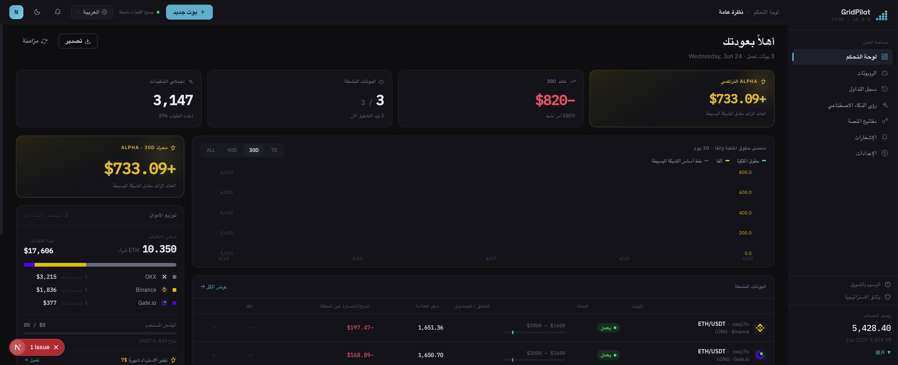

# GridPilot

> منصة تداول **الشبكة الديناميكية** لعقود ETH/USDT الدائمة · متوافقة مع Binance / Gate.io / OKX

**ترقّي شبكة البورصة الثابتة «ضع الأوامر وانسَها» إلى متداول يراقب السوق على مدار الساعة — يعيد اتخاذ القرار عند كل تغيّر في السعر.**

- 🧠 **أوامر بمراقبة ديناميكية للسوق**: لا مزيد من وضع دفعة أوامر ثابتة وانتظار القدر — يعيد التقييم عند كل تحديث للسوق قبل وضع/تعديل/إلغاء الأوامر، ويلتقط فروقاً سعرية إضافية تتجاوز خطوة الشبكة عند القفزات السعرية الكبيرة
- 💸 **توفير ~0.03% من الرسوم في كل صفقة**: أوامر Post-Only Maker افتراضياً للاستفادة من الرسوم الأقل؛ لا يبادر إلى Taker إلا عندما يفوق الربح الزائد تكلفة التنفيذ النشط؛ ويرفض الأمر مباشرةً عند الأسعار غير المواتية
- 🎯 **بناء المركز بالتتبّع — لا فتح عند القمة أبداً**: عند دخول السعر النطاق يتتبّع القاع أولاً، ولا يبني المركز إلا بعد تأكيد الارتداد، تجنباً للوقوع في الفخ فور الدخول
- 🛡️ **وقف خسارة طبقي مُخفِّف للصدمات**: عند الكسر المؤقت ثم الارتداد تستفيد المراكز المتبقية مباشرةً — بلا رسوم مهدورة على تصفية كاملة وإعادة بناء
- 🧭 **تتبّع تلقائي متعدد النطاقات**: جهّز مسبقاً عدة نطاقات غير متداخلة؛ أيّ نطاق يدخله السعر يُفعَّل

[简体中文](README.md) · [繁體中文](README.zh-TW.md) · [English](README.en.md) · [日本語](README.ja.md) · [Español](README.es.md) · **العربية** · [Français](README.fr.md) · [Português](README.pt.md) · [Italiano](README.it.md) · [한국어](README.ko.md) · [ไทย](README.th.md) · [Tiếng Việt](README.vi.md)

---

## 📸 معاينة الواجهة

| لوحة التحكم · نظرة عامة | الرسوم والعمولات المُستردة |
|:---:|:---:|
|  |  |

> سمة العلامة التجارية باللون السماوي الداكن · خطوط Space Grotesk / IBM Plex · تدعم 12 لغة مدمجة، وتتبدّل الواجهة تبعاً للغة.

## 🎯 لماذا تداول الشبكة؟

يقسّم تداول الشبكة نطاقاً سعرياً معيّناً إلى عدد من «خطوط الشبكة»، فيشتري كلما هبط السعر خطوة ويبيع كلما ارتفع خطوة — **يكرّر البيع عند الارتفاع والشراء عند الانخفاض في الأسواق المتذبذبة، فيحوّل التذبذب نفسه إلى ربح**. إنه لا يتنبأ بالصعود أو الهبوط، بل يكسب فقط فروق التذبذب ذهاباً وإياباً داخل النطاق، لذا فهو مناسب بشكل خاص للأسواق التي لا اتجاه واضح فيها وتتأرجح صعوداً وهبوطاً.

مقارنةً بـ«الشراء والاحتفاظ»: لا يربح الشراء والاحتفاظ إلا عند الصعود في النهاية؛ أما الشبكة فتراكم باستمرار أرباحاً صغيرة متتالية في التذبذب الجانبي. الثمن هو الحاجة إلى إدارة الأوامر باستمرار والتحكم في المخاطر — وهذا تحديداً هو الجزء الذي يتولى GridPilot أتمتته نيابةً عنك.

> ⚠️ تداول الشبكة ليس ربحاً مضموناً: ففي الهبوط أحادي الاتجاه ستظل هناك خسائر عائمة، والرافعة المالية تضخّم المخاطر. يُرجى فهم الاستراتيجية أولاً قبل الاستثمار.

## 🚀 ابتكاراتنا الخمسة الكبرى مقارنةً بالشبكة الأصلية في البورصات

روبوت الشبكة المدمج في البورصات هو في جوهره «وضع دفعة من الأوامر مرة واحدة، وتركها دون حراك، وانتظار أن يصطدم السوق بها». الفارق الجوهري في GridPilot هو **محاكاة متداول مُحنّك يراقب السوق برمجياً**:

| البُعد | الشبكة الأصلية في البورصات | GridPilot |
|------|----------------|-----------|
| **طريقة وضع الأوامر** | أوامر ثابتة بالجملة، لا تتحرك بعد وضعها | مراقبة آلية للسوق: عند كل تحديث للسعر يُعاد التقييم قبل وضع/تعديل/إلغاء الأوامر ديناميكياً، وقد لا توجد أوامر معلّقة في أي لحظة |
| **الرسوم** | لا تميّز بين التنفيذ النشط والسلبي | تسعير بثلاثة نطاقات: في نطاق POC يوضع أمر Maker (يوفّر ~0.03%)، وفي نطاق GTC يُسمح بأمر Taker لتثبيت الربح الزائد، وفي نطاق قاطع الدائرة يُرفض وضع الأمر |
| **توقيت بناء المركز** | فتح المركز فور دخول النطاق | بناء المركز بالتتبّع: عند دخول السعر النطاق يتتبّع القاع أولاً، ولا يبني المركز إلا بعد تأكيد الارتداد، تجنباً للوقوع في فخ القمة فور الفتح |
| **وقف الخسارة** | تصفية المركز دفعة واحدة عند سعر واحد | تخفيف تدريجي للمركز بأوامر خوارزمية طبقية، فعند الكسر المؤقت ثم الارتداد تستفيد المراكز المتبقية مباشرةً، مع توفير رسوم إعادة البناء |
| **التكيّف مع السوق** | نطاق واحد ثابت | نطاقات متعددة غير متداخلة، يُفعَّل النطاق الذي يدخله السعر وتبقى البقية في سُبات |

1. **عقلية المراقبة قبل اتخاذ القرار**: يقيّم النظام في كل مرة يستقبل فيها تحديثاً للسوق العلاقة بين السعر الحالي والسعر المستهدف — فإن كانت الظروف غير مواتية توقّف وراقب، وإن كانت مواتية تموضَع عند أفضل سعر، وعند قفزة سعرية كبيرة يمكنه التقاط فرق سعري إضافي يتجاوز خطوة الشبكة.
2. **أولوية Maker / السماح بـ Taker / قاطع الدائرة عند الظروف غير المواتية**: افتراضياً يضع أمر Post-Only Maker للحصول على رسوم أقل؛ ولا يبادر إلى أمر Taker إلا عندما يفوق الربح الإضافي تكلفة التنفيذ النشط وتكون الفرصة عابرة؛ وعندما يكون السعر الحالي أغلى من سعر الشراء المستهدف يرفض الأمر مباشرةً، تجنباً للشراء بسعر مرتفع والبيع بسعر منخفض.
3. **بناء المركز بالتتبّع**: لتجنب الوقوع في فخ الفتح عند القمة.
4. **وقف الخسارة بأوامر خوارزمية طبقية**: للحفاظ على القدرة على التعافي عند الارتداد.
5. **نطاقات سعرية متعددة**: أينما ذهب السعر، تتبعه الاستراتيجية.

> لمبدأ الاستراتيجية الكامل راجع [`docs/STRATEGY_SPEC.md`](docs/STRATEGY_SPEC.md).

## ✨ نظرة عامة على الميزات

- **نطاقات سعرية متعددة**: تهيئة مسبقة لعدة نطاقات غير متداخلة (مثل 2000–2600 و2600–3200)، ويُفعَّل النطاق الذي يدخله السعر
- **بناء المركز بالتتبّع**: تتبّع القاع وبناء المركز فقط بعد تأكيد الارتداد
- **تسعير ديناميكي بثلاثة نطاقات**: Maker في نطاق POC، تثبيت الربح الزائد في نطاق GTC، رفض الأمر في نطاق قاطع الدائرة
- **مخزن وقف خسارة طبقي**: أوامر خوارزمية شرطية متعددة المستويات أسفل الشبكة الرئيسية لتخفيف المركز طبقياً
- **بث فوري عبر WebSocket**: مزامنة أحداث Ticker / التنفيذ / آلة الحالة مع الواجهة في الوقت الفعلي
- **دعم متعدد البورصات**: واجهة محوّل موحّدة، متوافقة مع Binance وGate.io وOKX
- **واجهة متعددة اللغات**: تدعم 12 لغة مدمجة

## 💰 افهم الرسوم، ووفّر المال باستخدام رمز الدعوة عند التسجيل (الراعي rebateto.me)

الرسوم تجبيها البورصة، و**GridPilot لا يقتطع منها فلساً واحداً**. في الصفقة نفسها، أمر التعليق (Maker) ≈0.02%، وأمر التنفيذ النشط (Taker) ≈0.05%. تحت الرافعة المالية والشبكة عالية التردد، تتضخّم الرسوم خفيةً، ولا تُستهان بتراكمها يوماً بعد يوم — يضع GridPilot افتراضياً أوامر Maker نيابةً عنك، فيوفّر نحو 0.03% لكل صفقة، ولا يبادر إلى التنفيذ النشط إلا حين تكون الفرصة عابرة.

وأبعد من ذلك: **عند التسجيل في البورصة، ما عليك إلا إدخال رمز عمولة مُستردة، حتى تستردّ على المدى الطويل نحو 20% من الرسوم المدفوعة (Gate 40%)، وتصلك تلقائياً** — وكأنك تحصل على خصم إضافي على كل صفقة.

> ⚠️ يمكن التسجيل في كل بورصة مرة واحدة فقط، ولا تُربط العمولة المُستردة إلا عند التسجيل، **ولا يمكن استدراكها للحسابات القديمة — هذه هي الفرصة الوحيدة**.

**الراعي [rebateto.me](https://rebateto.me)** يجمّع ويصون مداخل التسجيل للعمولة المُستردة في مختلف البورصات. يُرجى استخدام رمز الدعوة عند التسجيل:

| البورصة | رمز الدعوة | نسبة العمولة المُستردة |
|--------|--------|----------|
| Binance | `fanwo20` | 20% |
| OKX | `fangeiwo` | 20% |
| Gate.io | `fangeiwo` | 40% |

> عند التسجيل عبر التطبيق تذكّر إدخال رمز الدعوة يدوياً — فإن أغفلته لن تحصل على الاسترداد. لكل بطاقة هوية حساب واحد فقط في كل بورصة.

## 📦 التثبيت

**المتطلبات المسبقة**: Node.js ≥ 20، pnpm ≥ 9، Docker

### الطريقة الأولى: حزمة كاملة بنقرة واحدة عبر Docker (موصى بها للنشر الذاتي)

```bash
git clone https://github.com/QuantiaAI/grid-pilot.git && cd grid-pilot
cp .env.example .env
# أنشئ مفتاح التشفير وضعه في ENCRYPTION_KEY في ملف .env
openssl rand -base64 32
# شغّل PostgreSQL + Redis + API + Web بأمر واحد (تُنفَّذ ترحيلات قاعدة البيانات تلقائياً)
docker compose --profile full up --build -d
```

بعد التشغيل، ادخل إلى http://localhost:3300 .

> دون `--profile full`، يشغّل `docker compose up` بنية PostgreSQL + Redis الأساسية فقط، لاستخدامها في التطوير المحلي.

### الطريقة الثانية: التثبيت المحلي (موصى به للتطوير)

```bash
git clone https://github.com/QuantiaAI/grid-pilot.git && cd grid-pilot
pnpm install
cp .env.example .env        # عدّل المنافذ حسب الحاجة؛ واضبط ENCRYPTION_KEY على ناتج openssl rand -base64 32
pnpm --filter @gridpilot/api exec prisma generate       # أنشئ Prisma Client (خطوة postinstall معطّلة — هذه الخطوة إلزامية)
pnpm dev:infra              # شغّل PostgreSQL + Redis
pnpm exec dotenv -e .env -- pnpm --filter @gridpilot/api exec prisma migrate deploy # عند التثبيت الأول فقط: طبّق ترحيلات قاعدة البيانات
pnpm dev:skip-infra         # شغّل API + الواجهة الأمامية
```

> خطوتا `prisma generate` / `migrate deploy` مطلوبتان مرة واحدة فقط عند التثبيت الأول؛ بعد ذلك يكفي تشغيل `pnpm dev` لتشغيل كل شيء.

| الخدمة | العنوان | عنصر الإعداد |
|------|------|--------|
| الواجهة الأمامية | http://localhost:3300 | `WEB_PORT` / `WEB_HOST` |
| واجهة API الخلفية | http://localhost:3301 | `API_PORT` / `API_HOST` |
| PostgreSQL | localhost:25432 | `DB_PORT` |
| Redis | localhost:26379 | `REDIS_PORT` |

التشغيل المنفرد:

```bash
pnpm dev:infra        # PostgreSQL + Redis فقط
pnpm dev:api          # الواجهة الخلفية فقط
pnpm dev:web          # الواجهة الأمامية فقط
pnpm dev:skip-infra   # API + Web مع تخطي docker
```

## 🕹️ تعليمات الاستخدام

1. **توصيل البورصة**: أدخل API Key/Secret في الإعدادات. **امنح صلاحية تداول العقود فقط، ولا تفعّل صلاحية السحب إطلاقاً.**
2. **تهيئة الشبكة**: اختر زوج التداول والنطاق السعري، واضبط عدد خطوط الشبكة الرئيسية وحجم الخطوة والكمية لكل خط والرافعة المالية ومخزن وقف الخسارة ومعاملات بناء المركز بالتتبّع.
3. **تشغيل الروبوت**: ادخل إلى بناء المركز بالتتبّع → التشغيل، وتعرض الواجهة في الوقت الفعلي حالة السوق والأوامر المعلّقة والتنفيذ وآلة الحالة.
4. **المراقبة والإنهاء**: عند تفعيل جانب جني الأرباح يتوقف عن زيادة المركز ويبدأ الإنهاء؛ وعند تفعيل مخزن وقف الخسارة يجري التخفيف الطبقي للمركز.

المعاملات الرئيسية:

| المعامل | الوصف |
|------|------|
| `takeProfitPrice` | سعر جني الأرباح (حدّ جانب جني أرباح الصندوق) |
| `mainGridCount` / `mainGridStep` | عدد خطوط الشبكة الرئيسية / حجم الخطوة لكل خط (USDT) |
| `mainGridPortionSize` | كمية الأمر لكل خط |
| `leverage` | مضاعف الرافعة المالية |
| `stopLossGridCount` / `stopLossGridStep` | عدد خطوط منطقة مخزن وقف الخسارة / حجم الخطوة |
| `activationPrice` / `trailingCallbackRate` | سعر تفعيل بناء المركز بالتتبّع / نسبة الارتداد |
| `excessProfitMultiplier` | مضاعف تفعيل نطاق GTC (عتبة الربح الزائد) |

للمعاملات الكاملة راجع [`docs/STRATEGY_SPEC.md`](docs/STRATEGY_SPEC.md).

## ⚠️ ملاحظات هامة

- **إخلاء المسؤولية عن المخاطر**: تداول العقود يتسم برافعة مالية عالية ومخاطر عالية، وقد يؤدي إلى خسارة رأس المال بالكامل. هذا المشروع أداة تداول مفتوحة المصدر، **ولا يشكّل أي نصيحة استثمارية**، ولا يتحمل مسؤولية الأرباح أو الخسائر. يُرجى التحقق الكافي أولاً برأس مال صغير أو على الشبكة التجريبية للبورصة.
- **صلاحيات API**: افتح صلاحية تداول العقود فقط، **ولا** تفعّل صلاحية السحب.
- **قيد المُشغّل الواحد**: لزوج التداول نفسه في حساب البورصة نفسه، لا يمكن تشغيل سوى روبوت واحد في الوقت نفسه.
- **توقيت العمولة المُستردة**: لا يُربط رمز الدعوة إلا عند التسجيل، ولا يمكن استدراكه للحسابات القديمة.
- **أمان المفتاح**: يُستخدم `ENCRYPTION_KEY` لتشفير بيانات اعتماد البورصة، فاحرص على استخدام مفتاح قوي مولّد عشوائياً وحفظه بعناية.
- **تعارض المنافذ**: إذا كان المنفذان المحليان 3300/3301 مشغولَين بـ `pnpm dev`، فسيتعارضان مع حاويات الحزمة الكاملة في Docker، لذا أوقِف العمليات المحلية أولاً قبل تشغيل الحاويات، أو عدّل إعداد المنافذ في `.env`.

## 🏗️ المنظومة التقنية والمعمارية

| الطبقة | التقنية |
|------|------|
| الواجهة الأمامية | Next.js 16 · React 19 · Tailwind CSS v4 · Zustand · React Query · Recharts |
| الواجهة الخلفية | NestJS 10 · Prisma 5 · BullMQ · Socket.IO |
| البنية التحتية | PostgreSQL 16 · Redis 7 · Docker Compose |
| المشترك | TypeScript · pnpm Workspaces · Turborepo |

```
apps/web/          # واجهة Next.js الأمامية (سمة داكنة، 12 لغة)
apps/api/          # واجهة NestJS الخلفية
packages/shared-types/  # أنواع مشتركة بين الواجهتين الأمامية والخلفية
docs/              # STRATEGY_SPEC.md (مواصفات الاستراتيجية) · ARCHITECTURE.md (ربط المكوّنات)
docker-compose.yml # البنية التحتية الافتراضية؛ --profile full للحزمة الكاملة
```

**آلة حالة الاستراتيجية**: `TRAILING_ENTRY → RUNNING → LIQUIDATING → LIQUIDATED`، ويمكن لـ `RUNNING` أن يتفرّع إلى `TAKE_PROFIT`؛ وتشمل فروع التشغيل `PAUSED` (يمكن إعادة ضبطه عبر `USER_RESUME`) و`CANCELLED` و`HOLD`.

**أوامر التطوير**:

```bash
pnpm dev          # تشغيل جميع الخدمات بأمر واحد
pnpm build        # البناء
pnpm test         # الاختبار
pnpm lint         # Lint
```

**قاعدة البيانات** (التطوير المحلي):

```bash
cd apps/api
pnpm prisma migrate dev    # تنفيذ الترحيلات
pnpm prisma studio         # عرض البيانات
```

## فهرس الوثائق

| الوثيقة | الوصف |
|------|------|
| [`docs/STRATEGY_SPEC.md`](docs/STRATEGY_SPEC.md) | دليل مواصفات الاستراتيجية الكامل (المرجع المعتمد) |
| [`docs/ARCHITECTURE.md`](docs/ARCHITECTURE.md) | فهرس ربط مكوّنات الكود بأقسام المواصفات |
| [`docs/fees-and-funding.md`](docs/fees-and-funding.md) | شرح الرسوم ورسوم التمويل |
