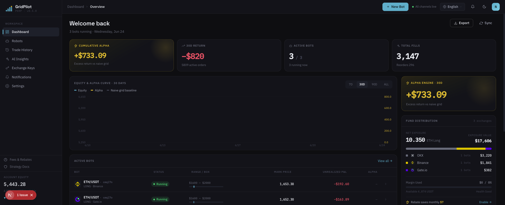
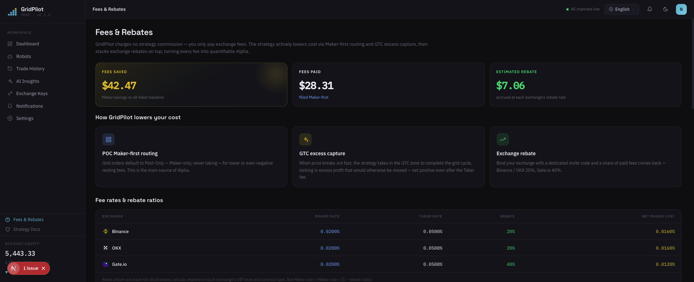

# GridPilot

> ETH/USDT perpetual futures **dynamic grid** trading platform · compatible with Binance / Gate.io / OKX

**The grid bot built into your exchange is a product of a bygone era.**

It plants a batch of orders on the book and never looks back — entering without asking the price, stopping out in one slash, and capturing nothing but the dead price on the grid line when the market jumps. GridPilot is a trader watching the charts 24/7: **on every tick, it re-decides whether to act and at what price.**

[简体中文](README.md) · [繁體中文](README.zh-TW.md) · **English** · [日本語](README.ja.md) · [Español](README.es.md) · [العربية](README.ar.md) · [Français](README.fr.md) · [Português](README.pt.md) · [Italiano](README.it.md) · [한국어](README.ko.md) · [ไทย](README.th.md) · [Tiếng Việt](README.vi.md)

---

## 📸 Interface Preview

| Dashboard · Overview | Fees & Rebates |
|:---:|:---:|
|  |  |

> Deep teal brand theme · Space Grotesk / IBM Plex fonts · 12 built-in languages, with the interface switching along with the language.

## 🎯 Why Grid Trading?

Grid trading slices a price range into multiple "grid lines": it buys each time the price drops one grid and sells each time it rises one grid—**repeatedly buying low and selling high in choppy markets, turning volatility itself into profit**. It does not predict whether prices will go up or down; it only earns the spread from back-and-forth swings within a range, which makes it especially suited to markets with no clear trend that oscillate up and down.

Compared with "buy and hold": buy-and-hold only profits if the price ultimately rises; grid trading keeps accumulating small profits one by one during sideways consolidation. The cost is the need to continuously manage orders and control risk—and that is precisely the part GridPilot automates for you.

> ⚠️ Grid trading is not a guaranteed win: you can still take unrealized losses during a one-sided decline, and leverage amplifies risk. Make sure you understand the strategy before committing funds.

## 🤔 Before you grid-trade, ask yourself five questions

**The price is still falling — why is the grid rushing to build a full position at the top?**
A native grid opens the moment the price enters the range. GridPilot uses **trailing entry**: it follows the low down and enters only after a 0.2% (default) rebound confirms the footing — no bottom-guessing, no instant bag-holding. (Trailing only happens when the price enters the activation window toward the loss side; if the price climbs back into the range from deeper levels toward the take-profit side, trailing is skipped and the bot starts running directly.)

**The market moves every second — why do your orders never move once placed?**
GridPilot re-decides on every market update: cancel when it should, amend when it should, and at any moment there may be no order on the book at all. When the price is favorable it chases the order book for the best price; when unfavorable it would rather circuit-break and refuse the order; and when it can fill as a Maker (0.02%) it never wastes a Taker fee (0.05%). This chasing carries no downside: if price keeps falling past the grid price, it chases and buys even cheaper; if it bounces back without breaking the line above, it can still fill at the original price — under a standard gambler's-ruin model, the odds of a true miss are negligible — extra profit is free, and missing it costs nothing.

**When the price jumps 5–10 USDT in one tick, what can your grid do but watch?**
Static resting orders can only ever earn the dead price on the grid line. When the price deviates from the grid's theoretical price by more than a threshold (default 0.1% ≈ 2× the taker fee, adjustable), GridPilot deliberately takes liquidity to lock in the extra spread beyond the grid step — and our tests show that the "rougher" an exchange's order book, the higher the excess return.

**A brief dip below the range — why slash the entire position at market in one go?**
One-click liquidation pays Taker fees *and* forfeits the rebound. GridPilot **trims in stages with limit orders** inside the stop-loss buffer; if the price rebounds, the residual position keeps earning. Only when the liquidation line is breached does the final backstop conditional order take over.

**The price left your range long ago — why is your grid still idling in place?**
GridPilot pre-configures multiple non-overlapping ranges and activates whichever one the price walks into. After a stop-loss it even takes a "cooling-off period," waiting for a fresh stabilization signal before trailing in again.

## 📊 Head-to-head against exchange-native grids

| Dimension | Exchange-Native Grid | GridPilot |
|------|----------------|-----------|
| **Decision-making** | Static batch orders that never move once placed | Automated chart-watching: re-evaluates on every market update before dynamically placing/amending/canceling orders, and may have no open orders at any given moment |
| **Execution quality** | Static orders only ever earn the grid-line price; the excess spread in a jump passes by | Anchors to the order book for the best price, never filling worse than the theoretical price; when the price deviates from the theoretical price beyond a threshold (default ≈2× the fee), deliberately takes liquidity to lock in excess profit; circuit-breaks and refuses orders at unfavorable prices |
| **Entry timing** | Opens a position immediately upon entering the range | Trailing entry: when entering toward the loss side, trails the low and builds the position only after a confirmed rebound (0.2% by default) |
| **Stop-loss** | One-shot market liquidation at a single price | Staged limit-order reduction in the buffer zone; the residual position benefits directly on a rebound; one backstop conditional order at the liquidation line |
| **Market adaptation** | A fixed single range | Multiple non-overlapping ranges; whichever range the price enters becomes active while the rest stay dormant |

> See [`docs/INNOVATIONS.en.md`](docs/INNOVATIONS.en.md) for a point-by-point comparison against exchange-native grids; see [`docs/STRATEGY_SPEC.md`](docs/STRATEGY_SPEC.md) for the complete strategy rationale.

## ✨ Feature Overview

- **State-agnostic self-healing**: target position = f(current price) — automatically re-converges after crashes, network drops, or manual position changes
- **Real-time WebSocket push**: Ticker / fills / state-machine events synced to the frontend in real time
- **Multi-exchange support**: a unified adapter interface compatible with Binance, Gate.io, and OKX
- **AI box-configuration advice**: offline recommendations for ranges and parameters, never involved in live trading decisions
- **Multilingual interface**: 12 built-in languages

## 💰 Understand the Fees, Save Money With an Invite Code at Sign-Up (sponsored by rebateto.me)

Fees are charged by the exchange, and **GridPilot takes not a single cent**. On the same trade, a maker order (Maker) is ≈0.02% and a taker order (Taker) is ≈0.05%. Routine grid orders on both sides actually execute as Maker (resting orders), so there is no fee difference in day-to-day grid fills; GridPilot's fee edge shows up at three critical moments—on entry it waits for the rebound confirmation and places resting orders instead of instantly opening at market, on stop-loss it trims in stages with limit orders instead of slashing the whole position at market, and it only takes liquidity when the excess spread genuinely covers the fee.

Going further: **when you register with an exchange, filling in a rebate code lets you get back roughly 20% of the fees you've already paid over the long term (40% for Gate), credited automatically**—effectively giving every trade an extra discount.

> ⚠️ You can only register once per exchange, and the rebate can only be bound at registration. **Existing accounts cannot add it later—this is the only chance.**

**Sponsored by [rebateto.me](https://rebateto.me)**, which aggregates and maintains the rebate registration entry points for each exchange. Please use the following invite codes when registering:

| Exchange | Invite Code | Rebate Rate |
|--------|--------|----------|
| Binance | `fanwo20` | 20% |
| OKX | `fangeiwo` | 20% |
| Gate.io | `fangeiwo` | 40% |

> When registering via the app, remember to fill in the invite code manually—miss it and you won't get the rebate. Each ID can open only one account per exchange.

## 📦 Installation

**Prerequisites**: Node.js ≥ 20, pnpm ≥ 9, Docker

### Option 1: One-Command Full Stack via Docker (recommended for self-hosting)

```bash
git clone https://github.com/QuantiaAI/grid-pilot.git && cd grid-pilot
cp .env.example .env
# Generate an encryption key and fill it into ENCRYPTION_KEY in .env
openssl rand -base64 32
# Bring up PostgreSQL + Redis + API + Web in one command (database migrations run automatically)
docker compose --profile full up --build -d
```

After startup, visit http://localhost:3300 .

> Without `--profile full`, `docker compose up` only starts the PostgreSQL + Redis infrastructure for local development.

### Option 2: Local Installation (recommended for development)

```bash
git clone https://github.com/QuantiaAI/grid-pilot.git && cd grid-pilot
pnpm install
cp .env.example .env        # adjust ports as needed; set ENCRYPTION_KEY to the output of openssl rand -base64 32
pnpm --filter @gridpilot/api exec prisma generate       # generate the Prisma Client (postinstall is disabled — this step is required)
pnpm dev:infra              # bring up PostgreSQL + Redis
pnpm exec dotenv -e .env -- pnpm --filter @gridpilot/api exec prisma migrate deploy # first install only: apply database migrations
pnpm dev:skip-infra         # start API + Web
```

> The `prisma generate` / `migrate deploy` steps are only needed once on first install; afterwards just run `pnpm dev` to start everything.

| Service | Address | Config |
|------|------|--------|
| Frontend | http://localhost:3300 | `WEB_PORT` / `WEB_HOST` |
| Backend API | http://localhost:3301 | `API_PORT` / `API_HOST` |
| PostgreSQL | localhost:25432 | `DB_PORT` |
| Redis | localhost:26379 | `REDIS_PORT` |

Start individually:

```bash
pnpm dev:infra        # PostgreSQL + Redis only
pnpm dev:api          # backend only
pnpm dev:web          # frontend only
pnpm dev:skip-infra   # API + Web, skipping docker
```

## 🕹️ Usage Guide

1. **Connect an exchange**: fill in your API Key/Secret in settings. **Grant only futures trading permission—never enable withdrawal permission.**
2. **Configure the grid**: choose the trading pair and direction (long/short), and set the take-profit price anchor, main grid count/step, quantity per grid, leverage, stop-loss buffer, and trailing-entry parameters (the box boundaries are derived automatically from the take-profit anchor plus the grid count and step).
3. **Start the bot**: enter trailing entry → running, and the frontend displays market data, open orders, fills, and the state machine in real time.
4. **Monitor and wind down**: when the price reaches the take-profit end, the grid closes out grid by grid and winds down naturally, taking profit and exiting once the position is flat; entering the stop-loss buffer trims the position dynamically grid by grid.

Key parameters:

| Parameter | Description |
|------|------|
| `takeProfitPrice` | Take-profit price (the take-profit boundary of the box) |
| `direction` | Direction: LONG (long) / SHORT (short) |
| `mainGridCount` / `mainGridStep` | Main grid count / step per grid (USDT) |
| `mainGridPortionSize` | Order quantity per grid |
| `leverage` | Leverage multiplier |
| `stopLossGridCount` / `stopLossGridStep` | Stop-loss buffer zone count / step |
| `isolationStep` | Isolation band width (defaults to the stop-loss zone step) |
| `activationPrice` / `trailingCallbackRate` | Range activation price (defaults to the midpoint of the main grid) / trailing-entry callback rate |
| `excessProfitMultiplier` | GTC zone trigger multiplier (excess-profit threshold) |

See [`docs/STRATEGY_SPEC.md`](docs/STRATEGY_SPEC.md) for the complete set of parameters.

## ⚠️ Important Notes

- **Risk disclaimer**: futures trading is highly leveraged and high-risk, and may lead to the loss of all your principal. This project is an open-source trading tool and **does not constitute any investment advice**; it is not responsible for your profits or losses. Please validate thoroughly with small amounts or an exchange testnet first.
- **API permissions**: enable only futures trading permission—**do not** enable withdrawal permission.
- **Single-runner constraint**: for the same trading pair on the same exchange account, only one bot can run at a time.
- **Rebate timing**: the invite code can only be bound at registration; existing accounts cannot add it later.
- **Key security**: `ENCRYPTION_KEY` is used to encrypt exchange credentials—be sure to use a randomly generated strong key and keep it safe.
- **Port conflicts**: if your local 3300/3301 ports are occupied by `pnpm dev`, they will conflict with the Docker full-stack containers; stop the local processes before starting the containers, or change the port configuration in `.env`.

## 🏗️ Tech Stack & Architecture

| Layer | Technology |
|------|------|
| Frontend | Next.js 16 · React 19 · Tailwind CSS v4 · Zustand · React Query · Recharts |
| Backend | NestJS 10 · Prisma 5 · BullMQ · Socket.IO |
| Infrastructure | PostgreSQL 16 · Redis 7 · Docker Compose |
| Shared | TypeScript · pnpm Workspaces · Turborepo |

```
apps/web/          # Next.js frontend (dark theme, 12 languages)
apps/api/          # NestJS backend
packages/shared-types/  # types shared between frontend and backend
docs/              # STRATEGY_SPEC.md (strategy spec) · ARCHITECTURE.md (component mapping)
docker-compose.yml # default infrastructure; --profile full for the full stack
```

**Strategy state machine**: `TRAILING_ENTRY → RUNNING → LIQUIDATING → LIQUIDATED`, where `RUNNING` can branch to `TAKE_PROFIT`; operational branches include `PAUSED` (can be reset via `USER_RESUME`), `CANCELLED`, and `HOLD`.

**Development commands**:

```bash
pnpm dev          # start all services in one command
pnpm build        # build
pnpm test         # test
pnpm lint         # lint
```

**Database** (local development):

```bash
cd apps/api
pnpm prisma migrate dev    # run migrations
pnpm prisma studio         # view data
```

## Documentation Index

| Document | Description |
|------|------|
| [`docs/INNOVATIONS.en.md`](docs/INNOVATIONS.en.md) | Core innovations explained (point-by-point vs exchange-native grids) |
| [`docs/STRATEGY_SPEC.md`](docs/STRATEGY_SPEC.md) | Complete strategy specification (authoritative reference) |
| [`docs/ARCHITECTURE.md`](docs/ARCHITECTURE.md) | Index mapping code components to spec sections |
| [`docs/fees-and-funding.md`](docs/fees-and-funding.md) | Fees and funding-rate explanation |
