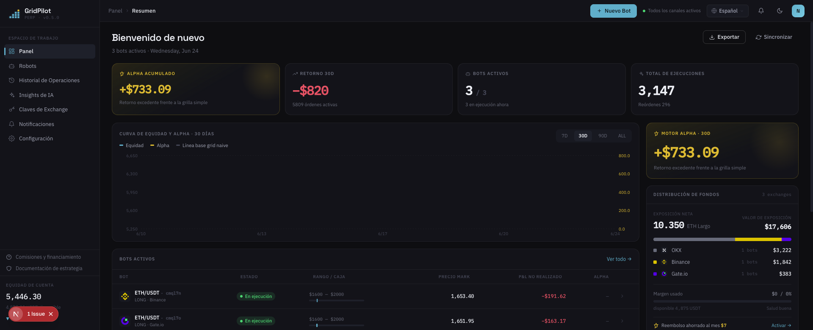
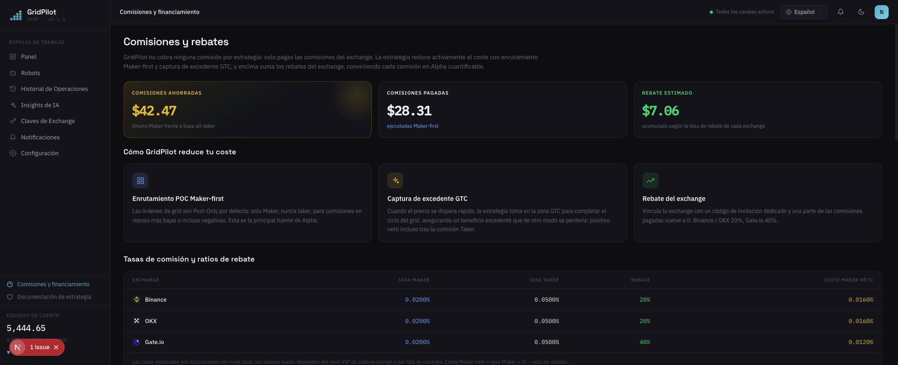

# GridPilot

> Plataforma de trading de **cuadrícula dinámica** para contratos perpetuos ETH/USDT · Compatible con Binance / Gate.io / OKX

**El bot de cuadrícula que trae el exchange es un producto de otra era.**

Cuelga un montón de órdenes en el libro y se desentiende: abre posición sin mirar el precio, corta el stop-loss de un tajo y, cuando el mercado da un salto, solo captura los precios muertos de las líneas de cuadrícula. GridPilot es un trader que vigila el mercado 24/7: **con cada tick vuelve a decidir si actuar y a qué precio.**

[简体中文](README.md) · [繁體中文](README.zh-TW.md) · [English](README.en.md) · [日本語](README.ja.md) · **Español** · [العربية](README.ar.md) · [Français](README.fr.md) · [Português](README.pt.md) · [Italiano](README.it.md) · [한국어](README.ko.md) · [ไทย](README.th.md) · [Tiếng Việt](README.vi.md)

---

## 📸 Vista previa de la interfaz

| Panel de control · Resumen | Comisiones y reembolsos |
|:---:|:---:|
|  |  |

> Tema de marca verde azulado oscuro · Tipografías Space Grotesk / IBM Plex · 12 idiomas integrados, la interfaz cambia al cambiar de idioma.

## 🎯 ¿Por qué el trading de cuadrícula?

El trading de cuadrícula divide un rango de precios en varias "líneas de cuadrícula": compra cada vez que el precio baja un nivel y vende cada vez que sube uno; **en mercados laterales, compra barato y vende caro repetidamente, convirtiendo la propia volatilidad en ganancia**. No predice subidas ni bajadas, solo gana el diferencial de las oscilaciones de ida y vuelta dentro del rango, por lo que resulta especialmente adecuado para mercados sin una tendencia clara que se mueven arriba y abajo.

Comparado con "comprar y mantener": comprar y mantener solo genera ganancias cuando el precio finalmente sube; la cuadrícula acumula continuamente pequeñas ganancias durante las oscilaciones laterales. El precio a pagar es la necesidad de gestionar las órdenes de forma continua y controlar el riesgo, que es justo la parte que GridPilot automatiza por ti.

> ⚠️ El trading de cuadrícula no garantiza ganancias: durante una caída unidireccional puede haber pérdidas no realizadas, y el apalancamiento amplifica el riesgo. Comprende bien la estrategia antes de invertir.

## 🤔 Antes de usar una cuadrícula, hazte estas cinco preguntas

**El precio sigue cayendo: ¿por qué tu cuadrícula tiene tanta prisa por llenar la posición en plena cima?**
La cuadrícula nativa abre posición en cuanto el precio entra en el rango. GridPilot **abre por seguimiento**: primero persigue el punto bajo y solo entra tras confirmar un rebote del 0,2 % — ni compra la caída a ciegas ni se queda colgado arriba.

**El mercado cambia cada segundo: ¿por qué tus órdenes no se mueven una vez colocadas?**
GridPilot vuelve a decidir con cada actualización del mercado: cancela lo que hay que cancelar, modifica lo que hay que modificar, y en cualquier momento puede no haber ni una sola orden en el libro; si el precio no conviene, prefiere rechazar la orden antes que perseguir el precio — si puede ser Maker (0,02 %), jamás regala el Taker (0,05 %).

**El precio salta 5–10 USDT de golpe: ¿tu cuadrícula se queda mirando o hace algo?**
Las órdenes estáticas solo capturan los precios muertos de las líneas de cuadrícula. Cuando el diferencial supera 2 veces la comisión Taker, GridPilot ejecuta activamente a mercado y se embolsa el diferencial del salto que excede el paso de la cuadrícula — las pruebas demuestran que cuanto más "irregular" es el libro de órdenes de un exchange, mayor es la ganancia extra.

**Es solo una ruptura breve a la baja: ¿por qué liquidar toda la posición de golpe a mercado?**
Un cierre total de un clic paga comisión Taker y, encima, renuncia al rebote. GridPilot **reduce la posición nivel a nivel con órdenes límite** dentro de la zona de amortiguación del stop-loss; si el precio rebota, la posición residual sigue ganando directamente. Solo cuando se rompe la línea de liquidación, la última orden condicional de respaldo toma el control de una vez.

**El precio se salió del rango hace rato: ¿por qué tu cuadrícula sigue girando en vacío?**
GridPilot preconfigura varios rangos que no se superponen: se activa el rango en el que entra el precio; tras un stop-loss entra en un "periodo de enfriamiento" y solo vuelve a abrir por seguimiento cuando reaparece una señal de estabilización.

## 📊 Cara a cara con la cuadrícula nativa del exchange

| Dimensión | Cuadrícula nativa del exchange | GridPilot |
|------|----------------|-----------|
| **Forma de decidir** | Órdenes estáticas en lote, inmóviles una vez colocadas | Vigilancia automatizada: reevalúa con cada actualización del mercado antes de colocar/modificar/cancelar dinámicamente; en cualquier momento puede no haber órdenes colgadas |
| **Calidad de ejecución** | Las órdenes estáticas solo capturan el precio de las líneas de cuadrícula; el diferencial extra de los saltos se escapa | Persigue el mejor bid/ask para clavar el mejor precio; cuando el diferencial supera 2× la comisión, ejecuta activamente para bloquear la ganancia extra; si el precio no conviene, rechaza la orden |
| **Momento de apertura** | Abre posición en cuanto entra en el rango | Apertura por seguimiento: persigue el punto bajo y solo abre tras confirmar un rebote del 0,2 % |
| **Stop-loss** | Cierre total a mercado en un solo precio | Reducción nivel a nivel con órdenes límite en la zona de amortiguación; si rebota, la posición residual se beneficia directamente; la línea de liquidación guarda una orden condicional de respaldo |
| **Adaptación al mercado** | Un único rango fijo | Varios rangos no superpuestos: se activa el rango en el que entra el precio y los demás quedan inactivos |

> La explicación completa de las innovaciones, punto por punto frente a la cuadrícula del exchange, está en [`docs/INNOVATIONS.en.md`](docs/INNOVATIONS.en.md); el principio completo de la estrategia, en [`docs/STRATEGY_SPEC.md`](docs/STRATEGY_SPEC.md).

## ✨ Resumen de funciones

- **Autorreparación independiente del estado**: posición objetivo = f(precio actual); tras un fallo, un corte de red o una modificación manual de la posición, al reiniciar corrige automáticamente cualquier desviación
- **Notificaciones en tiempo real por WebSocket**: Ticker / ejecuciones / eventos de la máquina de estados sincronizados en tiempo real con el frontend
- **Soporte multi-exchange**: interfaz de adaptador unificada, compatible con Binance, Gate.io y OKX
- **Sugerencias de configuración de rangos con IA**: recomienda rangos y parámetros de forma offline, sin intervenir en las decisiones de trading en tiempo real
- **Interfaz multilingüe**: 12 idiomas integrados

## 💰 Entiende las comisiones y ahorra usando un código de invitación al registrarte (patrocinador rebateto.me)

Las comisiones las cobra el exchange; **GridPilot no se queda ni un céntimo**. En una misma operación, una orden Maker cuesta ≈0,02 % y una orden Taker ≈0,05 %. Con apalancamiento y cuadrículas de alta frecuencia, las comisiones se amplifican silenciosamente y, acumuladas con el tiempo, no son pequeñas; GridPilot coloca órdenes Maker por ti por defecto, ahorrando unos 0,03 % por operación, y solo ejecuta como Taker cuando la oportunidad es fugaz.

Y un paso más allá: **al registrarte en un exchange, basta con introducir un código de reembolso para que se te devuelva a largo plazo alrededor del 20 % de las comisiones ya pagadas (40 % en Gate), de forma automática**, lo que equivale a un descuento adicional en cada operación.

> ⚠️ Cada exchange solo se puede registrar una vez, y el reembolso solo puede vincularse en el momento del registro; **las cuentas antiguas no pueden añadirlo después: esta es la única oportunidad**.

**Patrocinador [rebateto.me](https://rebateto.me)** recopila y mantiene los accesos de registro con reembolso de cada exchange. Al registrarte, utiliza el código de invitación:

| Exchange | Código de invitación | Porcentaje de reembolso |
|--------|--------|----------|
| Binance | `fanwo20` | 20% |
| OKX | `fangeiwo` | 20% |
| Gate.io | `fangeiwo` | 40% |

> Recuerda introducir manualmente el código de invitación al registrarte desde la App; si lo omites, no obtendrás el reembolso. Cada documento de identidad permite abrir una sola cuenta por exchange.

## 📦 Instalación

**Dependencias previas**: Node.js ≥ 20, pnpm ≥ 9, Docker

### Opción 1: Stack completo con Docker en un solo comando (recomendado para autoalojamiento)

```bash
git clone https://github.com/QuantiaAI/grid-pilot.git && cd grid-pilot
cp .env.example .env
# Genera la clave de cifrado e insértala en ENCRYPTION_KEY en .env
openssl rand -base64 32
# Levanta PostgreSQL + Redis + API + Web con un solo comando (las migraciones se ejecutan automáticamente)
docker compose --profile full up --build -d
```

Tras el arranque, accede a http://localhost:3300 .

> Sin `--profile full`, `docker compose up` solo arranca la infraestructura base de PostgreSQL + Redis, para desarrollo local.

### Opción 2: Instalación local (recomendado para desarrollo)

```bash
git clone https://github.com/QuantiaAI/grid-pilot.git && cd grid-pilot
pnpm install
cp .env.example .env        # ajusta los puertos según necesites; en ENCRYPTION_KEY pon la salida de openssl rand -base64 32
pnpm --filter @gridpilot/api exec prisma generate       # genera el Prisma Client (el postinstall está desactivado — este paso es obligatorio)
pnpm dev:infra              # levanta PostgreSQL + Redis
pnpm exec dotenv -e .env -- pnpm --filter @gridpilot/api exec prisma migrate deploy # solo en la primera instalación: aplica las migraciones de la base de datos
pnpm dev:skip-infra         # arranca API + Web
```

> Los pasos `prisma generate` / `migrate deploy` solo son necesarios una vez, en la primera instalación; después basta con ejecutar `pnpm dev` para arrancarlo todo.

| Servicio | Dirección | Opción de configuración |
|------|------|--------|
| Frontend | http://localhost:3300 | `WEB_PORT` / `WEB_HOST` |
| API backend | http://localhost:3301 | `API_PORT` / `API_HOST` |
| PostgreSQL | localhost:25432 | `DB_PORT` |
| Redis | localhost:26379 | `REDIS_PORT` |

Arranque individual:

```bash
pnpm dev:infra        # Solo PostgreSQL + Redis
pnpm dev:api          # Solo backend
pnpm dev:web          # Solo frontend
pnpm dev:skip-infra   # API + Web, omitiendo docker
```

## 🕹️ Instrucciones de uso

1. **Conecta el exchange**: introduce la API Key/Secret en los ajustes. **Concede únicamente permiso de trading de contratos; nunca habilites el permiso de retiro.**
2. **Configura la cuadrícula**: elige el par de trading y el rango de precios, y define el número de niveles de la cuadrícula principal, el paso, la cantidad por nivel, el apalancamiento, el amortiguador de stop-loss y los parámetros de apertura por seguimiento.
3. **Inicia el bot**: entra en la apertura por seguimiento → en ejecución; el frontend muestra en tiempo real el mercado, las órdenes, las ejecuciones y la máquina de estados.
4. **Monitorea y cierra**: al activarse el take-profit, se detiene la acumulación y se cierra; al activarse el amortiguador de stop-loss, se reduce la posición de forma escalonada.

Parámetros clave:

| Parámetro | Descripción |
|------|------|
| `takeProfitPrice` | Precio de take-profit (límite superior del rango de take-profit) |
| `mainGridCount` / `mainGridStep` | Número de niveles de la cuadrícula principal / paso por nivel (USDT) |
| `mainGridPortionSize` | Cantidad de orden por nivel |
| `leverage` | Multiplicador de apalancamiento |
| `stopLossGridCount` / `stopLossGridStep` | Número de niveles / paso de la zona de amortiguación de stop-loss |
| `activationPrice` / `trailingCallbackRate` | Precio de activación de la apertura por seguimiento / amplitud de retroceso |
| `excessProfitMultiplier` | Multiplicador de activación de la zona GTC (umbral de ganancia adicional) |

Consulta todos los parámetros en [`docs/STRATEGY_SPEC.md`](docs/STRATEGY_SPEC.md).

## ⚠️ Advertencias

- **Descargo de responsabilidad de riesgo**: el trading de contratos implica alto apalancamiento y alto riesgo, y puede provocar la pérdida total del capital. Este proyecto es una herramienta de trading de código abierto, **no constituye ningún consejo de inversión** y no se responsabiliza de las ganancias ni de las pérdidas. Verifícalo a fondo primero con poco capital o en la testnet del exchange.
- **Permisos de API**: habilita solo el permiso de trading de contratos; **no** habilites el permiso de retiro.
- **Restricción de un solo runner**: para un mismo par de trading de una misma cuenta de exchange, solo puede ejecutarse un bot a la vez.
- **Momento del reembolso**: el código de invitación solo puede vincularse en el momento del registro; las cuentas antiguas no pueden añadirlo después.
- **Seguridad de las claves**: `ENCRYPTION_KEY` se utiliza para cifrar las credenciales del exchange; usa siempre una clave fuerte generada aleatoriamente y guárdala con cuidado.
- **Conflicto de puertos**: si los puertos locales 3300/3301 están ocupados por `pnpm dev`, entrarán en conflicto con los contenedores del stack completo de Docker; detén primero los procesos locales antes de arrancar los contenedores, o modifica la configuración de puertos en `.env`.

## 🏗️ Stack tecnológico y arquitectura

| Capa | Tecnología |
|------|------|
| Frontend | Next.js 16 · React 19 · Tailwind CSS v4 · Zustand · React Query · Recharts |
| Backend | NestJS 10 · Prisma 5 · BullMQ · Socket.IO |
| Infraestructura | PostgreSQL 16 · Redis 7 · Docker Compose |
| Compartido | TypeScript · pnpm Workspaces · Turborepo |

```
apps/web/          # Frontend Next.js (tema oscuro, 12 idiomas)
apps/api/          # Backend NestJS
packages/shared-types/  # Tipos compartidos entre frontend y backend
docs/              # STRATEGY_SPEC.md (especificación de la estrategia) · ARCHITECTURE.md (mapeo de componentes)
docker-compose.yml # Infraestructura por defecto; --profile full para el stack completo
```

**Máquina de estados de la estrategia**: `TRAILING_ENTRY → RUNNING → LIQUIDATING → LIQUIDATED`; `RUNNING` puede ramificarse a `TAKE_PROFIT`; las ramas operativas incluyen `PAUSED` (se puede restablecer con `USER_RESUME`), `CANCELLED` y `HOLD`.

**Comandos de desarrollo**:

```bash
pnpm dev          # Inicia todos los servicios con un solo comando
pnpm build        # Compila
pnpm test         # Pruebas
pnpm lint         # Lint
```

**Base de datos** (desarrollo local):

```bash
cd apps/api
pnpm prisma migrate dev    # Ejecuta las migraciones
pnpm prisma studio         # Visualiza los datos
```

## Índice de documentación

| Documento | Descripción |
|------|------|
| [`docs/INNOVATIONS.en.md`](docs/INNOVATIONS.en.md) | Explicación completa de las innovaciones clave (comparación punto por punto con la cuadrícula nativa) |
| [`docs/STRATEGY_SPEC.md`](docs/STRATEGY_SPEC.md) | Especificación completa de la estrategia (referencia autorizada) |
| [`docs/ARCHITECTURE.md`](docs/ARCHITECTURE.md) | Índice de mapeo de componentes de código a secciones de la especificación |
| [`docs/fees-and-funding.md`](docs/fees-and-funding.md) | Explicación de comisiones y tarifas de financiación |
