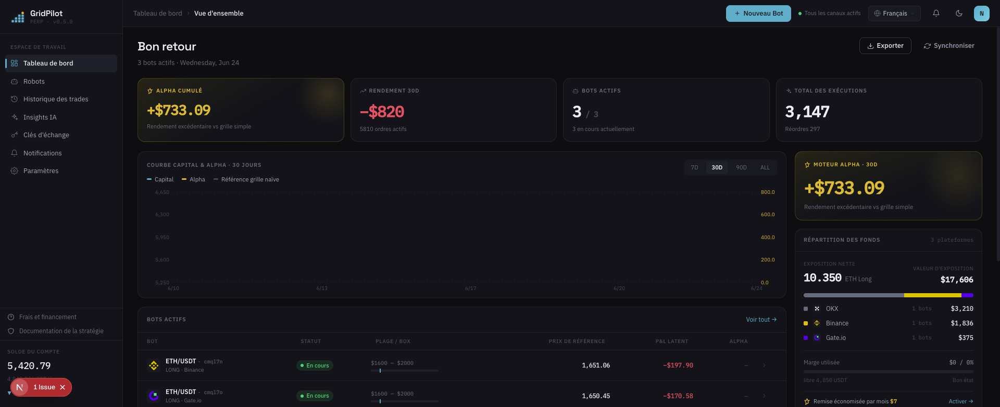
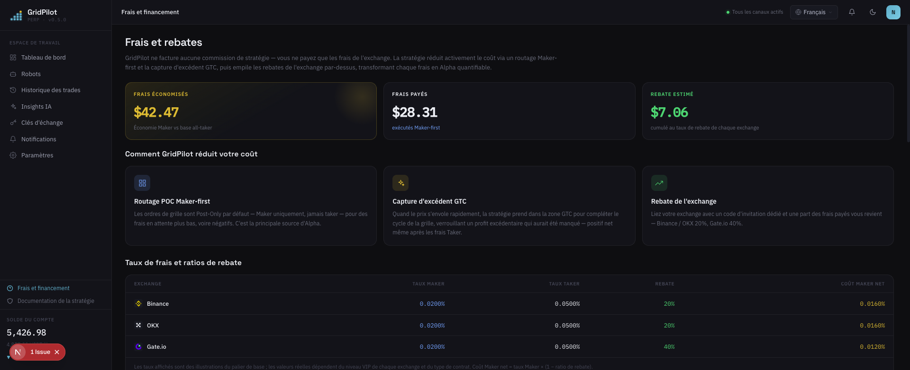

# GridPilot

> Plateforme de trading par **grille dynamique** sur contrats perpétuels ETH/USDT · Compatible Binance / Gate.io / OKX

**Transforme la grille statique « posez et oubliez » des exchanges en un trader qui surveille les marchés 24 h/24, 7 j/7 — et qui redécide à chaque tick.**

- 🧠 **Ordres pilotés par la surveillance** : fini le lot d'ordres statiques posés en croisant les doigts — à chaque mise à jour du marché, le système réévalue avant de passer, modifier ou annuler un ordre, et lorsque le prix fait un grand bond, il capture même un écart supplémentaire au-delà du pas de la grille
- 💸 **~0,03 % de frais économisés par transaction** : des ordres Maker Post-Only par défaut pour profiter des frais réduits ; exécution en taker uniquement lorsque le surprofit dépasse le coût du taker ; refus pur et simple de l'ordre lorsque le prix est défavorable
- 🎯 **Ouverture par suivi — jamais au sommet** : à l'entrée du prix dans la fourchette, on suit d'abord le point bas et on n'ouvre la position qu'après confirmation du rebond, pour éviter de se retrouver coincé dès l'entrée
- 🛡️ **Stop-loss à tampon en couches** : en cas de cassure brève suivie d'un rebond, la position résiduelle en bénéficie directement — pas de frais gaspillés à liquider entièrement puis reconstruire
- 🧭 **Suivi automatique multi-fourchettes** : préconfigurez plusieurs fourchettes non chevauchantes ; celle dans laquelle entre le prix devient active

[简体中文](README.md) · [繁體中文](README.zh-TW.md) · [English](README.en.md) · [日本語](README.ja.md) · [Español](README.es.md) · [العربية](README.ar.md) · **Français** · [Português](README.pt.md) · [Italiano](README.it.md) · [한국어](README.ko.md) · [ไทย](README.th.md) · [Tiếng Việt](README.vi.md)

---

## 📸 Aperçu de l'interface

| Tableau de bord · Vue d'ensemble | Frais et rétrocessions |
|:---:|:---:|
|  |  |

> Thème de marque vert sarcelle foncé · Polices Space Grotesk / IBM Plex · 12 langues intégrées, l'interface s'adapte au changement de langue.

## 🎯 Pourquoi le trading par grille ?

Le trading par grille découpe une fourchette de prix en plusieurs « lignes de grille » : à chaque baisse d'un cran, on achète ; à chaque hausse d'un cran, on vend — **acheter bas et vendre haut de manière répétée dans un marché de fluctuation, en transformant la volatilité elle-même en gains**. Il ne prédit ni la hausse ni la baisse, il ne fait que profiter de l'écart des oscillations à l'intérieur de la fourchette ; il convient donc particulièrement aux marchés sans tendance claire, qui oscillent de haut en bas.

Comparé au « buy and hold » : la stratégie d'achat-conservation ne génère un profit qu'en cas de hausse finale ; la grille, elle, accumule en continu de petits profits dans un marché latéral. La contrepartie, c'est qu'elle nécessite une gestion continue des ordres et un contrôle du risque — et c'est précisément la partie que GridPilot automatise pour vous.

> ⚠️ Le trading par grille n'est pas un gain garanti : en cas de baisse unilatérale, il subit toujours des pertes latentes, et l'effet de levier amplifie le risque. Comprenez d'abord la stratégie avant d'investir.

## 🚀 Nos 5 innovations majeures par rapport aux grilles natives des exchanges

Le robot de grille intégré aux exchanges consiste essentiellement à « poser une fois un lot d'ordres statiques, les laisser immobiles, et attendre que le marché vienne les percuter ». La différence fondamentale de GridPilot, c'est qu'il **simule par programme un trader expérimenté qui surveille les marchés** :

| Dimension | Grille native de l'exchange | GridPilot |
|------|----------------|-----------|
| **Mode de passage d'ordre** | Ordres statiques posés par lots, immobiles une fois placés | Surveillance automatisée : à chaque mise à jour du marché, réévaluation avant d'agir, puis passage/modification/annulation dynamique d'ordres ; à tout instant, il n'y a pas nécessairement d'ordre en attente |
| **Frais** | Aucune distinction entre exécution active et passive | Tarification à trois zones : zone POC en ordre Maker (économie d'~0,03 %), zone GTC en taker autorisé pour verrouiller le surprofit, zone coupe-circuit refusant l'ordre |
| **Moment d'ouverture de position** | Ouverture immédiate à l'entrée dans la fourchette | Ouverture par suivi : à l'entrée dans la fourchette, on suit d'abord le point bas, et on n'ouvre la position qu'après confirmation du rebond, évitant de se retrouver coincé en haut dès l'ouverture |
| **Stop-loss** | Liquidation unique à un seul niveau de prix | Réduction de position en couches via ordres algorithmiques tampons : en cas de cassure brève suivie d'un rebond, la position résiduelle en bénéficie directement, économisant les frais de reconstruction |
| **Adaptation au marché** | Fourchette unique fixe | Plusieurs fourchettes non chevauchantes : c'est la fourchette dans laquelle entre le prix qui s'active, les autres restent en veille |

1. **Une logique de surveillance : observer d'abord, décider ensuite** : le système ne juge la relation entre le prix actuel et le prix cible qu'à chaque réception du marché — si les conditions sont défavorables, il s'abstient et observe ; ce n'est que si les conditions sont favorables qu'il se positionne au meilleur prix, et lorsque le prix fait un grand bond, il peut même capturer un écart supplémentaire dépassant le pas de la grille.
2. **Maker prioritaire / Taker autorisé / coupe-circuit défavorable** : par défaut, des ordres Maker Post-Only sont placés pour bénéficier de frais plus bas ; ce n'est que lorsque le profit supplémentaire dépasse le coût du taker et que l'opportunité est fugace qu'il prend l'initiative d'exécuter en taker ; lorsque le prix actuel est plus cher que le prix d'achat cible, l'ordre est directement refusé pour éviter d'acheter haut et de vendre bas.
3. **Ouverture par suivi** : éviter de rester coincé après une ouverture au sommet.
4. **Stop-loss algorithmique en couches** : préserver la capacité de récupération en cas de rebond.
5. **Plusieurs fourchettes de prix** : où que le prix aille, la stratégie le suit.

> Voir le principe complet de la stratégie dans [`docs/STRATEGY_SPEC.md`](docs/STRATEGY_SPEC.md).

## ✨ Aperçu des fonctionnalités

- **Plusieurs fourchettes de prix** : préconfigurez plusieurs fourchettes non chevauchantes (par ex. 2000–2600, 2600–3200) ; c'est la fourchette dans laquelle entre le prix qui s'active
- **Ouverture par suivi** : suivre le point bas et n'ouvrir la position qu'après confirmation du rebond
- **Tarification dynamique à trois zones** : Maker en zone POC, verrouillage du surprofit en zone GTC, refus d'ordre en zone coupe-circuit
- **Tampon de stop-loss en couches** : ordres conditionnels algorithmiques sur plusieurs paliers sous la grille principale, réduisant la position par couches
- **Diffusion WebSocket en temps réel** : Ticker / exécutions / événements de la machine à états synchronisés en temps réel avec le frontend
- **Support multi-exchanges** : interface d'adaptateur unifiée, compatible Binance, Gate.io, OKX
- **Interface multilingue** : 12 langues intégrées

## 💰 Comprendre les frais et économiser à l'inscription avec un code de parrainage (sponsor rebateto.me)

Les frais sont prélevés par l'exchange, **GridPilot n'en prend pas un centime**. Pour une même transaction, l'ordre passif (Maker) ≈0,02 %, l'ordre actif (Taker) ≈0,05 %. Sous l'effet de levier et d'une grille à haute fréquence, les frais sont discrètement amplifiés et, jour après jour, ce n'est pas négligeable — GridPilot place par défaut des ordres Maker pour vous, économisant environ 0,03 % par ordre, et n'exécute en taker que lorsque l'opportunité est fugace.

Pour aller plus loin : **en renseignant un code de rétrocession lors de l'inscription à l'exchange, vous pouvez vous faire restituer durablement environ 20 % des frais déjà payés (Gate 40 %), crédités automatiquement** — c'est comme une remise supplémentaire sur chaque transaction.

> ⚠️ On ne peut s'inscrire qu'une seule fois par exchange, et la rétrocession ne peut être liée qu'au moment de l'inscription. **Les anciens comptes ne peuvent pas le rattraper — c'est l'unique occasion.**

**Sponsor [rebateto.me](https://rebateto.me)** recense et maintient les points d'inscription avec rétrocession pour chaque exchange. Lors de l'inscription, utilisez les codes de parrainage suivants :

| Exchange | Code de parrainage | Taux de rétrocession |
|--------|--------|----------|
| Binance | `fanwo20` | 20% |
| OKX | `fangeiwo` | 20% |
| Gate.io | `fangeiwo` | 40% |

> Lors de l'inscription via l'application, pensez à saisir manuellement le code de parrainage — l'oublier vous prive de la restitution. Un seul compte par exchange et par pièce d'identité.

## 📦 Installation

**Prérequis** : Node.js ≥ 20, pnpm ≥ 9, Docker

### Méthode 1 : Docker tout-en-un (recommandé pour l'auto-hébergement)

```bash
git clone https://github.com/QuantiaAI/grid-pilot.git && cd grid-pilot
cp .env.example .env
# Génère la clé de chiffrement et renseigne-la dans ENCRYPTION_KEY du fichier .env
openssl rand -base64 32
# Démarre PostgreSQL + Redis + API + Web en une commande (migrations exécutées automatiquement)
docker compose --profile full up --build -d
```

Après le démarrage, accédez à http://localhost:3300 .

> Sans `--profile full`, `docker compose up` ne démarre que l'infrastructure PostgreSQL + Redis, destinée au développement local.

### Méthode 2 : installation locale (recommandée pour le développement)

```bash
git clone https://github.com/QuantiaAI/grid-pilot.git && cd grid-pilot
pnpm install
cp .env.example .env        # ajustez les ports si besoin ; définissez ENCRYPTION_KEY avec la sortie de openssl rand -base64 32
pnpm --filter @gridpilot/api exec prisma generate       # génère le client Prisma (le postinstall est désactivé — cette étape est obligatoire)
pnpm dev:infra              # démarre PostgreSQL + Redis
pnpm exec dotenv -e .env -- pnpm --filter @gridpilot/api exec prisma migrate deploy # première installation uniquement : applique les migrations de la base de données
pnpm dev:skip-infra         # démarre l'API + le Web
```

> Les étapes `prisma generate` / `migrate deploy` ne sont nécessaires qu'une seule fois, lors de la première installation ; ensuite, un simple `pnpm dev` suffit pour tout démarrer.

| Service | Adresse | Option de configuration |
|------|------|--------|
| Frontend | http://localhost:3300 | `WEB_PORT` / `WEB_HOST` |
| API backend | http://localhost:3301 | `API_PORT` / `API_HOST` |
| PostgreSQL | localhost:25432 | `DB_PORT` |
| Redis | localhost:26379 | `REDIS_PORT` |

Démarrage séparé :

```bash
pnpm dev:infra        # PostgreSQL + Redis uniquement
pnpm dev:api          # backend uniquement
pnpm dev:web          # frontend uniquement
pnpm dev:skip-infra   # API + Web, sans docker
```

## 🕹️ Mode d'emploi

1. **Connecter l'exchange** : renseignez l'API Key/Secret dans les paramètres. **N'accordez que la permission de trading de contrats, n'activez jamais la permission de retrait.**
2. **Configurer la grille** : choisissez la paire de trading et la fourchette de prix, définissez le nombre de cellules de la grille principale, le pas, la quantité par cellule, le levier, le tampon de stop-loss et les paramètres d'ouverture par suivi.
3. **Lancer le robot** : passez en ouverture par suivi → exécution ; le frontend affiche en temps réel le marché, les ordres en attente, les exécutions et la machine à états.
4. **Surveiller et clôturer** : le déclenchement du take-profit arrête l'ajout de positions et clôture ; le déclenchement du tampon de stop-loss réduit la position par couches.

Paramètres clés :

| Paramètre | Description |
|------|------|
| `takeProfitPrice` | Prix de take-profit (limite du côté take-profit de la boîte) |
| `mainGridCount` / `mainGridStep` | Nombre de cellules de la grille principale / pas par cellule (USDT) |
| `mainGridPortionSize` | Quantité d'ordre par cellule |
| `leverage` | Multiplicateur de levier |
| `stopLossGridCount` / `stopLossGridStep` | Nombre de cellules / pas de la zone tampon de stop-loss |
| `activationPrice` / `trailingCallbackRate` | Prix d'activation / taux de rappel de l'ouverture par suivi |
| `excessProfitMultiplier` | Multiplicateur de déclenchement de la zone GTC (seuil de surprofit) |

Voir tous les paramètres dans [`docs/STRATEGY_SPEC.md`](docs/STRATEGY_SPEC.md).

## ⚠️ Points d'attention

- **Avertissement sur les risques** : le trading de contrats comporte un fort effet de levier et un risque élevé, pouvant entraîner la perte de la totalité du capital. Ce projet est un outil de trading open source, **il ne constitue aucun conseil en investissement** et n'assume aucune responsabilité quant aux gains ou pertes. Validez d'abord pleinement avec un petit capital ou le testnet de l'exchange.
- **Permissions API** : n'activez que la permission de trading de contrats, **n'activez pas** la permission de retrait.
- **Contrainte du runner unique** : pour une même paire de trading sur un même compte d'exchange, un seul robot peut s'exécuter à la fois.
- **Moment de la rétrocession** : le code de parrainage ne peut être lié qu'au moment de l'inscription, les anciens comptes ne peuvent pas le rattraper.
- **Sécurité des clés** : `ENCRYPTION_KEY` sert à chiffrer les identifiants de l'exchange ; veillez impérativement à utiliser une clé forte générée aléatoirement et à la conserver soigneusement.
- **Conflit de ports** : si les ports locaux 3300/3301 sont occupés par `pnpm dev`, ils entreront en conflit avec les conteneurs Docker tout-en-un ; arrêtez d'abord les processus locaux avant de démarrer les conteneurs, ou modifiez la configuration des ports dans `.env`.

## 🏗️ Pile technique et architecture

| Couche | Technologie |
|------|------|
| Frontend | Next.js 16 · React 19 · Tailwind CSS v4 · Zustand · React Query · Recharts |
| Backend | NestJS 10 · Prisma 5 · BullMQ · Socket.IO |
| Infrastructure | PostgreSQL 16 · Redis 7 · Docker Compose |
| Partagé | TypeScript · pnpm Workspaces · Turborepo |

```
apps/web/          # Frontend Next.js (thème sombre, 12 langues)
apps/api/          # Backend NestJS
packages/shared-types/  # Types partagés entre frontend et backend
docs/              # STRATEGY_SPEC.md (spéc. stratégie) · ARCHITECTURE.md (mapping des composants)
docker-compose.yml # Infrastructure par défaut ; --profile full pour la pile complète
```

**Machine à états de la stratégie** : `TRAILING_ENTRY → RUNNING → LIQUIDATING → LIQUIDATED`, `RUNNING` peut bifurquer vers `TAKE_PROFIT` ; les branches d'exploitation comprennent `PAUSED` (réinitialisable via `USER_RESUME`), `CANCELLED`, `HOLD`.

**Commandes de développement** :

```bash
pnpm dev          # démarre tous les services en une commande
pnpm build        # compilation
pnpm test         # tests
pnpm lint         # Lint
```

**Base de données** (développement local) :

```bash
cd apps/api
pnpm prisma migrate dev    # exécute les migrations
pnpm prisma studio         # visualise les données
```

## Index de la documentation

| Document | Description |
|------|------|
| [`docs/STRATEGY_SPEC.md`](docs/STRATEGY_SPEC.md) | Spécification complète de la stratégie (référence faisant autorité) |
| [`docs/ARCHITECTURE.md`](docs/ARCHITECTURE.md) | Index de correspondance entre les composants de code et les chapitres de la spécification |
| [`docs/fees-and-funding.md`](docs/fees-and-funding.md) | Explication des frais et des frais de financement |
