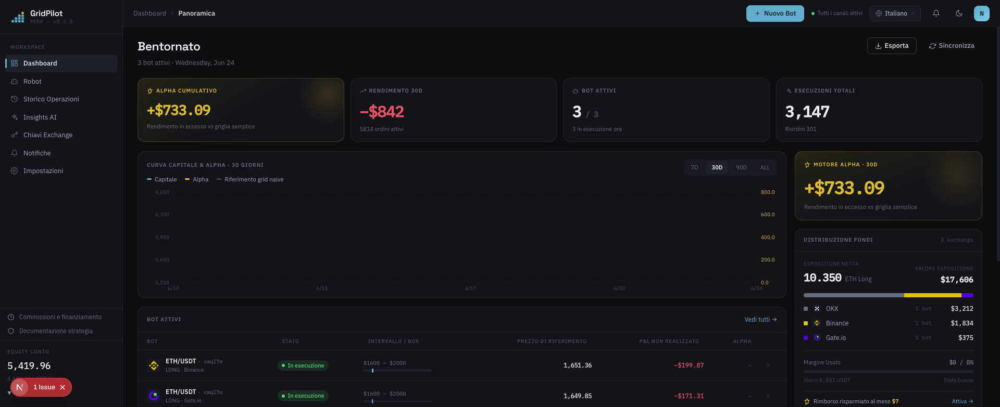
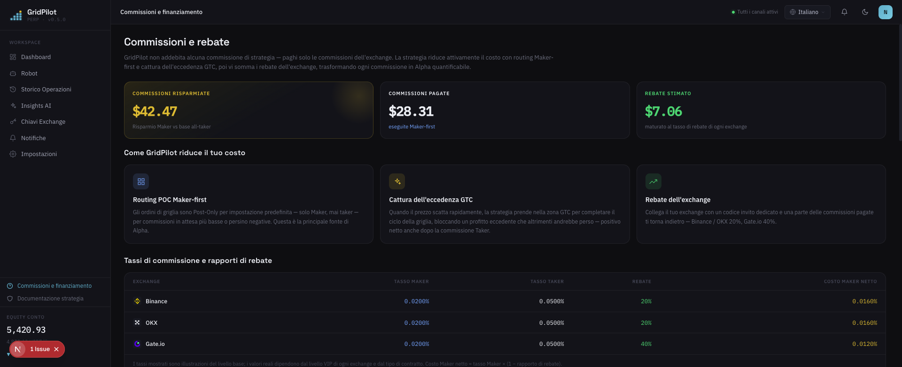

# GridPilot

> Piattaforma di trading a **griglia dinamica** per contratti perpetui ETH/USDT · compatibile con Binance / Gate.io / OKX

**Il bot a griglia integrato negli exchange è un prodotto di un'epoca passata.**

Piazza una batteria di ordini sul book e non ci pensa più — apre senza guardare il prezzo, taglia tutto allo stop loss, e quando il mercato salta si accontenta del prezzo morto sulla linea della griglia. GridPilot è un trader che segue i grafici 24 ore su 24, 7 giorni su 7: **a ogni movimento di mercato ridecide se intervenire e a quale prezzo.**

[简体中文](README.md) · [繁體中文](README.zh-TW.md) · [English](README.en.md) · [日本語](README.ja.md) · [Español](README.es.md) · [العربية](README.ar.md) · [Français](README.fr.md) · [Português](README.pt.md) · **Italiano** · [한국어](README.ko.md) · [ไทย](README.th.md) · [Tiếng Việt](README.vi.md)

---

## 📸 Anteprima dell'interfaccia

| Dashboard · Panoramica | Commissioni e rimborsi |
|:---:|:---:|
|  |  |

> Tema brand verde-acqua scuro · font Space Grotesk / IBM Plex · 12 lingue integrate, l'interfaccia cambia con la lingua.

## 🎯 Perché il trading a griglia?

Il trading a griglia divide un intervallo di prezzo in più "linee della griglia": a ogni discesa di un livello si compra, a ogni salita di un livello si vende — **in un mercato laterale si compra basso e si vende alto ripetutamente, trasformando la volatilità stessa in profitto**. Non prevede i rialzi o i ribassi, guadagna solo sulla differenza delle oscillazioni di andata e ritorno all'interno dell'intervallo, quindi è particolarmente adatto a mercati privi di una tendenza chiara, che oscillano su e giù.

Rispetto al "compra e mantieni": il "compra e mantieni" guadagna solo se alla fine il prezzo sale; la griglia accumula in continuazione piccoli profitti durante le fasi laterali. Il prezzo da pagare è la necessità di gestire costantemente gli ordini e controllare il rischio — ed è proprio questa la parte che GridPilot automatizza al posto tuo.

> ⚠️ Il trading a griglia non garantisce profitti: in caso di ribasso unilaterale si subiscono comunque perdite latenti, e la leva amplifica il rischio. Comprendi la strategia prima di investire.

## 🤔 Prima di usare una griglia, fatti queste cinque domande

**Il prezzo sta ancora scendendo — perché la griglia si affretta a riempire la posizione proprio sul massimo?**
La griglia nativa apre appena il prezzo entra nell'intervallo. GridPilot usa l'**apertura con trailing**: segue prima il minimo ed entra solo dopo che un rimbalzo dello 0,2% conferma la tenuta — niente tentativi di indovinare il fondo, niente posizioni incastrate dal primo minuto.

**Il mercato si muove ogni secondo — perché i tuoi ordini, una volta piazzati, non si muovono più?**
GridPilot ridecide a ogni aggiornamento di mercato: annulla quando serve, modifica quando serve, e in qualsiasi istante sul book potrebbe non esserci alcun ordine. Quando il prezzo è sfavorevole rifiuta invece di inseguire; quando può eseguire come Maker (0,02%) non regala mai una commissione Taker (0,05%).

**Il prezzo salta di 5–10 USDT in un colpo solo — la tua griglia sa fare altro oltre a stare a guardare?**
Gli ordini statici possono incassare solo il prezzo morto sulla linea della griglia. Quando lo spread supera di 2 volte la commissione Taker, GridPilot esegue attivamente a mercato e si mette in tasca lo spread extra oltre il passo della griglia — e i test dimostrano che più l'order book di un exchange è "irregolare", maggiore è il rendimento in eccesso.

**Una breve rottura al ribasso — perché liquidare l'intera posizione a mercato in un colpo solo?**
La chiusura con un clic paga la commissione Taker *e* rinuncia al rimbalzo. GridPilot **riduce a scaglioni con ordini limite** nella zona tampone dello stop loss; se il prezzo rimbalza, la posizione residua continua a guadagnare. Solo quando viene violata la linea di liquidazione entra in gioco l'ultimo ordine condizionato di salvaguardia.

**Il prezzo è uscito dall'intervallo da un pezzo — perché la tua griglia gira ancora a vuoto?**
GridPilot preconfigura più intervalli non sovrapposti e attiva quello in cui entra il prezzo. Dopo uno stop loss osserva persino un "periodo di raffreddamento", aspettando un nuovo segnale di stabilizzazione prima di riprendere l'apertura con trailing.

## 📊 Confronto diretto con la griglia nativa degli exchange

| Dimensione | Griglia nativa dell'exchange | GridPilot |
|------|----------------|-----------|
| **Processo decisionale** | Ordini statici di massa, immobili una volta piazzati | Monitoraggio automatizzato: rivaluta a ogni aggiornamento di mercato prima di piazzare/modificare/annullare ordini in modo dinamico; in qualsiasi istante potrebbe non esserci alcun ordine attivo |
| **Qualità di esecuzione** | Gli ordini statici incassano solo il prezzo sulla linea della griglia; lo spread extra di un salto passa oltre | Insegue bid/ask migliori per posizionarsi al prezzo ottimale; esegue attivamente quando lo spread supera 2× la commissione Taker per bloccare il profitto extra; rifiuta direttamente gli ordini a prezzi sfavorevoli |
| **Tempistica di apertura** | Apre la posizione subito all'ingresso nell'intervallo | Apertura con trailing: segue il minimo e costruisce la posizione solo dopo un rimbalzo confermato dello 0,2% |
| **Stop loss** | Liquidazione a mercato in un colpo solo a un unico prezzo | Riduzione a scaglioni con ordini limite nella zona tampone; la posizione residua beneficia direttamente del rimbalzo; un ordine condizionato di salvaguardia sulla linea di liquidazione |
| **Adattamento al mercato** | Un unico intervallo fisso | Più intervalli non sovrapposti: si attiva quello in cui entra il prezzo, gli altri restano dormienti |

> Per il confronto punto per punto con le griglie native degli exchange vedi [`docs/INNOVATIONS.en.md`](docs/INNOVATIONS.en.md); per il principio completo della strategia vedi [`docs/STRATEGY_SPEC.md`](docs/STRATEGY_SPEC.md).

## ✨ Panoramica delle funzionalità

- **Auto-riallineamento indipendente dallo stato**: posizione obiettivo = f(prezzo attuale) — dopo crash, disconnessioni o modifiche manuali alla posizione, al riavvio corregge automaticamente la deviazione
- **Push WebSocket in tempo reale**: eventi Ticker / esecuzioni / macchina a stati sincronizzati in tempo reale verso il frontend
- **Supporto multi-exchange**: interfaccia adapter unificata, compatibile con Binance, Gate.io, OKX
- **Suggerimenti AI per la configurazione del box**: raccomandazioni offline di intervalli e parametri, senza intervenire nelle decisioni di trading in tempo reale
- **Interfaccia multilingue**: 12 lingue integrate

## 💰 Capire le commissioni e risparmiare usando un codice invito alla registrazione (sponsor rebateto.me)

Le commissioni sono riscosse dagli exchange, **GridPilot non trattiene un centesimo**. Per una stessa operazione, Maker ≈0,02%, Taker ≈0,05%. Con la leva e una griglia ad alta frequenza, le commissioni vengono amplificate silenziosamente e, accumulandosi giorno dopo giorno, non sono affatto trascurabili — GridPilot di default piazza ordini Maker al posto tuo, risparmiando circa 0,03% per operazione, ed esegue attivamente solo quando l'opportunità è fugace.

C'è di più: **inserendo un codice di rimborso alla registrazione sull'exchange, puoi farti restituire a lungo termine circa il 20% delle commissioni già pagate (Gate 40%), accreditato automaticamente** — equivale a un ulteriore sconto su ogni operazione.

> ⚠️ Ogni exchange può essere registrato una sola volta, e il rimborso può essere vincolato solo al momento della registrazione, **gli account già esistenti non possono recuperarlo — è l'unica occasione**.

**Sponsor [rebateto.me](https://rebateto.me)** raccoglie e mantiene i punti di accesso alla registrazione con rimborso per i vari exchange. Alla registrazione usa il codice invito:

| Exchange | Codice invito | Percentuale di rimborso |
|--------|--------|----------|
| Binance | `fanwo20` | 20% |
| OKX | `fangeiwo` | 20% |
| Gate.io | `fangeiwo` | 40% |

> Quando ti registri tramite l'App, ricordati di inserire manualmente il codice invito — se lo ometti, non otterrai il rimborso. Ogni documento d'identità può aprire un solo account per exchange.

## 📦 Installazione

**Prerequisiti**: Node.js ≥ 20, pnpm ≥ 9, Docker

### Metodo 1: stack completo Docker in un comando (consigliato per il self-hosting)

```bash
git clone https://github.com/QuantiaAI/grid-pilot.git && cd grid-pilot
cp .env.example .env
# Genera la chiave di crittografia e inseriscila in ENCRYPTION_KEY nel file .env
openssl rand -base64 32
# Avvia in un comando PostgreSQL + Redis + API + Web (esegue automaticamente le migrazioni del database)
docker compose --profile full up --build -d
```

Dopo l'avvio, visita http://localhost:3300 .

> Senza `--profile full`, `docker compose up` avvia solo l'infrastruttura PostgreSQL + Redis, per lo sviluppo locale.

### Metodo 2: installazione locale (consigliato per lo sviluppo)

```bash
git clone https://github.com/QuantiaAI/grid-pilot.git && cd grid-pilot
pnpm install
cp .env.example .env        # regola le porte se necessario; imposta ENCRYPTION_KEY con l'output di openssl rand -base64 32
pnpm --filter @gridpilot/api exec prisma generate       # genera il Prisma Client (il postinstall è disabilitato — questo passaggio è obbligatorio)
pnpm dev:infra              # avvia PostgreSQL + Redis
pnpm exec dotenv -e .env -- pnpm --filter @gridpilot/api exec prisma migrate deploy # solo alla prima installazione: applica le migrazioni del database
pnpm dev:skip-infra         # avvia API + Web
```

> I passaggi `prisma generate` / `migrate deploy` sono necessari solo alla prima installazione; in seguito basta eseguire `pnpm dev` per avviare tutto.

| Servizio | Indirizzo | Opzione di configurazione |
|------|------|--------|
| Frontend | http://localhost:3300 | `WEB_PORT` / `WEB_HOST` |
| API backend | http://localhost:3301 | `API_PORT` / `API_HOST` |
| PostgreSQL | localhost:25432 | `DB_PORT` |
| Redis | localhost:26379 | `REDIS_PORT` |

Avvio separato:

```bash
pnpm dev:infra        # Solo PostgreSQL + Redis
pnpm dev:api          # Solo backend
pnpm dev:web          # Solo frontend
pnpm dev:skip-infra   # API + Web, salta docker
```

## 🕹️ Istruzioni per l'uso

1. **Connetti l'exchange**: nelle impostazioni inserisci API Key/Secret. **Concedi solo il permesso di trading sui contratti, non abilitare mai il permesso di prelievo.**
2. **Configura la griglia**: scegli la coppia di trading e l'intervallo di prezzo, imposta numero di griglie principali, passo, quantità per griglia, leva, tampone di stop loss e parametri di apertura con trailing.
3. **Avvia il bot**: entra in apertura con trailing → in esecuzione, il frontend mostra in tempo reale mercato, ordini, esecuzioni e macchina a stati.
4. **Monitoraggio e chiusura**: l'attivazione del take profit interrompe gli incrementi e avvia la chiusura; l'attivazione del tampone di stop loss riduce la posizione a più livelli.

Parametri chiave:

| Parametro | Descrizione |
|------|------|
| `takeProfitPrice` | Prezzo di take profit (confine superiore del box) |
| `mainGridCount` / `mainGridStep` | Numero di griglie principali / passo per griglia (USDT) |
| `mainGridPortionSize` | Quantità d'ordine per griglia |
| `leverage` | Moltiplicatore di leva |
| `stopLossGridCount` / `stopLossGridStep` | Numero di griglie / passo della zona tampone di stop loss |
| `activationPrice` / `trailingCallbackRate` | Prezzo di attivazione apertura con trailing / ampiezza di callback |
| `excessProfitMultiplier` | Moltiplicatore di trigger della zona GTC (soglia del profitto in eccesso) |

Per i parametri completi vedi [`docs/STRATEGY_SPEC.md`](docs/STRATEGY_SPEC.md).

## ⚠️ Avvertenze

- **Esclusione di responsabilità sul rischio**: il trading sui contratti comporta leva elevata e rischio elevato, e può portare alla perdita dell'intero capitale. Questo progetto è uno strumento di trading open source, **non costituisce alcun consiglio di investimento** e non risponde di profitti o perdite. Verifica prima a fondo con piccole somme o sulla testnet dell'exchange.
- **Permessi API**: abilita solo il permesso di trading sui contratti, **non** abilitare il permesso di prelievo.
- **Vincolo a runner singolo**: per la stessa coppia di trading dello stesso account di un exchange, può essere in esecuzione un solo bot alla volta.
- **Tempistica del rimborso**: il codice invito può essere vincolato solo al momento della registrazione, gli account già esistenti non possono inserirlo a posteriori.
- **Sicurezza della chiave**: `ENCRYPTION_KEY` serve a crittografare le credenziali dell'exchange; usa assolutamente una chiave forte generata casualmente e conservala con cura.
- **Conflitto di porte**: se in locale le porte 3300/3301 sono occupate da `pnpm dev`, andranno in conflitto con i container dello stack completo Docker; ferma prima i processi locali e poi avvia i container, oppure modifica la configurazione delle porte nel file `.env`.

## 🏗️ Stack tecnologico e architettura

| Livello | Tecnologia |
|------|------|
| Frontend | Next.js 16 · React 19 · Tailwind CSS v4 · Zustand · React Query · Recharts |
| Backend | NestJS 10 · Prisma 5 · BullMQ · Socket.IO |
| Infrastruttura | PostgreSQL 16 · Redis 7 · Docker Compose |
| Condivisi | TypeScript · pnpm Workspaces · Turborepo |

```
apps/web/          # Frontend Next.js (tema scuro, 12 lingue)
apps/api/          # Backend NestJS
packages/shared-types/  # Tipi condivisi tra frontend e backend
docs/              # STRATEGY_SPEC.md (specifica della strategia) · ARCHITECTURE.md (mappatura dei componenti)
docker-compose.yml # Infrastruttura di default; --profile full per lo stack completo
```

**Macchina a stati della strategia**: `TRAILING_ENTRY → RUNNING → LIQUIDATING → LIQUIDATED`, da `RUNNING` si può ramificare verso `TAKE_PROFIT`; i rami operativi includono `PAUSED` (ripristinabile con `USER_RESUME`), `CANCELLED`, `HOLD`.

**Comandi di sviluppo**:

```bash
pnpm dev          # Avvia tutti i servizi in un comando
pnpm build        # Build
pnpm test         # Test
pnpm lint         # Lint
```

**Database** (sviluppo locale):

```bash
cd apps/api
pnpm prisma migrate dev    # Esegui le migrazioni
pnpm prisma studio         # Visualizza i dati
```

## Indice della documentazione

| Documento | Descrizione |
|------|------|
| [`docs/INNOVATIONS.en.md`](docs/INNOVATIONS.en.md) | Spiegazione completa delle innovazioni principali (confronto punto per punto con la griglia nativa) |
| [`docs/STRATEGY_SPEC.md`](docs/STRATEGY_SPEC.md) | Specifica completa della strategia (riferimento autorevole) |
| [`docs/ARCHITECTURE.md`](docs/ARCHITECTURE.md) | Indice di mappatura dai componenti del codice ai capitoli della specifica |
| [`docs/fees-and-funding.md`](docs/fees-and-funding.md) | Spiegazione di commissioni e funding |
