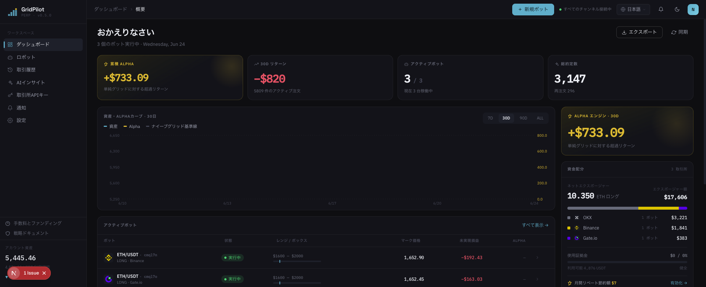
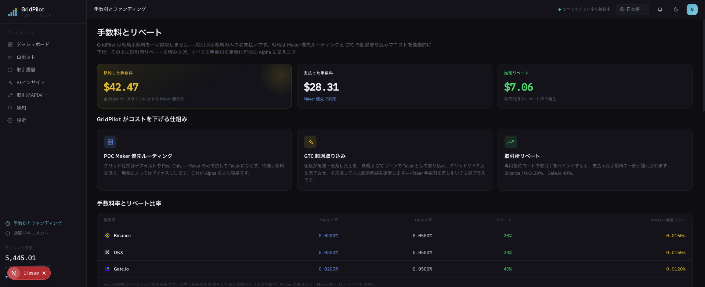

# GridPilot

> ETH/USDT 無期限先物の**ダイナミックグリッド**取引プラットフォーム · Binance / Gate.io / OKX 対応

**取引所に内蔵されているグリッドボットは、もう一昔前の製品です。**

注文の束を板に並べたら、あとは知らんぷり——建玉は価格を問わず、ストップロスは一律の一括決済、価格が飛べばグリッドライン上の固定価格しか取れません。GridPilot は 7×24 時間相場に張り付くトレーダーです：**ティックのたびに、手を出すべきか、いくらで出すべきかを判断し直します。**

[简体中文](README.md) · [繁體中文](README.zh-TW.md) · [English](README.en.md) · **日本語** · [Español](README.es.md) · [العربية](README.ar.md) · [Français](README.fr.md) · [Português](README.pt.md) · [Italiano](README.it.md) · [한국어](README.ko.md) · [ไทย](README.th.md) · [Tiếng Việt](README.vi.md)

---

## 📸 画面プレビュー

| ダッシュボード · 概要 | 手数料とリベート |
|:---:|:---:|
|  |  |

> ディープティール基調のブランドテーマ · Space Grotesk / IBM Plex フォント · 12 言語を内蔵し、言語切り替えで UI も連動します。

## 🎯 なぜグリッド取引なのか？

グリッド取引は、ある価格レンジを複数の「グリッドライン」に分割し、価格が 1 マス下がるごとに買い、1 マス上がるごとに売ります——**レンジ相場の中で繰り返し高値で売り安値で買い、ボラティリティそのものを収益に変えるのです**。上昇・下落を予測するのではなく、レンジ内を行き来する値動きの差額だけを稼ぐため、明確なトレンドがなく上下に振れる相場に特に適しています。

「バイ・アンド・ホールド」と比べると、バイ・アンド・ホールドは最終的に上昇したときだけ利益が出ます。一方グリッドは、横ばいの揉み合いの中で小さな利益を一つひとつ積み上げ続けます。その代償として、注文を継続的に管理しリスクをコントロールする必要があります——まさにそこを GridPilot が自動化してくれる部分です。

> ⚠️ グリッド取引は必ず儲かるわけではありません。一方向に下落する局面では含み損を抱えることもあり、レバレッジはリスクを増幅します。投入する前に必ず戦略を理解してください。

## 🤔 グリッドを使う前に、自分に聞くべき 5 つの質問

**価格がまだ下がっているのに、なぜグリッドは天井で建玉を積み上げてしまうのか？**
ネイティブグリッドは価格がレンジに入った瞬間に即座に建玉します。GridPilot の**トラッキングエントリー**は、まず安値に追随し、0.2% の反発で底固めを確認してからエントリー——底値を当てにいかず、高値掴みの棒持ちもしません。

**相場は毎秒動いているのに、なぜあなたの注文は出したまま微動だにしないのか？**
GridPilot は相場が更新されるたびに判断し直します。キャンセルすべきときはキャンセルし、修正すべきときは修正し、ある瞬間には板に注文が 1 枚もないことすらあります。価格が不利なら追いかけるより拒否を選び、Maker（0.02%）で置けるのに無駄に Taker（0.05%）を払うことはありません。

**価格が一気に 5〜10 USDT 跳んだとき、あなたのグリッドは指をくわえて眺める以外に何ができますか？**
静的な注文はグリッドライン上の固定価格しか取れません。GridPilot は値幅が Taker 手数料の 2 倍を超えたとき、能動的に成行で約定してグリッドのステップ幅を超えるジャンプの超過値幅をポケットに収めます——実測では、板がざらついている取引所ほど超過リターンが高くなります。

**一時的な割り込みに過ぎないのに、なぜ全建玉を成行で一括決済してしまうのか？**
一括決済は Taker 手数料を払ううえに、反発の機会まで手放します。GridPilot はストップロスバッファ内で**グリッドごとに指値で減玉**し、価格が反発すれば残り建玉はそのまま稼ぎ続けます。清算ラインを割り込んだときだけ、最後の 1 枚のバックストップ条件注文が一括で引き継ぎます。

**価格はとっくにレンジの外に出ているのに、なぜあなたのグリッドはその場で空転し続けるのか？**
GridPilot は重ならない複数レンジを事前設定し、価格が入ったレンジだけを有効化します。ストップロス後は「クールダウン期」に入り、再び底固めのシグナルが現れてからトラッキングエントリーを再開します。

## 📊 取引所ネイティブグリッドとの正面对決

| 観点 | 取引所ネイティブグリッド | GridPilot |
|------|----------------|-----------|
| **判断方式** | 一括の静的注文、出したら動かさない | 自動張り付き：相場が更新されるたびに判断し直してから動的に発注／変更／キャンセル。いかなる時点にも注文が出ているとは限らない |
| **約定品質** | 静的注文はグリッドラインの価格しか取れず、ジャンプ時の超過値幅は取り逃す | 買い気配／売り気配の最良価格に張り付き、値幅が手数料の 2 倍を超えたら能動的に成行で超過利益を確定。不利な価格では発注自体を拒否 |
| **建玉タイミング** | レンジ進入で即座に建玉 | トラッキングエントリー：安値に追随し、0.2% の反発を確認してから建玉 |
| **ストップロス** | 単一価格で成行一括決済 | ストップロスバッファ内でグリッドごとに指値減玉。反発すれば残り建玉がそのまま恩恵を受け、清算ラインにはバックストップ条件注文を 1 枚配置 |
| **相場適応** | 固定された単一レンジ | 重ならない複数レンジ。価格が入ったレンジだけ有効化し、他は休眠 |

> 取引所グリッドとの項目別比較を網羅したイノベーション全解は [`docs/INNOVATIONS.en.md`](docs/INNOVATIONS.en.md) を、完全な戦略原理は [`docs/STRATEGY_SPEC.md`](docs/STRATEGY_SPEC.md) を参照してください。

## ✨ 機能概要

- **ステートレス自己修復**：目標建玉 = f（現在価格）。クラッシュ／切断／手動での建玉変更後も、再起動すれば自動で是正
- **リアルタイム WebSocket 配信**：Ticker／約定／ステートマシンイベントをフロントエンドにリアルタイム同期
- **マルチ取引所対応**：統一されたアダプターインターフェースで、Binance、Gate.io、OKX に対応
- **AI ボックス設定提案**：レンジとパラメータをオフラインで推奨し、リアルタイムの取引判断には介入しない
- **多言語 UI**：12 言語を内蔵

## 💰 手数料を理解し、登録時に招待コードで節約（スポンサー rebateto.me）

手数料は取引所が徴収するもので、**GridPilot は一切抜きません**。同じ 1 回の取引でも、Maker（指値）は約 0.02%、Taker（成行）は約 0.05% です。レバレッジと高頻度グリッドのもとでは、手数料はひそかに増幅され、積もり積もると決して小さくありません——GridPilot はデフォルトであなたの代わりに Maker 注文を出し、1 回あたり約 0.03% を節約し、チャンスが一瞬で消える場合にのみ能動的に Taker を取りにいきます。

さらに一歩進んで、**取引所に登録するときにリベートコードを 1 つ記入するだけで、すでに支払った手数料を長期にわたって約 20%（Gate は 40%）返還してもらえ、自動的に着金します**——いわば 1 回ごとの取引にさらに割引をかけるようなものです。

> ⚠️ 各取引所は一度しか登録できず、リベートは登録時にのみ紐付けでき、**既存アカウントでは後から追加できません——これが唯一のチャンスです**。

**スポンサー [rebateto.me](https://rebateto.me)** が各取引所のリベート登録入口をまとめて維持しています。登録時は次の招待コードをお使いください：

| 取引所 | 招待コード | リベート比率 |
|--------|--------|----------|
| Binance | `fanwo20` | 20% |
| OKX | `fangeiwo` | 20% |
| Gate.io | `fangeiwo` | 40% |

> アプリで登録する際は招待コードを手動で記入するのを忘れずに——記入漏れすると返還を受けられません。身分証 1 つにつき各取引所で 1 アカウントまでです。

## 📦 インストール

**前提依存**：Node.js ≥ 20、pnpm ≥ 9、Docker

### 方法その一：Docker ワンコマンドでフルスタック（セルフホスト推奨）

```bash
git clone https://github.com/QuantiaAI/grid-pilot.git && cd grid-pilot
cp .env.example .env
# 暗号化キーを生成し、.env の ENCRYPTION_KEY に設定
openssl rand -base64 32
# PostgreSQL + Redis + API + Web を一括起動（データベースマイグレーションは自動実行）
docker compose --profile full up --build -d
```

起動後、http://localhost:3300 にアクセスしてください。

> `--profile full` を付けない場合、`docker compose up` は PostgreSQL + Redis のインフラのみを起動し、ローカル開発用として使えます。

### 方法その二：ローカルインストール（開発推奨）

```bash
git clone https://github.com/QuantiaAI/grid-pilot.git && cd grid-pilot
pnpm install
cp .env.example .env        # 必要に応じてポートを調整し、ENCRYPTION_KEY には openssl rand -base64 32 の出力を設定
pnpm --filter @gridpilot/api exec prisma generate       # Prisma Client を生成（postinstall は無効化されているため、このステップは必須）
pnpm dev:infra              # PostgreSQL + Redis を起動
pnpm exec dotenv -e .env -- pnpm --filter @gridpilot/api exec prisma migrate deploy # 初回インストール時のみ：データベースマイグレーションを適用
pnpm dev:skip-infra         # API + Web を起動
```

> `prisma generate` / `migrate deploy` は初回インストール時に一度だけ必要です。その後は `pnpm dev` だけで全サービスを起動できます。

| サービス | アドレス | 設定項目 |
|------|------|--------|
| フロントエンド | http://localhost:3300 | `WEB_PORT` / `WEB_HOST` |
| バックエンド API | http://localhost:3301 | `API_PORT` / `API_HOST` |
| PostgreSQL | localhost:25432 | `DB_PORT` |
| Redis | localhost:26379 | `REDIS_PORT` |

個別に起動：

```bash
pnpm dev:infra        # 仅 PostgreSQL + Redis
pnpm dev:api          # 仅后端
pnpm dev:web          # 仅前端
pnpm dev:skip-infra   # API + Web，跳过 docker
```

## 🕹️ 使い方

1. **取引所に接続**：設定で API Key/Secret を記入します。**先物取引権限のみを付与し、出金権限は絶対に有効にしないでください。**
2. **グリッドを設定**：取引ペアと価格レンジを選び、メイングリッドのマス数、ステップ幅、1 マスあたりの数量、レバレッジ、ストップロスバッファ、トラッキングエントリーのパラメータを設定します。
3. **ボットを起動**：トラッキングエントリーに入り → 実行すると、フロントエンドが相場、注文、約定、ステートマシンをリアルタイムで表示します。
4. **監視と仕上げ**：利確を発動すると加玉を停止して仕上げに入り、ストップロスバッファを発動すると階層的に減玉します。

主要パラメータ：

| パラメータ | 説明 |
|------|------|
| `takeProfitPrice` | 利確価格（ボックスの利確側境界） |
| `mainGridCount` / `mainGridStep` | メイングリッドのマス数／1 マスあたりのステップ幅（USDT） |
| `mainGridPortionSize` | 1 マスあたりの発注数量 |
| `leverage` | レバレッジ倍率 |
| `stopLossGridCount` / `stopLossGridStep` | ストップロスバッファ域のマス数／ステップ幅 |
| `activationPrice` / `trailingCallbackRate` | トラッキングエントリーの起動価格／コールバック幅 |
| `excessProfitMultiplier` | GTC レンジの発動倍率（超過利益のしきい値） |

完全なパラメータは [`docs/STRATEGY_SPEC.md`](docs/STRATEGY_SPEC.md) を参照してください。

## ⚠️ 注意事項

- **リスク免責**：先物取引は高レバレッジ・高リスクであり、元本のすべてを失う可能性があります。本プロジェクトはオープンソースの取引ツールであり、**いかなる投資助言も構成しません**。損益について責任を負いません。まず少額の資金または取引所のテストネットで十分に検証してください。
- **API 権限**：先物取引権限のみを開放し、出金権限は**有効にしないでください**。
- **単一 runner の制約**：同一取引所アカウントの同一取引ペアでは、同時に 1 つのボットしか実行できません。
- **リベートのタイミング**：招待コードは登録時にのみ紐付けでき、既存アカウントでは後から記入できません。
- **鍵のセキュリティ**：`ENCRYPTION_KEY` は取引所の認証情報を暗号化するために使われます。必ずランダムに生成した強力な鍵を使い、適切に保管してください。
- **ポート競合**：ローカルの 3300/3301 ポートが `pnpm dev` に占有されていると、Docker フルスタックのコンテナと競合します。先にローカルプロセスを停止してからコンテナを起動するか、`.env` のポート設定を変更してください。

## 🏗️ 技術スタックとアーキテクチャ

| レイヤー | 技術 |
|------|------|
| フロントエンド | Next.js 16 · React 19 · Tailwind CSS v4 · Zustand · React Query · Recharts |
| バックエンド | NestJS 10 · Prisma 5 · BullMQ · Socket.IO |
| インフラ | PostgreSQL 16 · Redis 7 · Docker Compose |
| 共有 | TypeScript · pnpm Workspaces · Turborepo |

```
apps/web/          # Next.js 前端（暗色主题，12 语）
apps/api/          # NestJS 后端
packages/shared-types/  # 前后端共享类型
docs/              # STRATEGY_SPEC.md（策略规格）· ARCHITECTURE.md（组件映射）
docker-compose.yml # 默认基础设施；--profile full 全栈
```

**戦略ステートマシン**：`TRAILING_ENTRY → RUNNING → LIQUIDATING → LIQUIDATED`、`RUNNING` は `TAKE_PROFIT` へ分岐可能。運用分岐には `PAUSED`（`USER_RESUME` で復帰可能）、`CANCELLED`、`HOLD` が含まれます。

**開発コマンド**：

```bash
pnpm dev          # 一键起所有服务
pnpm build        # 构建
pnpm test         # 测试
pnpm lint         # Lint
```

**データベース**（ローカル開発）：

```bash
cd apps/api
pnpm prisma migrate dev    # 执行迁移
pnpm prisma studio         # 查看数据
```

## ドキュメント索引

| ドキュメント | 説明 |
|------|------|
| [`docs/INNOVATIONS.en.md`](docs/INNOVATIONS.en.md) | コアとなるイノベーションの全解説（取引所ネイティブグリッドとの項目別比較） |
| [`docs/STRATEGY_SPEC.md`](docs/STRATEGY_SPEC.md) | 完全な戦略仕様書（権威ある参照） |
| [`docs/ARCHITECTURE.md`](docs/ARCHITECTURE.md) | コードコンポーネントから仕様章節へのマッピング索引 |
| [`docs/fees-and-funding.md`](docs/fees-and-funding.md) | 手数料と資金調達手数料の説明 |
