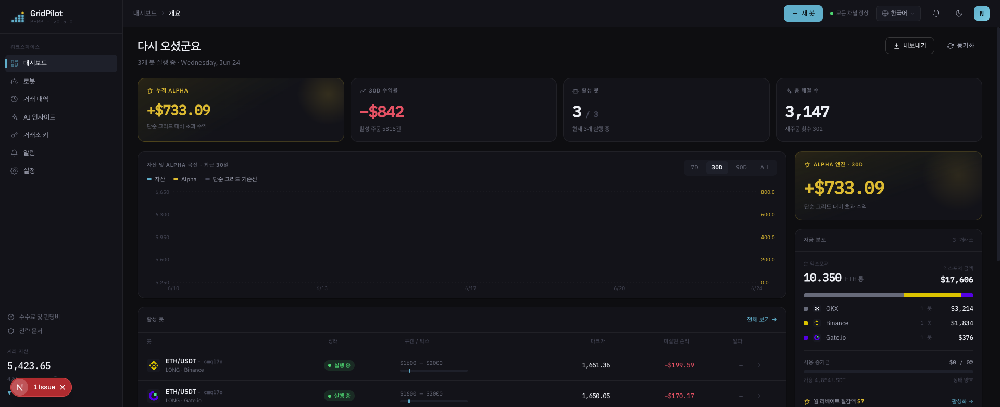
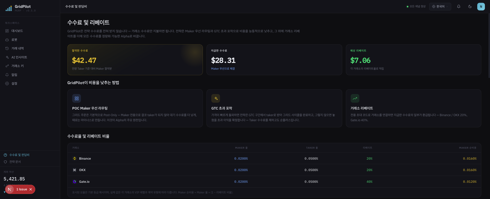

# GridPilot

> ETH/USDT 무기한 계약 **동적 그리드** 트레이딩 플랫폼 · Binance / Gate.io / OKX 호환

**거래소에 내장된 그리드 봇은 지난 시대의 유물입니다.**

주문 한 묶음을 호가창에 걸어두고는 다시는 돌아보지 않습니다——진입할 때 가격을 따지지 않고, 손절은 무조건 전량 청산, 가격이 점프할 때는 그리드 라인의 죽은 가격밖에 먹지 못합니다. GridPilot은 24시간 난판을 지켜보는 트레이더입니다: **매 틱이 바뀔 때마다 지금 움직여야 할지, 어느 가격에 움직여야 할지를 다시 판단합니다.**

[简体中文](README.md) · [繁體中文](README.zh-TW.md) · [English](README.en.md) · [日本語](README.ja.md) · [Español](README.es.md) · [العربية](README.ar.md) · [Français](README.fr.md) · [Português](README.pt.md) · [Italiano](README.it.md) · **한국어** · [ไทย](README.th.md) · [Tiếng Việt](README.vi.md)

---

## 📸 인터페이스 미리보기

| 대시보드 · 개요 | 수수료 및 리베이트 |
|:---:|:---:|
|  |  |

> 딥 틸(deep teal) 브랜드 테마 · Space Grotesk / IBM Plex 폰트 · 12개 언어 내장, 언어 전환에 따라 인터페이스가 함께 바뀝니다.

## 🎯 왜 그리드 트레이딩인가?

그리드 트레이딩은 하나의 가격 구간을 여러 개의 "그리드 라인"으로 나누어, 가격이 한 칸 떨어질 때마다 매수하고 한 칸 오를 때마다 매도합니다——**박스권 장세에서 반복적으로 고점 매도·저점 매수를 하며 변동성 그 자체를 수익으로 바꿉니다**. 등락을 예측하지 않고, 구간 내 왕복 변동의 차익만 취하기 때문에 명확한 추세 없이 위아래로 진동하는 시장에 특히 적합합니다.

"매수 후 보유(Buy and Hold)"와 비교하면: 매수 후 보유는 최종적으로 가격이 올랐을 때만 수익을 냅니다. 그리드는 횡보·진동 장세에서 자잘한 이익을 꾸준히 쌓아갑니다. 그 대가로 주문을 지속적으로 관리하고 리스크를 통제해야 하는데——바로 이 부분을 GridPilot이 당신을 대신해 자동화합니다.

> ⚠️ 그리드 트레이딩이 무조건 수익을 보장하지는 않습니다: 일방적 하락장에서는 여전히 평가손실이 발생하고, 레버리지는 리스크를 증폭시킵니다. 투입하기 전에 먼저 전략을 충분히 이해하세요.

## 🤔 그리드를 시작하기 전에, 스스로에게 던져야 할 다섯 가지 질문

**가격은 아직 하락 중인데, 그리드는 왜 서둘러 고점에서 포지션을 가득 채우는 걸까요?**
네이티브 그리드는 가격이 구간에 들어서는 순간 바로 포지션을 엽니다. GridPilot은 **추적 진입**을 사용합니다: 저점을 따라가며 기다리다가, 0.2% 반등으로 안정이 확인되어야 비로소 진입합니다——섣불리 바닥을 노리지도, 고점에 물려 서 있지도 않습니다.

**시세는 매초 바뀌는데, 당신의 주문은 왜 한 번 걸면 그대로 멈춰 있나요?**
GridPilot은 시세가 갱신될 때마다 다시 판단합니다: 취소할 건 취소하고, 정정할 건 정정하며, 어떤 순간에는 호가창에 주문이 한 장도 없을 수도 있습니다. 가격이 불리하면 추격하느니 차라리 주문을 거부하고, Maker(0.02%)로 걸 수 있는데 굳이 Taker(0.05%) 수수료를 내는 일은 없습니다.

**가격이 한 번에 5–10 USDT씩 점프할 때, 당신의 그리드는 멀뚱히 지켜보는 것 말고 뭘 할 수 있나요?**
정적 주문은 그리드 라인의 죽은 가격밖에 먹지 못합니다. GridPilot은 차익이 테이커 수수료의 2배를 넘으면 능동적으로 시장가로 체결해, 그리드 스텝을 뛰어넘는 점프 차익을 주머니에 넣습니다——실측 결과, 오더북이 "거칠"수록 초과 수익은 더 커집니다.

**잠깐 깨졌다가 곧 돌아올 하락인데, 왜 포지션 전체를 시장가로 한 번에 썰어버리나요?**
일괄 청산은 Taker 수수료를 내는 데다 반등 기회까지 날려버립니다. GridPilot은 손절 완충 구간에서 **칸마다 지정가로 단계적 감축**을 하고, 가격이 반등하면 남은 포지션이 그대로 이어서 수익을 냅니다. 청산선마저 뚫고 내려갈 때만, 마지막 안전망 조건부 주문이 한 번에 인수합니다.

**가격은 이미 구간을 한참 벗어났는데, 당신의 그리드는 왜 아직도 제자리에서 헛돌고 있나요?**
GridPilot은 겹치지 않는 여러 구간을 미리 설정해 두고, 가격이 어느 구간에 들어오면 그 구간을 활성화합니다. 손절 후에는 "냉각 기간"에 들어가, 안정 신호가 다시 나타날 때까지 기다렸다가 추적 진입을 재개합니다.

## 📊 거래소 네이티브 그리드와의 정면 비교

| 항목 | 거래소 네이티브 그리드 | GridPilot |
|------|----------------|-----------|
| **의사결정 방식** | 일괄 정적 주문, 한 번 걸면 이동하지 않음 | 자동화된 시세 감시: 시세가 갱신될 때마다 다시 판단한 후 동적으로 주문/정정/취소, 임의의 시점에 주문이 없을 수도 있음 |
| **체결 품질** | 정적 주문은 그리드 라인 가격만 먹을 수 있어, 점프 장세의 초과 차익을 눈앞에서 놓침 | 최우선 매수/매도 호가를 따라가 최적가 확보; 차익이 수수료의 2배를 넘으면 능동 체결로 초과 이익 확정; 가격이 불리하면 곧바로 주문 거부 |
| **진입 타이밍** | 구간 진입 즉시 포지션 오픈 | 추적 진입: 저점을 추적하고 0.2% 반등을 확인한 후에야 포지션 구축 |
| **손절** | 단일 가격대에서 시장가로 한 번에 전량 청산 | 손절 완충 구간에서 칸마다 지정가로 단계적 감축, 반등 시 잔여 포지션이 그대로 수익; 청산선에는 안전망 조건부 주문 한 장 배치 |
| **시세 적응** | 고정된 단일 구간 | 겹치지 않는 다중 구간, 가격이 들어온 구간만 활성화되고 나머지는 휴면 |

> 거래소 그리드와의 항목별 혁신 전체 해설은 [`docs/INNOVATIONS.en.md`](docs/INNOVATIONS.en.md)를, 전체 전략 원리는 [`docs/STRATEGY_SPEC.md`](docs/STRATEGY_SPEC.md)를 참고하세요.

## ✨ 기능 개요

- **상태 무관 자가 치유**: 목표 포지션 = f(현재 가격), 크래시/네트워크 단절/수동 포지션 변경 후 재시작하면 자동으로 오차를 바로잡음
- **실시간 WebSocket 푸시**: Ticker / 체결 / 상태 머신 이벤트를 프런트엔드에 실시간 동기화
- **다중 거래소 지원**: 통합 어댑터 인터페이스, Binance / Gate.io / OKX 호환
- **AI 박스권 설정 제안**: 구간과 파라미터를 오프라인으로 추천, 실시간 거래 의사결정에는 개입하지 않음
- **다국어 인터페이스**: 12개 언어 내장

## 💰 수수료를 이해하고, 가입 시 초대 코드로 절약하기 (스폰서 rebateto.me)

수수료는 거래소가 부과하며, **GridPilot은 한 푼도 떼지 않습니다**. 동일한 거래에서 메이커(Maker)는 약 0.02%, 테이커(Taker)는 약 0.05%입니다. 레버리지와 고빈도 그리드 환경에서는 수수료가 소리 없이 증폭되어, 쌓이면 결코 적지 않습니다——GridPilot은 기본적으로 당신을 대신해 Maker 주문을 걸어 매 건당 약 0.03%를 절약하고, 기회가 순식간에 사라질 때만 능동적으로 테이커 체결을 합니다.

한 걸음 더 나아가: **거래소에 가입할 때 리베이트 코드 하나를 입력하면, 이미 지불한 수수료의 약 20%(Gate는 40%)를 장기적으로 자동 환급받을 수 있습니다**——매 거래마다 추가 할인을 받는 셈입니다.

> ⚠️ 거래소마다 한 번만 가입할 수 있고, 리베이트는 가입 시에만 연동할 수 있으며, **기존 계정은 소급 적용 불가——이것이 유일한 기회입니다**.

**스폰서 [rebateto.me](https://rebateto.me)** 가 각 거래소의 리베이트 가입 경로를 모아 관리합니다. 가입 시 다음 초대 코드를 사용하세요:

| 거래소 | 초대 코드 | 리베이트 비율 |
|--------|--------|----------|
| Binance | `fanwo20` | 20% |
| OKX | `fangeiwo` | 20% |
| Gate.io | `fangeiwo` | 40% |

> 앱으로 가입할 때는 초대 코드를 수동으로 입력하는 것을 잊지 마세요——누락하면 환급을 받지 못합니다. 신분증 하나당 거래소별로 계정 하나만 개설할 수 있습니다.

## 📦 설치

**사전 의존성**: Node.js ≥ 20, pnpm ≥ 9, Docker

### 방법 1: Docker 원클릭 풀스택 (셀프 호스팅 권장)

```bash
git clone https://github.com/QuantiaAI/grid-pilot.git && cd grid-pilot
cp .env.example .env
# 암호화 키를 생성하여 .env 의 ENCRYPTION_KEY 에 입력
openssl rand -base64 32
# 원클릭으로 PostgreSQL + Redis + API + Web 기동(데이터베이스 마이그레이션 자동 실행)
docker compose --profile full up --build -d
```

기동 후 http://localhost:3300 에 접속하세요.

> `--profile full` 없이 `docker compose up` 을 실행하면 PostgreSQL + Redis 인프라만 기동되어 로컬 개발용으로 사용됩니다.

### 방법 2: 로컬 설치 (개발 권장)

```bash
git clone https://github.com/QuantiaAI/grid-pilot.git && cd grid-pilot
pnpm install
cp .env.example .env        # 필요에 따라 포트 조정; ENCRYPTION_KEY 는 openssl rand -base64 32 의 출력으로 설정
pnpm --filter @gridpilot/api exec prisma generate       # Prisma Client 생성(postinstall 이 비활성화되어 있어 필수 단계)
pnpm dev:infra              # PostgreSQL + Redis 기동
pnpm exec dotenv -e .env -- pnpm --filter @gridpilot/api exec prisma migrate deploy # 최초 설치 시에만: 데이터베이스 마이그레이션 적용
pnpm dev:skip-infra         # API + Web 기동
```

> `prisma generate` / `migrate deploy` 단계는 최초 설치 시 한 번만 필요합니다; 이후에는 `pnpm dev` 만 실행하면 모든 서비스가 기동됩니다.

| 서비스 | 주소 | 설정 항목 |
|------|------|--------|
| 프런트엔드 | http://localhost:3300 | `WEB_PORT` / `WEB_HOST` |
| 백엔드 API | http://localhost:3301 | `API_PORT` / `API_HOST` |
| PostgreSQL | localhost:25432 | `DB_PORT` |
| Redis | localhost:26379 | `REDIS_PORT` |

개별 기동:

```bash
pnpm dev:infra        # PostgreSQL + Redis 만
pnpm dev:api          # 백엔드만
pnpm dev:web          # 프런트엔드만
pnpm dev:skip-infra   # API + Web, docker 건너뛰기
```

## 🕹️ 사용 설명

1. **거래소 연결**: 설정에서 API Key/Secret 을 입력합니다. **계약 거래 권한만 부여하고, 출금 권한은 절대 켜지 마세요.**
2. **그리드 설정**: 거래쌍과 가격 구간을 선택하고, 메인 그리드 칸 수, 스텝, 칸당 수량, 레버리지, 손절 완충, 추적 진입 파라미터를 설정합니다.
3. **봇 시작**: 추적 진입 → 실행으로 진입하면, 프런트엔드에서 시세, 주문, 체결, 상태 머신을 실시간으로 표시합니다.
4. **모니터링 및 마무리**: 익절이 트리거되면 추가 매수를 중단하고 마무리하며, 손절 완충이 트리거되면 단계적으로 감축합니다.

핵심 파라미터:

| 파라미터 | 설명 |
|------|------|
| `takeProfitPrice` | 익절가(박스권 익절단 경계) |
| `mainGridCount` / `mainGridStep` | 메인 그리드 칸 수 / 칸당 스텝(USDT) |
| `mainGridPortionSize` | 칸당 주문 수량 |
| `leverage` | 레버리지 배수 |
| `stopLossGridCount` / `stopLossGridStep` | 손절 완충 구간 칸 수 / 스텝 |
| `activationPrice` / `trailingCallbackRate` | 추적 진입 활성화가 / 콜백 폭 |
| `excessProfitMultiplier` | GTC 구간 트리거 배수(초과 이익 임계값) |

전체 파라미터는 [`docs/STRATEGY_SPEC.md`](docs/STRATEGY_SPEC.md)를 참고하세요.

## ⚠️ 주의 사항

- **리스크 면책**: 계약 거래는 고레버리지·고위험으로 원금 전액 손실로 이어질 수 있습니다. 본 프로젝트는 오픈소스 트레이딩 도구로, **어떠한 투자 조언도 구성하지 않으며** 손익에 대해 책임지지 않습니다. 먼저 소액 자금이나 거래소 테스트넷으로 충분히 검증하세요.
- **API 권한**: 계약 거래 권한만 켜고, 출금 권한은 **켜지 마세요**.
- **단일 runner 제약**: 동일한 거래소 계정의 동일한 거래쌍에 대해, 동시에 하나의 봇만 실행할 수 있습니다.
- **리베이트 타이밍**: 초대 코드는 가입 시에만 연동할 수 있고, 기존 계정은 소급 입력이 불가능합니다.
- **키 보안**: `ENCRYPTION_KEY` 는 거래소 자격 증명을 암호화하는 데 사용되므로, 반드시 무작위로 생성한 강력한 키를 사용하고 안전하게 보관하세요.
- **포트 충돌**: 로컬 3300/3301 포트가 `pnpm dev` 에 의해 점유되면 Docker 풀스택 컨테이너와 충돌하므로, 먼저 로컬 프로세스를 중지한 뒤 컨테이너를 기동하거나 `.env` 의 포트 설정을 변경하세요.

## 🏗️ 기술 스택 및 아키텍처

| 계층 | 기술 |
|------|------|
| 프런트엔드 | Next.js 16 · React 19 · Tailwind CSS v4 · Zustand · React Query · Recharts |
| 백엔드 | NestJS 10 · Prisma 5 · BullMQ · Socket.IO |
| 인프라 | PostgreSQL 16 · Redis 7 · Docker Compose |
| 공유 | TypeScript · pnpm Workspaces · Turborepo |

```
apps/web/          # Next.js 프런트엔드(다크 테마, 12개 언어)
apps/api/          # NestJS 백엔드
packages/shared-types/  # 프런트·백엔드 공유 타입
docs/              # STRATEGY_SPEC.md(전략 규격) · ARCHITECTURE.md(컴포넌트 매핑)
docker-compose.yml # 기본 인프라; --profile full 풀스택
```

**전략 상태 머신**: `TRAILING_ENTRY → RUNNING → LIQUIDATING → LIQUIDATED`, `RUNNING` 은 `TAKE_PROFIT` 로 분기 가능; 운영 분기에는 `PAUSED`(`USER_RESUME` 로 복귀 가능), `CANCELLED`, `HOLD` 가 포함됩니다.

**개발 명령어**:

```bash
pnpm dev          # 모든 서비스 원클릭 기동
pnpm build        # 빌드
pnpm test         # 테스트
pnpm lint         # Lint
```

**데이터베이스**(로컬 개발):

```bash
cd apps/api
pnpm prisma migrate dev    # 마이그레이션 실행
pnpm prisma studio         # 데이터 조회
```

## 문서 색인

| 문서 | 설명 |
|------|------|
| [`docs/INNOVATIONS.en.md`](docs/INNOVATIONS.en.md) | 핵심 혁신 전체 해설(거래소 네이티브 그리드와 항목별 비교) |
| [`docs/STRATEGY_SPEC.md`](docs/STRATEGY_SPEC.md) | 전체 전략 규격 명세서(권위 있는 참조) |
| [`docs/ARCHITECTURE.md`](docs/ARCHITECTURE.md) | 코드 컴포넌트에서 규격 챕터로의 매핑 색인 |
| [`docs/fees-and-funding.md`](docs/fees-and-funding.md) | 수수료 및 펀딩비 설명 |
