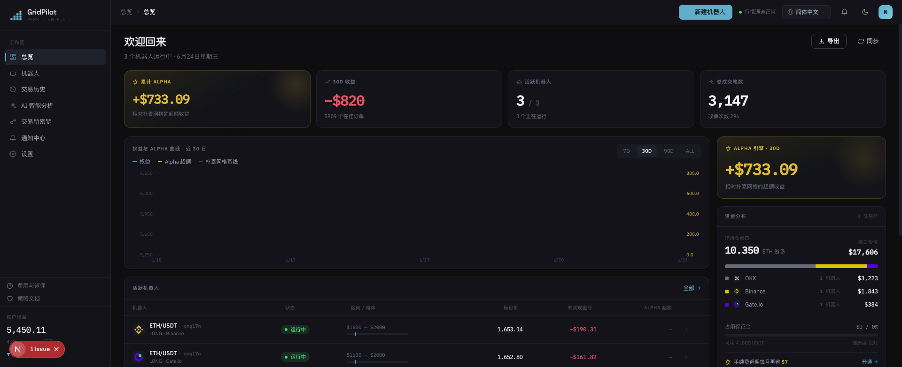
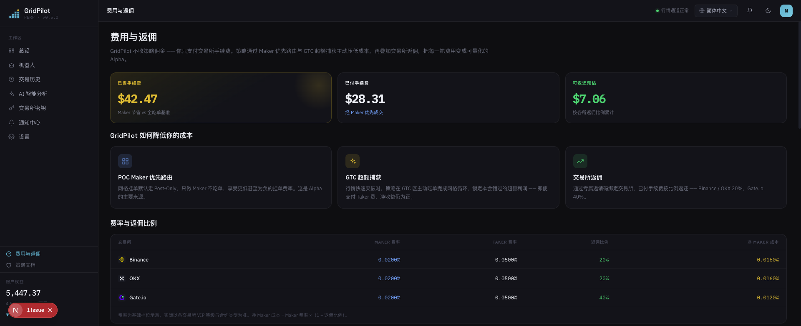

# GridPilot

> ETH/USDT 永续合约**动态网格**交易平台 · 兼容 Binance / Gate.io / OKX

**交易所自带的网格机器人，是上个时代的产品。**

它把一堆订单往盘口一挂就再也不管——建仓不问价位，止损一刀切，行情跳空只能吃到网格线上的死价格。GridPilot 是一位 7×24 小时盯盘的交易员：**每一次行情跳动，它都重新判断该不该出手、该出什么价。**

**简体中文** · [繁體中文](README.zh-TW.md) · [English](README.en.md) · [日本語](README.ja.md) · [Español](README.es.md) · [العربية](README.ar.md) · [Français](README.fr.md) · [Português](README.pt.md) · [Italiano](README.it.md) · [한국어](README.ko.md) · [ไทย](README.th.md) · [Tiếng Việt](README.vi.md)

---

## 📸 界面预览

| 仪表盘 · 总览 | 费用与返佣 |
|:---:|:---:|
|  |  |

> 深青色品牌主题 · Space Grotesk / IBM Plex 字体 · 内置 12 种语言，界面随语言切换。

## 🎯 为什么是网格交易？

网格交易把一段价格区间切成若干"网格线"，价格每跌一格就买、每涨一格就卖——**在震荡行情里反复高抛低吸，把波动本身变成收益**。它不预测涨跌，只赚区间内来回波动的差价，因此特别适合无明确趋势、上下震荡的市场。

与"买入持有"相比：买入持有只在最终上涨时获利；网格在横盘震荡中持续积累一笔笔小利润。代价是需要持续管理订单、控制风险——这正是 GridPilot 要替你自动化的部分。

> ⚠️ 网格交易并非稳赚：单边下跌时仍会浮亏，杠杆会放大风险。请先理解策略再投入。

## 🤔 用网格之前，先问自己五个问题

**价格还在跌，网格为什么急着在山顶把仓位建满？**
原生网格价格一进区间就立即开仓。GridPilot **追踪建仓**：先跟着低点走，反弹 0.2%（默认值，可调）确认企稳才进场——不抄底、不站岗。

**行情每秒都在变，你的订单为什么挂上去就不再动？**
GridPilot 每次行情更新都重新决策：该撤就撤、该改就改，任意时刻盘口上可能一张单都没有；价位不利宁可拒单也不追价，能挂 Maker（0.02%）绝不白交 Taker（0.05%）。

**价格一跳 5–10 USDT，你的网格除了干看着还能做什么？**
静态挂单只能吃到网格线上的死价格。GridPilot 在价差超过吃单手续费 2 倍时主动市价吃单，把超出网格步长的跳跃价差锁进口袋——实测订单簿越"毛糙"的交易所，超额收益越高。

**只是短暂跌破，为什么要把全部仓位一刀市价清仓？**
一键平仓既交 Taker 费，又放弃了反弹。GridPilot 在止损缓冲区**逐格限价减仓**；价格反弹，残余仓位直接接着赚。只有跌穿清算线，最后一张兜底条件单才一次性接管。

**价格早就跑出区间，你的网格为什么还在原地空转？**
GridPilot 预配置多段不重叠区间，价格走进哪段就激活哪段；止损后进入"冷静期"，等重新出现企稳信号才再次追踪建仓。

## 📊 和交易所原生网格正面对比

| 维度 | 交易所原生网格 | GridPilot |
|------|----------------|-----------|
| **决策方式** | 批量静态挂单，挂出后不再移动 | 自动化盯盘：每次行情更新重新判断后才动态下单/改单/撤单，任意时刻不一定有挂单 |
| **成交质量** | 静态单只能吃到网格线价格，跳跃行情的超额价差擦肩而过 | 追买一/卖一卡最优价；价差超 2× 手续费时主动吃单锁定超额利润；价位不利直接拒单 |
| **建仓时机** | 进区间立即开仓 | 追踪建仓：追低点、确认反弹（默认 0.2%）后才建仓 |
| **止损** | 单一价位一次性市价全平 | 止损缓冲区逐格限价减仓，反弹时残余仓位直接受益；清算线留一张兜底条件单 |
| **行情适应** | 固定单一区间 | 多段不重叠区间，价格进哪段激活哪段，其余休眠 |

> 逐项对比交易所网格的创新全解见 [`docs/INNOVATIONS.md`](docs/INNOVATIONS.md)；完整策略原理见 [`docs/STRATEGY_SPEC.md`](docs/STRATEGY_SPEC.md)。

## ✨ 功能概览

- **状态无关自愈**：目标仓位 = f(当前价格)，崩溃/断网/手动改仓后重启自动纠偏
- **实时 WebSocket 推送**：Ticker / 成交 / 状态机事件实时同步前端
- **多交易所支持**：统一适配器接口，兼容 Binance、Gate.io、OKX
- **AI 箱体配置建议**：离线推荐区间与参数，不介入实时交易决策
- **多语言界面**：内置 12 种语言

## 💰 看懂手续费，注册时用邀请码省钱（赞助商 rebateto.me）

手续费由交易所收取，**GridPilot 一分不抽**。同一笔交易，挂单（Maker）≈0.02%、吃单（Taker）≈0.05%。在杠杆与高频网格下，手续费会被悄悄放大，日积月累并不小——GridPilot 默认替你挂 Maker 单，每笔约省 0.03%，只有机会稍纵即逝时才主动吃单。

更进一步：**注册交易所时填一个返佣码，就能把已付手续费长期返还约 20%（Gate 40%），自动到账**——相当于给每笔交易再打个折。

> ⚠️ 每个交易所只能注册一次，返佣只能在注册时绑定，**老账户无法补——这是唯一的机会**。

**赞助商 [rebateto.me](https://rebateto.me)** 汇总并维护各交易所的返佣注册入口。注册时请使用邀请码：

| 交易所 | 邀请码 | 返佣比例 |
|--------|--------|----------|
| Binance | `fanwo20` | 20% |
| OKX | `fangeiwo` | 20% |
| Gate.io | `fangeiwo` | 40% |

> 用 App 注册时记得手动填邀请码——漏填就拿不到返还。每个身份证每所限开一个账户。

## 📦 安装

**前置依赖**：Node.js ≥ 20、pnpm ≥ 9、Docker

### 方式一：Docker 一键全栈（推荐自部署）

```bash
git clone https://github.com/QuantiaAI/grid-pilot.git && cd grid-pilot
cp .env.example .env
# 生成加密密钥并填入 .env 的 ENCRYPTION_KEY
openssl rand -base64 32
# 一键起 PostgreSQL + Redis + API + Web（自动执行数据库迁移）
docker compose --profile full up --build -d
```

启动后访问 http://localhost:3300 。

> 不带 `--profile full` 时，`docker compose up` 只启动 PostgreSQL + Redis 基础设施，供本地开发使用。

### 方式二：本地安装（推荐开发）

```bash
git clone https://github.com/QuantiaAI/grid-pilot.git && cd grid-pilot
pnpm install
cp .env.example .env        # 按需调整端口；ENCRYPTION_KEY 填入 openssl rand -base64 32 的输出
pnpm --filter @gridpilot/api exec prisma generate       # 生成 Prisma Client（postinstall 已禁用，必须手动执行）
pnpm dev:infra              # 起 PostgreSQL + Redis
pnpm exec dotenv -e .env -- pnpm --filter @gridpilot/api exec prisma migrate deploy # 仅首次安装：执行数据库迁移
pnpm dev:skip-infra         # 起 API + Web
```

> `prisma generate` / `migrate deploy` 只需首次安装时执行一次；之后日常开发直接 `pnpm dev` 即可一键起所有服务。

| 服务 | 地址 | 配置项 |
|------|------|--------|
| 前端 | http://localhost:3300 | `WEB_PORT` / `WEB_HOST` |
| 后端 API | http://localhost:3301 | `API_PORT` / `API_HOST` |
| PostgreSQL | localhost:25432 | `DB_PORT` |
| Redis | localhost:26379 | `REDIS_PORT` |

单独启动：

```bash
pnpm dev:infra        # 仅 PostgreSQL + Redis
pnpm dev:api          # 仅后端
pnpm dev:web          # 仅前端
pnpm dev:skip-infra   # API + Web，跳过 docker
```

## 🕹️ 使用说明

1. **连接交易所**：在设置中填入 API Key/Secret。**仅授予合约交易权限，切勿开启提现权限。**
2. **配置网格**：选择交易对与价格区间，设置主网格格数、步长、每格数量、杠杆、止损缓冲、追踪建仓参数。
3. **启动机器人**：进入追踪建仓 → 运行，前端实时显示行情、挂单、成交与状态机。
4. **监控与收尾**：触发止盈端停止加仓收尾；触发止损缓冲分层减仓。

关键参数：

| 参数 | 说明 |
|------|------|
| `takeProfitPrice` | 止盈价（箱体止盈端边界） |
| `mainGridCount` / `mainGridStep` | 主网格格数 / 每格步长（USDT） |
| `mainGridPortionSize` | 每格下单数量 |
| `leverage` | 杠杆倍数 |
| `stopLossGridCount` / `stopLossGridStep` | 止损缓冲区格数 / 步长 |
| `activationPrice` / `trailingCallbackRate` | 追踪建仓激活价 / 回调幅度 |
| `excessProfitMultiplier` | GTC 区触发倍数（超额利润阈值） |

完整参数见 [`docs/STRATEGY_SPEC.md`](docs/STRATEGY_SPEC.md)。

## ⚠️ 注意事项

- **风险免责**：合约交易具有高杠杆、高风险，可能导致全部本金损失。本项目为开源交易工具，**不构成任何投资建议**，不对盈亏负责。请先用小资金或交易所测试网充分验证。
- **API 权限**：只开合约交易权限，**不要**开启提现权限。
- **单 runner 约束**：同一交易所账户的同一交易对，同一时间只能运行一个机器人。
- **返佣时机**：邀请码只能在注册时绑定，老账户无法补填。
- **密钥安全**：`ENCRYPTION_KEY` 用于加密交易所凭证，务必使用随机生成的强密钥并妥善保管。
- **端口冲突**：本地 3300/3301 端口若被 `pnpm dev` 占用，会与 Docker 全栈容器冲突，请先停止本地进程再启动容器，或修改 `.env` 中的端口配置。

## 🏗️ 技术栈与架构

| 层级 | 技术 |
|------|------|
| 前端 | Next.js 16 · React 19 · Tailwind CSS v4 · Zustand · React Query · Recharts |
| 后端 | NestJS 10 · Prisma 5 · BullMQ · Socket.IO |
| 基础设施 | PostgreSQL 16 · Redis 7 · Docker Compose |
| 共享 | TypeScript · pnpm Workspaces · Turborepo |

```
apps/web/          # Next.js 前端（暗色主题，12 语）
apps/api/          # NestJS 后端
packages/shared-types/  # 前后端共享类型
docs/              # STRATEGY_SPEC.md（策略规格）· ARCHITECTURE.md（组件映射）
docker-compose.yml # 默认基础设施；--profile full 全栈
```

**策略状态机**：`TRAILING_ENTRY → RUNNING → LIQUIDATING → LIQUIDATED`，`RUNNING` 可分支至 `TAKE_PROFIT`；运维分支含 `PAUSED`（可 `USER_RESUME` 复位）、`CANCELLED`、`HOLD`。

**开发命令**：

```bash
pnpm dev          # 一键起所有服务
pnpm build        # 构建
pnpm test         # 测试
pnpm lint         # Lint
```

**数据库**（本地开发）：

```bash
cd apps/api
pnpm prisma migrate dev    # 执行迁移
pnpm prisma studio         # 查看数据
```

## 文档索引

| 文档 | 说明 |
|------|------|
| [`docs/INNOVATIONS.md`](docs/INNOVATIONS.md) | 核心创新全解（逐项对比交易所原生网格） |
| [`docs/STRATEGY_SPEC.md`](docs/STRATEGY_SPEC.md) | 完整策略规格说明书（权威参考） |
| [`docs/ARCHITECTURE.md`](docs/ARCHITECTURE.md) | 代码组件到规格章节的映射索引 |
| [`docs/fees-and-funding.md`](docs/fees-and-funding.md) | 手续费与资金费说明 |
