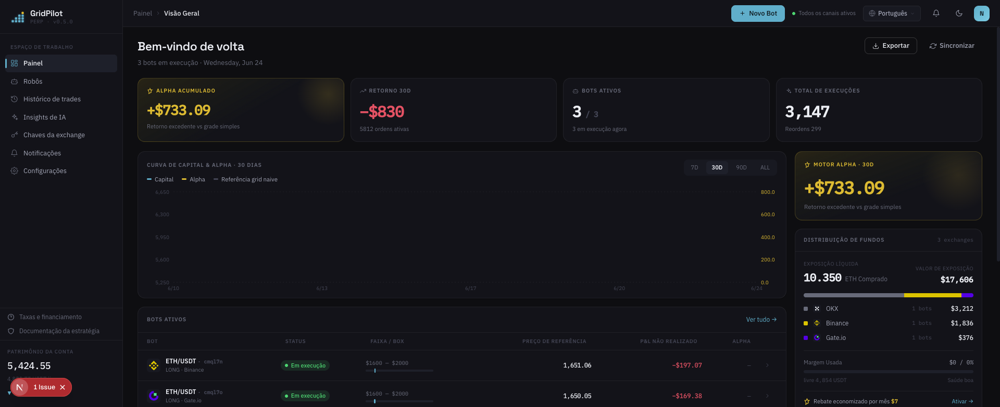
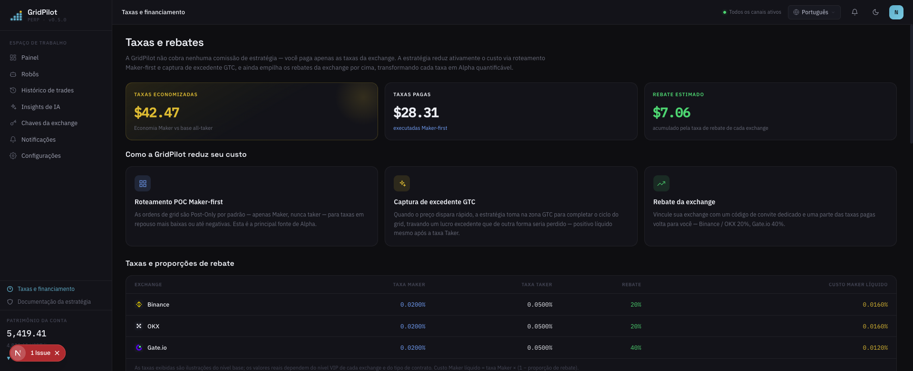

# GridPilot

> Plataforma de negociação com **grade dinâmica** para contratos perpétuos ETH/USDT · Compatível com Binance / Gate.io / OKX

**O robô de grade que vem nas corretoras é um produto da era passada.**

Ele pendura um lote de ordens no book e nunca mais olha — abre posição sem perguntar o preço, corta o stop de uma vez só e, num salto brusco, só consegue capturar o preço morto da linha de grade. O GridPilot é um trader que acompanha o mercado 24/7: **a cada atualização de preço, ele repensa se vale a pena agir e a que preço.**

[简体中文](README.md) · [繁體中文](README.zh-TW.md) · [English](README.en.md) · [日本語](README.ja.md) · [Español](README.es.md) · [العربية](README.ar.md) · [Français](README.fr.md) · **Português** · [Italiano](README.it.md) · [한국어](README.ko.md) · [ไทย](README.th.md) · [Tiếng Việt](README.vi.md)

---

## 📸 Visão geral da interface

| Painel · Visão geral | Taxas e rebates |
|:---:|:---:|
|  |  |

> Tema da marca em verde-azulado escuro · Fontes Space Grotesk / IBM Plex · 12 idiomas integrados, com a interface acompanhando a troca de idioma.

## 🎯 Por que negociação em grade?

A negociação em grade divide uma faixa de preço em várias "linhas de grade": a cada queda de um nível, compra; a cada subida de um nível, vende — **comprando na baixa e vendendo na alta repetidamente em mercados laterais, transformando a própria volatilidade em lucro**. Ela não tenta prever altas ou baixas, apenas captura a diferença das oscilações de ida e volta dentro da faixa, sendo por isso especialmente adequada a mercados sem tendência clara, que oscilam para cima e para baixo.

Em comparação com "comprar e segurar": comprar e segurar só gera lucro quando o preço sobe no final; a grade acumula continuamente pequenos lucros, um a um, durante a lateralização. O preço a pagar é a necessidade de gerenciar ordens e controlar o risco de forma contínua — e é exatamente essa parte que o GridPilot automatiza para você.

> ⚠️ A negociação em grade não é lucro garantido: em quedas unidirecionais ainda há perdas não realizadas, e a alavancagem amplia o risco. Entenda bem a estratégia antes de investir.

## 🤔 Antes de usar uma grade, faça a si mesmo estas cinco perguntas

**O preço ainda está caindo — por que a grade já quer montar a posição inteira no topo?**
A grade nativa abre posição assim que o preço entra na faixa. O GridPilot faz **entrada com trailing**: primeiro persegue o ponto baixo e só entra após um repique de 0,2% confirmar que o mercado se estabilizou — sem tentar adivinhar o fundo, sem ficar segurando o abacaxi no topo. (Só rastreia quando o preço entra na janela de ativação na direção da perda; se voltar a subir para dentro da faixa vindo de um nível mais fundo, pula o trailing e começa a rodar direto.)

**O mercado muda a cada segundo — por que suas ordens ficam penduradas sem se mexer?**
O GridPilot redecide a cada atualização de preço: cancela o que deve, modifica o que deve, e em certos momentos pode não haver nenhuma ordem no book; quando o preço é favorável, persegue o book para travar o melhor preço; quando é desfavorável, prefere disparar o circuit breaker e recusar a ordem — vai de Maker (0,02%) sempre que possível, nunca paga Taker (0,05%) de graça. Essa perseguição não tem risco de queda: se o preço continuar caindo além do preço da grade, o bot persegue e compra ainda mais barato; se ele recuar sem romper a linha de cima, a ordem ainda pode ser executada no preço original — segundo um modelo padrão de ruína do apostador (gambler's ruin), a probabilidade de realmente perder a execução é desprezível — o lucro extra é de graça, e perdê-lo não custa nada.

**O preço salta 5–10 USDT de uma vez — sua grade só sabe olhar?**
Ordens estáticas só capturam o preço morto das linhas de grade. Quando o preço se desvia do preço teórico da grade além de um limiar (padrão 0,1% ≈ 2× a taxa de execução ativa, ajustável), o GridPilot toma a liquidez ativamente e trava no bolso o lucro extra do salto além do passo da grade — na prática, quanto mais "irregular" o livro de ofertas da corretora, maior o lucro excedente.

**Foi só um rompimento rápido para baixo — por que liquidar a posição inteira a mercado de uma vez?**
Zerar tudo de uma vez paga taxa de Taker e ainda abre mão do repique. O GridPilot **reduz a posição nível a nível com ordens limitadas** dentro da zona de amortecimento do stop; se o preço repicar, a posição residual volta a lucrar na hora. Só se romper a linha de liquidação é que uma última ordem condicional de segurança assume de uma vez.

**O preço já saiu da faixa faz tempo — por que sua grade continua girando em falso no mesmo lugar?**
O GridPilot permite pré-configurar várias faixas que não se sobrepõem: em qual faixa o preço entrar, aquela é ativada; após um stop, entra em "período de calma" e só volta a rastrear a entrada quando surgir um novo sinal de estabilização.

## 📊 Comparação direta com a grade nativa das corretoras

| Dimensão | Grade nativa da corretora | GridPilot |
|------|----------------|-----------|
| **Forma de decidir** | Ordens estáticas em lote, imóveis após colocadas | Acompanhamento automatizado: a cada atualização de preço reavalia antes de colocar/modificar/cancelar ordens dinamicamente; em qualquer instante pode não haver ordem ativa |
| **Qualidade de execução** | Ordens estáticas só capturam o preço das linhas de grade; o lucro extra dos saltos passa ao lado | Ancorado no book para travar o melhor preço, com execução nunca pior que o preço teórico; quando o preço se desvia do teórico além do limiar (padrão ≈2× a taxa), toma a liquidez ativamente para travar o lucro excedente; com preço desfavorável, o circuit breaker recusa a ordem |
| **Momento de abrir posição** | Abre a posição assim que entra na faixa | Entrada com trailing: ao entrar na direção da perda, persegue o ponto baixo e só abre posição após confirmar um repique (padrão 0,2%) |
| **Stop loss** | Liquidação total de uma só vez a mercado em um único preço | Redução nível a nível com ordens limitadas na zona de amortecimento; no repique, a posição residual se beneficia diretamente; a linha de liquidação mantém uma ordem condicional de segurança |
| **Adaptação ao mercado** | Faixa única e fixa | Múltiplas faixas que não se sobrepõem; o preço ativa a faixa em que entra e as demais ficam dormentes |

> A explicação completa das inovações, ponto a ponto contra a grade nativa, está em [`docs/INNOVATIONS.en.md`](docs/INNOVATIONS.en.md); os princípios completos da estratégia, em [`docs/STRATEGY_SPEC.md`](docs/STRATEGY_SPEC.md).

## ✨ Visão geral dos recursos

- **Autocorreção independente de estado**: posição-alvo = f(preço atual); após falha, queda de rede ou alteração manual da posição, corrige o desvio automaticamente ao reiniciar
- **Push em tempo real via WebSocket**: eventos de Ticker / execuções / máquina de estados sincronizados em tempo real com o front-end
- **Suporte a múltiplas corretoras**: interface de adaptador unificada, compatível com Binance, Gate.io e OKX
- **Sugestão de configuração de faixa por IA**: recomenda faixas e parâmetros offline, sem intervir nas decisões de negociação em tempo real
- **Interface multilíngue**: 12 idiomas integrados

## 💰 Entenda as taxas e economize com código de convite ao se cadastrar (patrocinador rebateto.me)

As taxas são cobradas pelas corretoras, e o **GridPilot não fica com nenhum centavo**. Numa mesma operação, ordem passiva (Maker) ≈0,02% e ordem ativa (Taker) ≈0,05%. No dia a dia, as ordens de grade dos dois lados na verdade são todas Maker — não há diferença de taxa nas execuções rotineiras da grade. A vantagem do GridPilot nas taxas aparece em três momentos-chave: ① **na entrada** — coloca a ordem limitada depois da confirmação do repique, em vez de abrir a mercado assim que entra na faixa; ② **no stop** — reduz nível a nível com ordens limitadas, em vez de zerar tudo a mercado de uma vez; ③ **na tomada de liquidez** — só permite ir de Taker quando o lucro excedente realmente cobre a taxa.

E vai além: **ao preencher um código de rebate ao se cadastrar na corretora, você passa a receber de volta cerca de 20% (Gate 40%) das taxas já pagas, de forma contínua e automática** — é como dar mais um desconto em cada operação.

> ⚠️ Cada corretora só pode ser registrada uma vez, e o rebate só pode ser vinculado no momento do cadastro; **contas antigas não conseguem fazer isso depois — esta é a única chance**.

**Patrocinador [rebateto.me](https://rebateto.me)** reúne e mantém os pontos de cadastro com rebate de cada corretora. Ao se cadastrar, use o código de convite:

| Corretora | Código de convite | Percentual de rebate |
|--------|--------|----------|
| Binance | `fanwo20` | 20% |
| OKX | `fangeiwo` | 20% |
| Gate.io | `fangeiwo` | 40% |

> Ao se cadastrar pelo App, lembre-se de preencher manualmente o código de convite — se esquecer, não recebe o retorno. Cada documento de identidade pode abrir apenas uma conta por corretora.

## 📦 Instalação

**Pré-requisitos**: Node.js ≥ 20, pnpm ≥ 9, Docker

### Opção 1: Docker full stack em um comando (recomendado para auto-hospedagem)

```bash
git clone https://github.com/QuantiaAI/grid-pilot.git && cd grid-pilot
cp .env.example .env
# Gere a chave de criptografia e preencha ENCRYPTION_KEY no .env
openssl rand -base64 32
# Sobe PostgreSQL + Redis + API + Web com um comando (migrações executadas automaticamente)
docker compose --profile full up --build -d
```

Após iniciar, acesse http://localhost:3300 .

> Sem `--profile full`, o `docker compose up` inicia apenas a infraestrutura PostgreSQL + Redis, para uso em desenvolvimento local.

### Opção 2: Instalação local (recomendado para desenvolvimento)

```bash
git clone https://github.com/QuantiaAI/grid-pilot.git && cd grid-pilot
pnpm install
cp .env.example .env        # ajuste as portas conforme necessário; defina ENCRYPTION_KEY com a saída de openssl rand -base64 32
pnpm --filter @gridpilot/api exec prisma generate       # gera o Prisma Client (o postinstall está desativado — este passo é obrigatório)
pnpm dev:infra              # sobe PostgreSQL + Redis
pnpm exec dotenv -e .env -- pnpm --filter @gridpilot/api exec prisma migrate deploy # apenas na primeira instalação: aplica as migrações do banco de dados
pnpm dev:skip-infra         # inicia API + Web
```

> Os passos `prisma generate` / `migrate deploy` só são necessários uma vez, na primeira instalação; depois, basta executar `pnpm dev` para iniciar tudo.

| Serviço | Endereço | Item de configuração |
|------|------|--------|
| Front-end | http://localhost:3300 | `WEB_PORT` / `WEB_HOST` |
| API back-end | http://localhost:3301 | `API_PORT` / `API_HOST` |
| PostgreSQL | localhost:25432 | `DB_PORT` |
| Redis | localhost:26379 | `REDIS_PORT` |

Iniciar individualmente:

```bash
pnpm dev:infra        # Apenas PostgreSQL + Redis
pnpm dev:api          # Apenas back-end
pnpm dev:web          # Apenas front-end
pnpm dev:skip-infra   # API + Web, sem docker
```

## 🕹️ Instruções de uso

1. **Conecte a corretora**: insira a API Key/Secret nas configurações. **Conceda apenas a permissão de negociação de contratos; jamais habilite a permissão de saque.**
2. **Configure a grade**: escolha o par de negociação e a direção (comprado/vendido), defina a âncora de preço de take profit, o número de níveis e o passo da grade principal, a quantidade por nível, a alavancagem, o amortecimento de stop loss e os parâmetros de entrada com trailing (os limites do range são derivados automaticamente da âncora de take profit + número de níveis e passo).
3. **Inicie o robô**: entre na entrada com trailing → execução; o front-end exibe em tempo real cotações, ordens, execuções e a máquina de estados.
4. **Monitoramento e encerramento**: quando o preço chega à extremidade do take profit, a grade vai fechando nível a nível e encerra naturalmente; com a posição zerada, sai pelo take profit. Se cair na zona de amortecimento de stop loss, reduz dinamicamente nível a nível.

Parâmetros principais:

| Parâmetro | Descrição |
|------|------|
| `takeProfitPrice` | Preço de take profit (limite superior do range) |
| `direction` | Direção: LONG (comprado) / SHORT (vendido) |
| `mainGridCount` / `mainGridStep` | Número de níveis da grade principal / passo de cada nível (USDT) |
| `mainGridPortionSize` | Quantidade por ordem em cada nível |
| `leverage` | Múltiplo de alavancagem |
| `stopLossGridCount` / `stopLossGridStep` | Número de níveis / passo da zona de amortecimento de stop loss |
| `isolationStep` | Largura da faixa de isolamento (padrão = passo da zona de stop) |
| `activationPrice` / `trailingCallbackRate` | Preço de ativação da faixa (padrão: ponto médio da grade principal) / amplitude de callback da entrada com trailing |
| `excessProfitMultiplier` | Múltiplo de disparo da faixa GTC (limiar de lucro excedente) |

Os parâmetros completos estão em [`docs/STRATEGY_SPEC.md`](docs/STRATEGY_SPEC.md).

## ⚠️ Avisos importantes

- **Isenção de risco**: a negociação de contratos tem alta alavancagem e alto risco, podendo causar a perda total do capital. Este projeto é uma ferramenta de negociação de código aberto, **não constitui qualquer recomendação de investimento** e não se responsabiliza por lucros ou perdas. Valide bem com pouco capital ou na testnet da corretora antes.
- **Permissões da API**: habilite apenas a permissão de negociação de contratos; **não** habilite a permissão de saque.
- **Restrição de runner único**: para o mesmo par de negociação da mesma conta da mesma corretora, só pode rodar um robô por vez.
- **Momento do rebate**: o código de convite só pode ser vinculado no cadastro; contas antigas não conseguem preencher depois.
- **Segurança da chave**: a `ENCRYPTION_KEY` é usada para criptografar as credenciais da corretora; use sempre uma chave forte gerada aleatoriamente e guarde-a com cuidado.
- **Conflito de portas**: se as portas locais 3300/3301 estiverem ocupadas pelo `pnpm dev`, haverá conflito com os contêineres full stack do Docker; pare os processos locais antes de iniciar os contêineres, ou altere a configuração de portas no `.env`.

## 🏗️ Stack tecnológica e arquitetura

| Camada | Tecnologia |
|------|------|
| Front-end | Next.js 16 · React 19 · Tailwind CSS v4 · Zustand · React Query · Recharts |
| Back-end | NestJS 10 · Prisma 5 · BullMQ · Socket.IO |
| Infraestrutura | PostgreSQL 16 · Redis 7 · Docker Compose |
| Compartilhado | TypeScript · pnpm Workspaces · Turborepo |

```
apps/web/          # Front-end Next.js (tema escuro, 12 idiomas)
apps/api/          # Back-end NestJS
packages/shared-types/  # Tipos compartilhados entre front-end e back-end
docs/              # STRATEGY_SPEC.md (especificação da estratégia) · ARCHITECTURE.md (mapeamento de componentes)
docker-compose.yml # Infraestrutura padrão; --profile full para a stack completa
```

**Máquina de estados da estratégia**: `TRAILING_ENTRY → RUNNING → LIQUIDATING → LIQUIDATED`; `RUNNING` pode ramificar para `TAKE_PROFIT`; os ramos operacionais incluem `PAUSED` (que pode ser restaurado com `USER_RESUME`), `CANCELLED` e `HOLD`.

**Comandos de desenvolvimento**:

```bash
pnpm dev          # Inicia todos os serviços com um comando
pnpm build        # Build
pnpm test         # Testes
pnpm lint         # Lint
```

**Banco de dados** (desenvolvimento local):

```bash
cd apps/api
pnpm prisma migrate dev    # Executa as migrações
pnpm prisma studio         # Visualiza os dados
```

## Índice da documentação

| Documento | Descrição |
|------|------|
| [`docs/INNOVATIONS.en.md`](docs/INNOVATIONS.en.md) | Explicação completa das inovações principais (comparação ponto a ponto com a grade nativa) |
| [`docs/STRATEGY_SPEC.md`](docs/STRATEGY_SPEC.md) | Especificação completa da estratégia (referência autoritativa) |
| [`docs/ARCHITECTURE.md`](docs/ARCHITECTURE.md) | Índice de mapeamento de componentes de código para seções da especificação |
| [`docs/fees-and-funding.md`](docs/fees-and-funding.md) | Explicação sobre taxas e funding |
