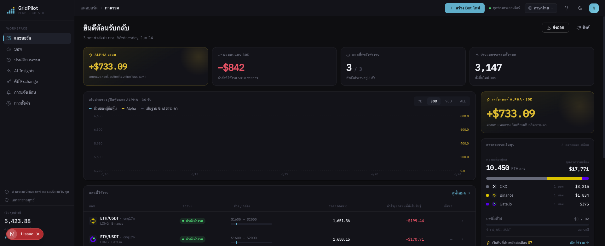
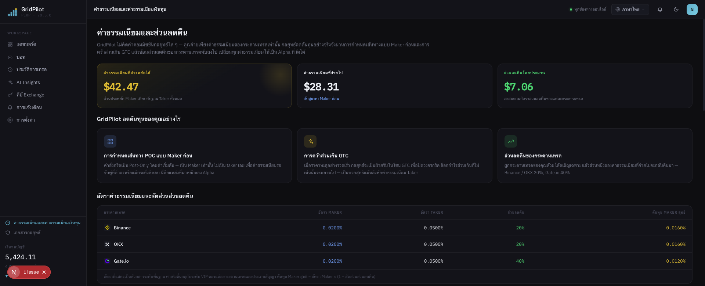

# GridPilot

> แพลตฟอร์มเทรด **กริดแบบไดนามิก** สำหรับสัญญาฟิวเจอร์สถาวร ETH/USDT · รองรับ Binance / Gate.io / OKX

**บอทกริดที่เอ็กซ์เชนจ์มีมาให้ คือสินค้าของยุคก่อน**

มันแค่วางคำสั่งทิ้งไว้กลางตลาดแล้วไม่เคยแตะอีกเลย — เปิดสถานะโดยไม่สนราคา ตัดขาดทุนทีเดียวรวด พอตลาดกระโดดก็ได้แค่ราคาตายตัวบนเส้นกริด GridPilot คือเทรดเดอร์ที่เฝ้ากราฟตลอด 24 ชั่วโมงทุกวัน: **ทุกครั้งที่ราคาขยับ มันตัดสินใจใหม่หมดว่าควรลงมือไหม และควรลงมือที่ราคาเท่าไหร่**

[简体中文](README.md) · [繁體中文](README.zh-TW.md) · [English](README.en.md) · [日本語](README.ja.md) · [Español](README.es.md) · [العربية](README.ar.md) · [Français](README.fr.md) · [Português](README.pt.md) · [Italiano](README.it.md) · [한국어](README.ko.md) · **ไทย** · [Tiếng Việt](README.vi.md)

---

## 📸 ตัวอย่างหน้าจอ

| แดชบอร์ด · ภาพรวม | ค่าธรรมเนียมและรีเบต |
|:---:|:---:|
|  |  |

> ธีมแบรนด์โทนเขียวน้ำเงินเข้ม · ฟอนต์ Space Grotesk / IBM Plex · รองรับ 12 ภาษาในตัว อินเทอร์เฟซเปลี่ยนตามภาษาที่เลือก

## 🎯 ทำไมต้องเทรดแบบกริด?

การเทรดแบบกริดคือการแบ่งช่วงราคาหนึ่งช่วงออกเป็น "เส้นกริด" หลายเส้น ราคาตกลงหนึ่งช่องก็ซื้อ ขึ้นหนึ่งช่องก็ขาย — **ในตลาดที่แกว่งไปมา จะซื้อต่ำขายสูงซ้ำ ๆ เปลี่ยนความผันผวนให้กลายเป็นกำไร** มันไม่ได้พยายามทำนายขึ้นลง แต่ทำกำไรจากส่วนต่างของการแกว่งไปมาภายในช่วงราคา จึงเหมาะเป็นพิเศษกับตลาดที่ไม่มีแนวโน้มชัดเจนและแกว่งขึ้นลง

เมื่อเทียบกับ "ซื้อแล้วถือ": การซื้อแล้วถือจะได้กำไรก็ต่อเมื่อราคาขึ้นในตอนท้ายเท่านั้น ส่วนกริดจะสะสมกำไรเล็ก ๆ ทีละก้อนอย่างต่อเนื่องในช่วงที่ตลาดออกข้าง ราคาที่ต้องจ่ายคือต้องบริหารคำสั่งและควบคุมความเสี่ยงอย่างต่อเนื่อง — ซึ่งนี่แหละคือส่วนที่ GridPilot จะทำให้เป็นอัตโนมัติแทนคุณ

> ⚠️ การเทรดแบบกริดไม่ได้กำไรแน่นอน: เมื่อราคาตกทางเดียวก็ยังขาดทุนทางบัญชีได้ และเลเวอเรจจะขยายความเสี่ยง โปรดทำความเข้าใจกลยุทธ์ให้ดีก่อนลงทุน

## 🤔 ก่อนใช้กริด ลองถามตัวเองสักห้าคำถาม

**ราคายังร่วงไม่หยุด แล้วกริดรีบสร้างสถานะเต็มพิกัดที่ยอดดอยไปทำไม?**
กริดเนทีฟเปิดสถานะทันทีที่ราคาเข้าช่วง GridPilot ใช้การ**ติดตามเปิดสถานะ**: ไล่ตามจุดต่ำไปก่อน รอการเด้งกลับ 0.2% ยืนยันว่าราคาหยุดลงแล้วจึงเข้า — ไม่รับมีดตก ไม่ติดดอย (ติดตามเฉพาะเมื่อราคาเข้าหน้าต่างเปิดใช้งานจากทิศทางขาดทุนเท่านั้น หากราคาเด้งกลับจากระดับที่ลึกกว่าเข้าสู่ช่วง จะข้ามการติดตามแล้วเริ่มรันทันที)

**ตลาดเปลี่ยนทุกวินาที แล้วทำไมคำสั่งของคุณวางไว้แล้วไม่ขยับอีกเลย?**
GridPilot ตัดสินใจใหม่ทุกครั้งที่ตลาดอัปเดต: ควรยกเลิกก็ยกเลิก ควรแก้ก็แก้ บางช่วงอาจไม่มีคำสั่งค้างอยู่ในตลาดเลยก็ได้; ถ้าราคาเอื้อก็ไล่ตามออเดอร์บุ๊กเพื่อเกาะราคาที่ดีที่สุด ถ้าราคาไม่เอื้อก็ยอมตัดวงจรปฏิเสธคำสั่ง ถ้าวาง Maker (0.02%) ได้ก็จะไม่เสียค่า Taker (0.05%) เปล่า ๆ การไล่ตามนี้ไม่มีความเสี่ยงขาลง: ถ้าราคายังร่วงต่อเกินราคากริด ระบบจะไล่ตามซื้อในราคาที่ถูกลงไปอีก ถ้าราคาเด้งกลับโดยไม่ทะลุเส้นด้านบน ก็ยังเข้าซื้อได้ที่ราคาเดิม — คำนวณตามโมเดลการล้มละลายของนักพนัน (gambler's ruin) มาตรฐานแล้ว โอกาสที่จะพลาดการเข้าซื้อจริง ๆ นั้นแทบไม่มีนัยสำคัญ — กำไรส่วนเกินคือของฟรี ไม่ได้ก็ไม่ขาดทุน

**ราคากระโดดทีละ 5–10 USDT แล้วกริดของคุณทำได้อะไรนอกจากยืนดู?**
คำสั่งสแตติกกินได้แค่ราคาตายตัวบนเส้นกริด GridPilot จะกินคำสั่งด้วยราคาตลาดทันทีเมื่อราคาเบี่ยงเบนจากราคาเชิงทฤษฎีของกริดเกินเกณฑ์ (ค่าเริ่มต้น 0.1% ≈ 2× ค่าธรรมเนียมการกินคำสั่ง ปรับได้) ล็อกส่วนต่างที่เกินจากสเต็ปกริดเข้ากระเป๋า — ทดสอบจริงแล้ว ยิ่งเอ็กซ์เชนจ์ที่ออเดอร์บุ๊ก "ขรุขระ" ยิ่งได้กำไรส่วนเกินสูง

**แค่หลุดลงชั่วครู่ ทำไมต้องปิดทั้งสถานะด้วยราคาตลาดทีเดียวรวด?**
การปิดทีเดียวทั้งเสียค่า Taker ทั้งพลาดการเด้งกลับ GridPilot **ค่อย ๆ ลดสถานะด้วยคำสั่งลิมิตทีละช่อง**ในบัฟเฟอร์ตัดขาดทุน; ถ้าราคาเด้งกลับ สถานะที่เหลือก็ทำกำไรต่อได้ทันที มีเพียงเมื่อราคาหลุดเส้นลิควิเดชันเท่านั้น คำสั่งเงื่อนไขเฝ้าระวังตัวสุดท้ายถึงเข้ามารับช่วงปิดทั้งหมดในครั้งเดียว

**ราคาวิ่งออกนอกช่วงไปนานแล้ว ทำไมกริดของคุณยังหมุนเปล่าอยู่ที่เดิม?**
GridPilot ตั้งค่าหลายช่วงที่ไม่ทับซ้อนกันล่วงหน้า ราคาเข้าช่วงไหนก็เปิดใช้งานช่วงนั้น; หลังตัดขาดทุนจะเข้าสู่ "ช่วงพักเย็นใจ" รอสัญญาณหยุดลงใหม่ก่อนจึงเริ่มติดตามเปิดสถานะอีกครั้ง

## 📊 เทียบกริดเนทีฟของเอ็กซ์เชนจ์แบบตัวต่อตัว

| มิติ | กริดเนทีฟของเอ็กซ์เชนจ์ | GridPilot |
|------|----------------|-----------|
| **วิธีตัดสินใจ** | วางคำสั่งสแตติกเป็นชุด วางแล้วไม่ขยับอีก | จับตาตลาดอัตโนมัติ: ประเมินใหม่ทุกครั้งที่ตลาดอัปเดต แล้วจึงวาง/แก้/ยกเลิกคำสั่งแบบไดนามิก บางช่วงอาจไม่มีคำสั่งค้างอยู่เลย |
| **คุณภาพการจับคู่** | คำสั่งสแตติกกินได้แค่ราคาบนเส้นกริด ส่วนต่างราคาส่วนเกินช่วงตลาดกระโดดหลุดมือไป | เกาะออเดอร์บุ๊กที่ราคาที่ดีที่สุด ราคาที่ได้ไม่แย่กว่าราคาเชิงทฤษฎี; เมื่อราคาเบี่ยงเบนจากราคาเชิงทฤษฎีเกินเกณฑ์ (ค่าเริ่มต้น ≈2× ค่าธรรมเนียม) จะกินคำสั่งเพื่อล็อกกำไรส่วนเกิน; ราคาไม่เอื้อก็ตัดวงจรปฏิเสธคำสั่ง |
| **จังหวะเปิดสถานะ** | เข้าช่วงราคาก็เปิดสถานะทันที | ติดตามเปิดสถานะ: เมื่อเข้ามาจากทิศทางขาดทุน ไล่ตามจุดต่ำ รอเด้งกลับ 0.2% ยืนยันแล้วจึงเปิดสถานะ |
| **ตัดขาดทุน** | ปิดทั้งสถานะด้วยราคาตลาดที่ราคาเดียวครั้งเดียว | ค่อย ๆ ลดสถานะด้วยคำสั่งลิมิตทีละช่องในบัฟเฟอร์ตัดขาดทุน เมื่อราคาเด้งกลับ สถานะที่เหลือได้ประโยชน์ทันที; มีคำสั่งเงื่อนไขเฝ้าระวังตัวสุดท้ายที่เส้นลิควิเดชัน |
| **การปรับตามตลาด** | ช่วงเดียวคงที่ | หลายช่วงที่ไม่ทับซ้อนกัน ราคาเข้าช่วงไหนเปิดใช้งานช่วงนั้น ที่เหลือหลับอยู่ |

> อ่านคำอธิบายนวัตกรรมเทียบกริดของเอ็กซ์เชนจ์ทีละข้อได้ที่ [`docs/INNOVATIONS.en.md`](docs/INNOVATIONS.en.md); ดูหลักการกลยุทธ์ฉบับเต็มได้ที่ [`docs/STRATEGY_SPEC.md`](docs/STRATEGY_SPEC.md)

## ✨ ภาพรวมฟีเจอร์

- **ฟื้นตัวอัตโนมัติแบบไร้สถานะ**: สถานะเป้าหมาย = f(ราคาปัจจุบัน) หลังระบบล่ม/เน็ตหลุด/แก้สถานะด้วยมือแล้วรีสตาร์ท จะแก้ค่าคลาดเคลื่อนให้อัตโนมัติ
- **พุชเรียลไทม์ผ่าน WebSocket**: ซิงค์ Ticker / การจับคู่คำสั่ง / อีเวนต์ของสเตทแมชชีนไปยังฟรอนต์เอนด์แบบเรียลไทม์
- **รองรับหลายเอ็กซ์เชนจ์**: อินเทอร์เฟซอะแดปเตอร์แบบรวม รองรับ Binance, Gate.io, OKX
- **AI แนะนำการตั้งค่ากรอบราคา**: แนะนำช่วงราคาและพารามิเตอร์แบบออฟไลน์ ไม่แทรกแซงการตัดสินใจเทรดเรียลไทม์
- **อินเทอร์เฟซหลายภาษา**: รองรับ 12 ภาษาในตัว

## 💰 เข้าใจค่าธรรมเนียม สมัครด้วยรหัสเชิญเพื่อประหยัดเงิน (สปอนเซอร์ rebateto.me)

ค่าธรรมเนียมเรียกเก็บโดยเอ็กซ์เชนจ์ **GridPilot ไม่หักแม้แต่บาทเดียว** ในการเทรดเดียวกัน คำสั่งฝั่งวาง (Maker) ≈0.02% คำสั่งฝั่งกิน (Taker) ≈0.05% จริง ๆ แล้วคำสั่งกริดประจำวันของทั้งสองฝั่งเดินผ่าน Maker เหมือนกัน จึงไม่มีส่วนต่างค่าธรรมเนียมในการจับคู่กริดประจำวันเลย ข้อได้เปรียบด้านค่าธรรมเนียมของ GridPilot อยู่ที่สามช่วงเวลาสำคัญ — ① ตอนเข้า: รอยืนยันการเด้งกลับแล้วค่อยวางคำสั่งเข้า แทนที่จะเปิดสถานะด้วยราคาตลาดทันทีที่เข้าช่วง ② ตอนตัดขาดทุน: ค่อย ๆ ลดสถานะด้วยคำสั่งลิมิตทีละช่อง แทนที่จะปิดทั้งหมดด้วยราคาตลาดในคลิกเดียว ③ ตอนกินคำสั่ง: อนุญาตให้ใช้ Taker เฉพาะเมื่อส่วนต่างส่วนเกินชนะค่าธรรมเนียมอย่างแท้จริงเท่านั้น

ก้าวไปอีกขั้น: **เมื่อสมัครเอ็กซ์เชนจ์ ใส่รหัสรีเบตหนึ่งรหัส ก็จะได้รับค่าธรรมเนียมที่จ่ายไปแล้วคืนระยะยาวราว 20% (Gate 40%) เข้าบัญชีอัตโนมัติ** — เท่ากับได้ส่วนลดเพิ่มในทุกการเทรด

> ⚠️ แต่ละเอ็กซ์เชนจ์สมัครได้ครั้งเดียว รีเบตผูกได้เฉพาะตอนสมัครเท่านั้น **บัญชีเก่าไม่สามารถเพิ่มย้อนหลังได้ — นี่คือโอกาสเดียว**

**สปอนเซอร์ [rebateto.me](https://rebateto.me)** รวบรวมและดูแลช่องทางสมัครรับรีเบตของแต่ละเอ็กซ์เชนจ์ เมื่อสมัครโปรดใช้รหัสเชิญ:

| เอ็กซ์เชนจ์ | รหัสเชิญ | สัดส่วนรีเบต |
|--------|--------|----------|
| Binance | `fanwo20` | 20% |
| OKX | `fangeiwo` | 20% |
| Gate.io | `fangeiwo` | 40% |

> เมื่อสมัครผ่านแอป อย่าลืมกรอกรหัสเชิญด้วยตนเอง — กรอกตกหล่นก็จะไม่ได้รับเงินคืน บัตรประชาชนหนึ่งใบเปิดได้หนึ่งบัญชีต่อเอ็กซ์เชนจ์

## 📦 การติดตั้ง

**สิ่งที่ต้องมีก่อน**: Node.js ≥ 20, pnpm ≥ 9, Docker

### วิธีที่หนึ่ง: Docker ขึ้นทั้งสแตกในคำสั่งเดียว (แนะนำสำหรับการดีพลอยเอง)

```bash
git clone https://github.com/QuantiaAI/grid-pilot.git && cd grid-pilot
cp .env.example .env
# สร้างคีย์เข้ารหัสแล้วใส่ใน ENCRYPTION_KEY ของ .env
openssl rand -base64 32
# รัน PostgreSQL + Redis + API + Web ด้วยคำสั่งเดียว (รันมิเกรชันฐานข้อมูลอัตโนมัติ)
docker compose --profile full up --build -d
```

หลังจากเริ่มทำงานแล้ว เข้าใช้งานที่ http://localhost:3300

> เมื่อไม่ใส่ `--profile full` คำสั่ง `docker compose up` จะเริ่มเฉพาะโครงสร้างพื้นฐาน PostgreSQL + Redis เพื่อใช้ในการพัฒนาบนเครื่อง

### วิธีที่สอง: ติดตั้งบนเครื่อง (แนะนำสำหรับการพัฒนา)

```bash
git clone https://github.com/QuantiaAI/grid-pilot.git && cd grid-pilot
pnpm install
cp .env.example .env        # ปรับพอร์ตตามต้องการ; ตั้งค่า ENCRYPTION_KEY เป็นผลลัพธ์ของ openssl rand -base64 32
pnpm --filter @gridpilot/api exec prisma generate       # สร้าง Prisma Client (postinstall ถูกปิดไว้ — ขั้นตอนนี้จำเป็น)
pnpm dev:infra              # เริ่ม PostgreSQL + Redis
pnpm exec dotenv -e .env -- pnpm --filter @gridpilot/api exec prisma migrate deploy # เฉพาะการติดตั้งครั้งแรก: รันการย้ายฐานข้อมูล
pnpm dev:skip-infra         # เริ่ม API + Web
```

> ขั้นตอน `prisma generate` / `migrate deploy` จำเป็นเฉพาะการติดตั้งครั้งแรกเท่านั้น หลังจากนั้นเพียงรัน `pnpm dev` เพื่อเริ่มทุกอย่าง

| บริการ | ที่อยู่ | รายการตั้งค่า |
|------|------|--------|
| ฟรอนต์เอนด์ | http://localhost:3300 | `WEB_PORT` / `WEB_HOST` |
| แบ็กเอนด์ API | http://localhost:3301 | `API_PORT` / `API_HOST` |
| PostgreSQL | localhost:25432 | `DB_PORT` |
| Redis | localhost:26379 | `REDIS_PORT` |

เริ่มทีละตัว:

```bash
pnpm dev:infra        # เฉพาะ PostgreSQL + Redis
pnpm dev:api          # เฉพาะแบ็กเอนด์
pnpm dev:web          # เฉพาะฟรอนต์เอนด์
pnpm dev:skip-infra   # API + Web โดยข้าม docker
```

## 🕹️ วิธีใช้งาน

1. **เชื่อมต่อเอ็กซ์เชนจ์**: กรอก API Key/Secret ในการตั้งค่า **ให้สิทธิ์เฉพาะการเทรดสัญญาฟิวเจอร์สเท่านั้น ห้ามเปิดสิทธิ์ถอนเงินเด็ดขาด**
2. **ตั้งค่ากริด**: เลือกคู่เทรดและทิศทาง (ลอง/ชอร์ต) ตั้งค่าราคาทำกำไรเป็นจุดยึด จำนวนช่อง/สเต็ปของกริดหลัก จำนวนต่อช่อง เลเวอเรจ บัฟเฟอร์ตัดขาดทุน และพารามิเตอร์ติดตามเปิดสถานะ (ขอบเขตกล่องคำนวณอัตโนมัติจากจุดยึดราคาทำกำไร + จำนวนช่องและสเต็ป)
3. **เริ่มบอท**: เข้าสู่การติดตามเปิดสถานะ → รัน ฟรอนต์เอนด์จะแสดงราคาตลาด คำสั่งค้าง การจับคู่ และสเตทแมชชีนแบบเรียลไทม์
4. **เฝ้าติดตามและปิดงาน**: เมื่อราคาถึงฝั่งทำกำไร กริดจะปิดทีละช่องจนจบตามธรรมชาติ และเมื่อสถานะเหลือศูนย์จึงออกด้วยการทำกำไร หากราคาตกลงในบัฟเฟอร์ตัดขาดทุน จะค่อย ๆ ลดสถานะแบบไดนามิกทีละช่อง

พารามิเตอร์สำคัญ:

| พารามิเตอร์ | คำอธิบาย |
|------|------|
| `takeProfitPrice` | ราคาทำกำไร (ขอบเขตฝั่งทำกำไรของกล่อง) |
| `direction` | ทิศทาง: LONG (ลอง) / SHORT (ชอร์ต) |
| `mainGridCount` / `mainGridStep` | จำนวนช่องกริดหลัก / สเต็ปต่อช่อง (USDT) |
| `mainGridPortionSize` | จำนวนการวางคำสั่งต่อช่อง |
| `leverage` | จำนวนเท่าของเลเวอเรจ |
| `stopLossGridCount` / `stopLossGridStep` | จำนวนช่องของบัฟเฟอร์ตัดขาดทุน / สเต็ป |
| `isolationStep` | ความกว้างของแถบกันชน (ค่าเริ่มต้น = สเต็ปของโซนตัดขาดทุน) |
| `activationPrice` / `trailingCallbackRate` | ราคาเปิดใช้งานช่วง (ค่าเริ่มต้นคือจุดกลางของกริดหลัก) / ระดับการรีเทรซ |
| `excessProfitMultiplier` | ตัวคูณกระตุ้นช่วง GTC (เกณฑ์กำไรส่วนเกิน) |

ดูพารามิเตอร์ฉบับเต็มได้ที่ [`docs/STRATEGY_SPEC.md`](docs/STRATEGY_SPEC.md)

## ⚠️ ข้อควรระวัง

- **คำปฏิเสธความรับผิดด้านความเสี่ยง**: การเทรดสัญญาฟิวเจอร์สมีเลเวอเรจสูงและความเสี่ยงสูง อาจทำให้สูญเสียเงินต้นทั้งหมดได้ โปรเจกต์นี้เป็นเครื่องมือเทรดโอเพนซอร์ส **ไม่ถือเป็นคำแนะนำการลงทุนใด ๆ** และไม่รับผิดชอบต่อกำไรขาดทุน โปรดทดสอบให้เพียงพอด้วยเงินจำนวนน้อยหรือเทสต์เน็ตของเอ็กซ์เชนจ์ก่อน
- **สิทธิ์ API**: เปิดเฉพาะสิทธิ์การเทรดสัญญาฟิวเจอร์ส **อย่า** เปิดสิทธิ์ถอนเงิน
- **ข้อจำกัด runner เดียว**: คู่เทรดเดียวกันของบัญชีเอ็กซ์เชนจ์เดียวกัน ในเวลาเดียวกันรันบอทได้เพียงตัวเดียว
- **จังหวะรีเบต**: รหัสเชิญผูกได้เฉพาะตอนสมัครเท่านั้น บัญชีเก่าไม่สามารถกรอกย้อนหลังได้
- **ความปลอดภัยของคีย์**: `ENCRYPTION_KEY` ใช้เข้ารหัสข้อมูลรับรองของเอ็กซ์เชนจ์ ต้องใช้คีย์ที่แข็งแรงซึ่งสุ่มสร้างขึ้นและเก็บรักษาให้ดี
- **พอร์ตชนกัน**: หากพอร์ต 3300/3301 บนเครื่องถูก `pnpm dev` ใช้อยู่ จะชนกับคอนเทนเนอร์ Docker แบบทั้งสแตก โปรดหยุดโพรเซสบนเครื่องก่อนเริ่มคอนเทนเนอร์ หรือแก้ไขการตั้งค่าพอร์ตใน `.env`

## 🏗️ เทคโนโลยีและสถาปัตยกรรม

| ชั้น | เทคโนโลยี |
|------|------|
| ฟรอนต์เอนด์ | Next.js 16 · React 19 · Tailwind CSS v4 · Zustand · React Query · Recharts |
| แบ็กเอนด์ | NestJS 10 · Prisma 5 · BullMQ · Socket.IO |
| โครงสร้างพื้นฐาน | PostgreSQL 16 · Redis 7 · Docker Compose |
| ส่วนแบ่งร่วม | TypeScript · pnpm Workspaces · Turborepo |

```
apps/web/          # ฟรอนต์เอนด์ Next.js (ธีมมืด 12 ภาษา)
apps/api/          # แบ็กเอนด์ NestJS
packages/shared-types/  # ไทป์ที่ใช้ร่วมกันระหว่างฟรอนต์เอนด์และแบ็กเอนด์
docs/              # STRATEGY_SPEC.md (สเปกกลยุทธ์) · ARCHITECTURE.md (การแมปคอมโพเนนต์)
docker-compose.yml # โครงสร้างพื้นฐานเริ่มต้น; --profile full สำหรับทั้งสแตก
```

**สเตทแมชชีนของกลยุทธ์**: `TRAILING_ENTRY → RUNNING → LIQUIDATING → LIQUIDATED`, `RUNNING` สามารถแตกแขนงไปยัง `TAKE_PROFIT` ได้ แขนงด้านปฏิบัติการมี `PAUSED` (สามารถ `USER_RESUME` เพื่อรีเซ็ตกลับ), `CANCELLED`, `HOLD`

**คำสั่งสำหรับการพัฒนา**:

```bash
pnpm dev          # เริ่มทุกบริการในคำสั่งเดียว
pnpm build        # สร้าง (build)
pnpm test         # ทดสอบ
pnpm lint         # Lint
```

**ฐานข้อมูล** (การพัฒนาบนเครื่อง):

```bash
cd apps/api
pnpm prisma migrate dev    # รันมิเกรชัน
pnpm prisma studio         # ดูข้อมูล
```

## ดัชนีเอกสาร

| เอกสาร | คำอธิบาย |
|------|------|
| [`docs/INNOVATIONS.en.md`](docs/INNOVATIONS.en.md) | คำอธิบายนวัตกรรมหลักฉบับสมบูรณ์ (เปรียบเทียบทีละข้อกับกริดเนทีฟของเอ็กซ์เชนจ์) |
| [`docs/STRATEGY_SPEC.md`](docs/STRATEGY_SPEC.md) | คู่มือสเปกกลยุทธ์ฉบับเต็ม (เอกสารอ้างอิงหลัก) |
| [`docs/ARCHITECTURE.md`](docs/ARCHITECTURE.md) | ดัชนีการแมปจากคอมโพเนนต์ของโค้ดไปยังบทในสเปก |
| [`docs/fees-and-funding.md`](docs/fees-and-funding.md) | คำอธิบายค่าธรรมเนียมและค่าฟันดิง |
