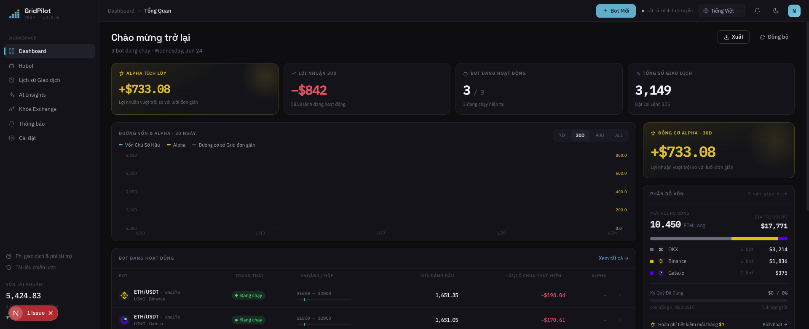
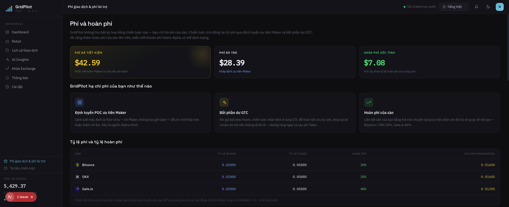

# GridPilot

> Nền tảng giao dịch **lưới động (dynamic grid)** cho hợp đồng vĩnh cửu ETH/USDT · Tương thích Binance / Gate.io / OKX

**Nâng cấp lưới tĩnh "đặt rồi mặc kệ" của sàn thành một trader theo bảng giá 24/7 — mỗi nhịp giá đều ra quyết định lại.**

- 🧠 **Đặt lệnh động theo bảng giá**: không còn đặt hàng loạt lệnh tĩnh rồi cầu may — mỗi lần giá cập nhật đều đánh giá lại trước khi đặt/sửa/hủy lệnh, và khi giá nhảy vọt mạnh còn bắt được phần chênh lệch vượt quá bước lưới
- 💸 **Tiết kiệm ~0.03% phí mỗi giao dịch**: mặc định đặt lệnh Post-Only Maker để hưởng phí thấp hơn; chỉ ăn lệnh khi lợi nhuận tăng thêm bù được chi phí ăn lệnh; giá bất lợi thì từ chối lệnh thẳng
- 🎯 **Vào lệnh theo dõi (trailing entry) — không mở vị thế ở đỉnh**: khi giá vào khoảng, bám đáy trước, xác nhận hồi phục rồi mới mở vị thế, tránh vừa vào lệnh đã bị kẹt
- 🛡️ **Đệm cắt lỗ theo lớp**: khi giá rớt thủng tạm thời rồi hồi lại, phần vị thế còn lại hưởng lợi trực tiếp — không tốn phí đóng toàn bộ rồi tái lập
- 🧭 **Tự động theo nhiều khoảng giá**: cấu hình sẵn nhiều khoảng không chồng lấn; giá vào khoảng nào thì kích hoạt khoảng đó

[简体中文](README.md) · [繁體中文](README.zh-TW.md) · [English](README.en.md) · [日本語](README.ja.md) · [Español](README.es.md) · [العربية](README.ar.md) · [Français](README.fr.md) · [Português](README.pt.md) · [Italiano](README.it.md) · [한국어](README.ko.md) · [ไทย](README.th.md) · **Tiếng Việt**

---

## 📸 Xem trước giao diện

| Bảng điều khiển · Tổng quan | Phí & Hoàn phí |
|:---:|:---:|
|  |  |

> Chủ đề thương hiệu xanh lam đậm · Phông chữ Space Grotesk / IBM Plex · Tích hợp sẵn 12 ngôn ngữ, giao diện đổi theo ngôn ngữ.

## 🎯 Tại sao chọn giao dịch lưới?

Giao dịch lưới chia một khoảng giá thành nhiều "đường lưới": giá giảm mỗi nấc thì mua, giá tăng mỗi nấc thì bán — **mua thấp bán cao lặp đi lặp lại trong thị trường đi ngang, biến chính sự dao động thành lợi nhuận**. Nó không dự đoán tăng giảm, chỉ kiếm chênh lệch từ các dao động qua lại trong khoảng giá, vì vậy đặc biệt phù hợp với thị trường không có xu hướng rõ ràng, lên xuống dập dềnh.

So với "mua và giữ": mua và giữ chỉ có lãi khi cuối cùng giá tăng; còn lưới tích lũy liên tục từng khoản lợi nhuận nhỏ trong giai đoạn đi ngang. Cái giá phải trả là cần quản lý lệnh liên tục và kiểm soát rủi ro — đây chính là phần mà GridPilot tự động hóa thay bạn.

> ⚠️ Giao dịch lưới không phải lúc nào cũng có lãi: khi giá giảm một chiều vẫn sẽ lỗ tạm tính, và đòn bẩy sẽ khuếch đại rủi ro. Hãy hiểu rõ chiến lược trước khi xuống tiền.

## 🚀 5 đổi mới lớn của chúng tôi so với lưới gốc của sàn

Robot lưới có sẵn của sàn giao dịch về bản chất là "đặt hàng loạt lệnh một lần, treo đó bất động, chờ thị trường chạy tới khớp lệnh". Khác biệt cốt lõi của GridPilot là **dùng chương trình mô phỏng một trader giàu kinh nghiệm đang theo bảng giá**:

| Khía cạnh | Lưới gốc của sàn | GridPilot |
|------|----------------|-----------|
| **Cách đặt lệnh** | Đặt lệnh tĩnh hàng loạt, treo xong không di chuyển | Tự động theo bảng giá: mỗi lần giá cập nhật đều đánh giá lại rồi mới đặt/sửa/hủy lệnh động, tại bất kỳ thời điểm nào cũng không nhất thiết có lệnh treo |
| **Phí giao dịch** | Không phân biệt khớp chủ động/bị động | Định giá ba vùng: vùng POC đặt lệnh Maker (tiết kiệm ~0.03%), vùng GTC được phép ăn lệnh để khóa lợi nhuận vượt mức, vùng ngắt mạch (circuit breaker) từ chối đặt lệnh |
| **Thời điểm vào lệnh** | Vào khoảng giá là mở vị thế ngay | Vào lệnh theo dõi (trailing entry): khi giá vào khoảng, bám đáy trước, xác nhận hồi phục rồi mới mở vị thế, tránh vừa mở đã đứng ở đỉnh bị kẹt |
| **Cắt lỗ** | Đóng một lần tại một mức giá duy nhất | Giảm vị thế theo lớp bằng lệnh thuật toán đệm, khi giá rớt thủng tạm thời rồi hồi lại thì phần vị thế còn lại hưởng lợi trực tiếp, đỡ tốn phí tái lập |
| **Thích ứng thị trường** | Một khoảng giá cố định | Nhiều khoảng giá không chồng lấn, giá vào khoảng nào thì kích hoạt khoảng đó, các khoảng còn lại ngủ đông |

1. **Tư duy theo bảng giá: quan sát trước, quyết định sau**: hệ thống mỗi khi nhận giá mới mới đánh giá quan hệ giữa giá hiện tại và giá mục tiêu — điều kiện bất lợi thì dừng tay quan sát, điều kiện thuận lợi mới đặt chỗ ở mức giá tối ưu; khi giá nhảy vọt mạnh còn có thể bắt được phần chênh lệch vượt quá bước lưới.
2. **Maker ưu tiên / Taker đặc cách / Ngắt mạch khi bất lợi**: mặc định đặt lệnh Post-Only Maker để hưởng phí thấp hơn; chỉ khi lợi nhuận tăng thêm bù được chi phí ăn lệnh và cơ hội thoáng qua trong chớp mắt thì mới chủ động ăn lệnh; khi giá hiện tại đắt hơn giá mua mục tiêu thì từ chối lệnh thẳng, tránh mua cao bán thấp.
3. **Vào lệnh theo dõi (trailing entry)**: tránh mở vị thế ở đỉnh rồi bị kẹt.
4. **Cắt lỗ bằng lệnh thuật toán theo lớp**: giữ được khả năng phục hồi khi giá bật lại.
5. **Nhiều khoảng giá**: giá đi đâu, chiến lược theo đó.

> Nguyên lý chiến lược đầy đủ xem tại [`docs/STRATEGY_SPEC.md`](docs/STRATEGY_SPEC.md).

## ✨ Tổng quan tính năng

- **Nhiều khoảng giá**: cấu hình sẵn nhiều khoảng không chồng lấn (ví dụ 2000–2600, 2600–3200), giá vào khoảng nào kích hoạt khoảng đó
- **Vào lệnh theo dõi**: bám đáy xác nhận hồi phục rồi mới mở vị thế
- **Định giá động ba vùng**: vùng POC dùng Maker, vùng GTC khóa lợi nhuận vượt mức, vùng ngắt mạch từ chối lệnh
- **Đệm cắt lỗ theo lớp**: nhiều bậc lệnh điều kiện thuật toán giảm vị thế theo lớp bên dưới lưới chính
- **Đẩy dữ liệu WebSocket thời gian thực**: sự kiện Ticker / khớp lệnh / máy trạng thái đồng bộ thời gian thực lên frontend
- **Hỗ trợ đa sàn**: giao diện adapter thống nhất, tương thích Binance, Gate.io, OKX
- **Giao diện đa ngôn ngữ**: tích hợp sẵn 12 ngôn ngữ

## 💰 Hiểu rõ phí, dùng mã mời để tiết kiệm khi đăng ký (nhà tài trợ rebateto.me)

Phí giao dịch do sàn thu, **GridPilot không lấy một xu nào**. Cùng một giao dịch, lệnh treo (Maker) ≈0.02%, lệnh ăn (Taker) ≈0.05%. Dưới đòn bẩy và lưới tần suất cao, phí giao dịch sẽ âm thầm bị khuếch đại, ngày qua ngày tích lại không hề nhỏ — GridPilot mặc định đặt lệnh Maker thay bạn, mỗi lệnh tiết kiệm khoảng 0.03%, chỉ khi cơ hội thoáng qua trong chớp mắt mới chủ động ăn lệnh.

Hơn nữa: **khi đăng ký sàn điền một mã hoàn phí, bạn có thể được hoàn lại lâu dài khoảng 20% (Gate 40%) phí đã trả, tự động vào tài khoản** — coi như được giảm giá thêm cho mỗi giao dịch.

> ⚠️ Mỗi sàn chỉ đăng ký được một lần, hoàn phí chỉ có thể gắn vào lúc đăng ký, **tài khoản cũ không thể bổ sung — đây là cơ hội duy nhất**.

**Nhà tài trợ [rebateto.me](https://rebateto.me)** tổng hợp và duy trì các cổng đăng ký hoàn phí của từng sàn. Khi đăng ký vui lòng dùng mã mời:

| Sàn giao dịch | Mã mời | Tỷ lệ hoàn phí |
|--------|--------|----------|
| Binance | `fanwo20` | 20% |
| OKX | `fangeiwo` | 20% |
| Gate.io | `fangeiwo` | 40% |

> Khi đăng ký bằng App nhớ điền thủ công mã mời — bỏ sót là không nhận được hoàn phí. Mỗi căn cước chỉ mở được một tài khoản trên mỗi sàn.

## 📦 Cài đặt

**Yêu cầu trước**: Node.js ≥ 20, pnpm ≥ 9, Docker

### Cách 1: Docker dựng toàn bộ stack một lệnh (khuyến nghị tự triển khai)

```bash
git clone https://github.com/QuantiaAI/grid-pilot.git && cd grid-pilot
cp .env.example .env
# Tạo khóa mã hóa và điền vào ENCRYPTION_KEY trong .env
openssl rand -base64 32
# Khởi chạy PostgreSQL + Redis + API + Web bằng một lệnh (tự động chạy migration)
docker compose --profile full up --build -d
```

Sau khi khởi động, truy cập http://localhost:3300 .

> Khi không kèm `--profile full`, `docker compose up` chỉ khởi động hạ tầng PostgreSQL + Redis để phục vụ phát triển cục bộ.

### Cách 2: Cài đặt cục bộ (khuyến nghị cho phát triển)

```bash
git clone https://github.com/QuantiaAI/grid-pilot.git && cd grid-pilot
pnpm install
cp .env.example .env        # điều chỉnh cổng nếu cần; đặt ENCRYPTION_KEY bằng kết quả của openssl rand -base64 32
pnpm --filter @gridpilot/api exec prisma generate       # tạo Prisma Client (postinstall đã bị tắt — bước này bắt buộc)
pnpm dev:infra              # khởi động PostgreSQL + Redis
pnpm exec dotenv -e .env -- pnpm --filter @gridpilot/api exec prisma migrate deploy # chỉ lần cài đầu tiên: áp dụng các migration của cơ sở dữ liệu
pnpm dev:skip-infra         # khởi động API + Web
```

> Các bước `prisma generate` / `migrate deploy` chỉ cần chạy một lần ở lần cài đặt đầu tiên; sau đó chỉ cần `pnpm dev` để khởi động mọi thứ.

| Dịch vụ | Địa chỉ | Tùy chọn cấu hình |
|------|------|--------|
| Frontend | http://localhost:3300 | `WEB_PORT` / `WEB_HOST` |
| API backend | http://localhost:3301 | `API_PORT` / `API_HOST` |
| PostgreSQL | localhost:25432 | `DB_PORT` |
| Redis | localhost:26379 | `REDIS_PORT` |

Khởi động riêng lẻ:

```bash
pnpm dev:infra        # chỉ PostgreSQL + Redis
pnpm dev:api          # chỉ backend
pnpm dev:web          # chỉ frontend
pnpm dev:skip-infra   # API + Web, bỏ qua docker
```

## 🕹️ Hướng dẫn sử dụng

1. **Kết nối sàn giao dịch**: điền API Key/Secret trong phần cài đặt. **Chỉ cấp quyền giao dịch hợp đồng, tuyệt đối không bật quyền rút tiền.**
2. **Cấu hình lưới**: chọn cặp giao dịch và khoảng giá, thiết lập số ô lưới chính, bước lưới, số lượng mỗi ô, đòn bẩy, đệm cắt lỗ, tham số vào lệnh theo dõi.
3. **Khởi động robot**: vào vào lệnh theo dõi → chạy, frontend hiển thị thời gian thực giá, lệnh treo, khớp lệnh và máy trạng thái.
4. **Giám sát và thu dọn**: khi chạm chốt lời thì dừng gia tăng vị thế để thu dọn; khi chạm đệm cắt lỗ thì giảm vị thế theo lớp.

Tham số then chốt:

| Tham số | Diễn giải |
|------|------|
| `takeProfitPrice` | Giá chốt lời (biên chốt lời của hộp) |
| `mainGridCount` / `mainGridStep` | Số ô lưới chính / bước mỗi ô (USDT) |
| `mainGridPortionSize` | Số lượng đặt lệnh mỗi ô |
| `leverage` | Hệ số đòn bẩy |
| `stopLossGridCount` / `stopLossGridStep` | Số ô vùng đệm cắt lỗ / bước lưới |
| `activationPrice` / `trailingCallbackRate` | Giá kích hoạt vào lệnh theo dõi / biên độ hồi |
| `excessProfitMultiplier` | Hệ số kích hoạt vùng GTC (ngưỡng lợi nhuận vượt mức) |

Tham số đầy đủ xem tại [`docs/STRATEGY_SPEC.md`](docs/STRATEGY_SPEC.md).

## ⚠️ Lưu ý

- **Miễn trừ rủi ro**: giao dịch hợp đồng có đòn bẩy cao, rủi ro cao, có thể dẫn đến mất toàn bộ vốn gốc. Dự án này là công cụ giao dịch mã nguồn mở, **không cấu thành bất kỳ lời khuyên đầu tư nào**, không chịu trách nhiệm về lãi lỗ. Hãy kiểm chứng đầy đủ với số vốn nhỏ hoặc testnet của sàn trước.
- **Quyền API**: chỉ bật quyền giao dịch hợp đồng, **đừng** bật quyền rút tiền.
- **Ràng buộc một runner**: cùng một cặp giao dịch trên cùng một tài khoản sàn, tại cùng một thời điểm chỉ có thể chạy một robot.
- **Thời điểm hoàn phí**: mã mời chỉ có thể gắn vào lúc đăng ký, tài khoản cũ không thể bổ sung.
- **An toàn khóa bí mật**: `ENCRYPTION_KEY` dùng để mã hóa thông tin xác thực của sàn, nhất định phải dùng khóa mạnh sinh ngẫu nhiên và bảo quản cẩn thận.
- **Xung đột cổng**: nếu cổng 3300/3301 cục bộ bị `pnpm dev` chiếm dụng sẽ xung đột với container Docker toàn stack, hãy dừng tiến trình cục bộ trước rồi mới khởi động container, hoặc sửa cấu hình cổng trong `.env`.

## 🏗️ Ngăn xếp công nghệ & Kiến trúc

| Tầng | Công nghệ |
|------|------|
| Frontend | Next.js 16 · React 19 · Tailwind CSS v4 · Zustand · React Query · Recharts |
| Backend | NestJS 10 · Prisma 5 · BullMQ · Socket.IO |
| Hạ tầng | PostgreSQL 16 · Redis 7 · Docker Compose |
| Dùng chung | TypeScript · pnpm Workspaces · Turborepo |

```
apps/web/          # Next.js frontend (giao diện tối, 12 ngôn ngữ)
apps/api/          # NestJS backend
packages/shared-types/  # kiểu dùng chung giữa frontend và backend
docs/              # STRATEGY_SPEC.md (đặc tả chiến lược) · ARCHITECTURE.md (ánh xạ thành phần)
docker-compose.yml # hạ tầng mặc định; --profile full cho toàn stack
```

**Máy trạng thái chiến lược**: `TRAILING_ENTRY → RUNNING → LIQUIDATING → LIQUIDATED`, `RUNNING` có thể rẽ nhánh sang `TAKE_PROFIT`; nhánh vận hành gồm `PAUSED` (có thể `USER_RESUME` để khôi phục), `CANCELLED`, `HOLD`.

**Lệnh phát triển**:

```bash
pnpm dev          # khởi động tất cả dịch vụ bằng một lệnh
pnpm build        # build
pnpm test         # kiểm thử
pnpm lint         # Lint
```

**Cơ sở dữ liệu** (phát triển cục bộ):

```bash
cd apps/api
pnpm prisma migrate dev    # chạy migration
pnpm prisma studio         # xem dữ liệu
```

## Mục lục tài liệu

| Tài liệu | Diễn giải |
|------|------|
| [`docs/STRATEGY_SPEC.md`](docs/STRATEGY_SPEC.md) | Tài liệu đặc tả chiến lược đầy đủ (tham chiếu chuẩn) |
| [`docs/ARCHITECTURE.md`](docs/ARCHITECTURE.md) | Chỉ mục ánh xạ từ thành phần mã nguồn tới chương đặc tả |
| [`docs/fees-and-funding.md`](docs/fees-and-funding.md) | Giải thích phí giao dịch và phí vốn (funding) |
