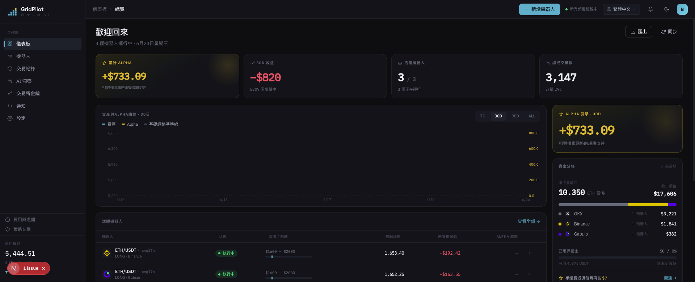
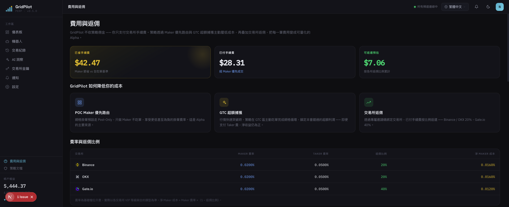

# GridPilot

> ETH/USDT 永續合約**動態網格**交易平台 · 相容 Binance / Gate.io / OKX

**交易所自帶的網格機器人，是上個時代的產品。**

它把一堆訂單往盤口一掛就再也不管——建倉不問價位，停損一刀切，行情跳空只能吃到網格線上的死價格。GridPilot 是一位 7×24 小時盯盤的交易員：**每一次行情跳動，它都重新判斷該不該出手、該出什麼價。**

[简体中文](README.md) · **繁體中文** · [English](README.en.md) · [日本語](README.ja.md) · [Español](README.es.md) · [العربية](README.ar.md) · [Français](README.fr.md) · [Português](README.pt.md) · [Italiano](README.it.md) · [한국어](README.ko.md) · [ไทย](README.th.md) · [Tiếng Việt](README.vi.md)

---

## 📸 介面預覽

| 儀表板 · 總覽 | 費用與返佣 |
|:---:|:---:|
|  |  |

> 深青色品牌主題 · Space Grotesk / IBM Plex 字體 · 內建 12 種語言，介面隨語言切換。

## 🎯 為什麼是網格交易？

網格交易把一段價格區間切成若干「網格線」，價格每跌一格就買、每漲一格就賣——**在震盪行情裡反覆高拋低吸，把波動本身變成收益**。它不預測漲跌，只賺區間內來回波動的差價，因此特別適合無明確趨勢、上下震盪的市場。

與「買入持有」相比：買入持有只在最終上漲時獲利；網格在橫盤震盪中持續累積一筆筆小利潤。代價是需要持續管理訂單、控制風險——這正是 GridPilot 要替你自動化的部分。

> ⚠️ 網格交易並非穩賺：單邊下跌時仍會浮虧，槓桿會放大風險。請先理解策略再投入。

## 🤔 用網格之前，先問自己五個問題

**價格還在跌，網格為什麼急著在山頂把倉位建滿？**
原生網格價格一進區間就立即開倉。GridPilot **追蹤建倉**：先跟著低點走，反彈 0.2% 確認企穩才進場——不抄底、不站崗。（僅當價格朝虧損方向進入啟動視窗時追蹤；若從更深處朝止盈方向漲回區間，則跳過追蹤直接開始運行。）

**行情每秒都在變，你的訂單為什麼掛上去就不再動？**
GridPilot 每次行情更新都重新決策：該撤就撤、該改就改，任意時刻盤口上可能一張單都沒有；價位有利就追著盤口卡最優價，價位不利寧可熔斷拒單；能掛 Maker（0.02%）絕不白交 Taker（0.05%）。這套追逐沒有下行風險：到了網格價繼續跌，就追著買得更便宜；漲回去只要沒漲破上一格，仍能按原價成交（按賭徒破產模型測算，真正踏空的機率微乎其微）——多賺是白撿的，撿不到也不虧。

**價格一跳 5–10 USDT，你的網格除了乾瞪眼還能做什麼？**
靜態掛單只能吃到網格線上的死價格。GridPilot 在價格偏離網格理論價超過閾值（預設 0.1% ≈ 2× 吃單手續費，可調）時主動吃單，把超出網格步長的跳躍價差鎖進口袋——實測訂單簿越「毛糙」的交易所，超額收益越高。

**只是短暫跌破，為什麼要把全部倉位一刀市價清倉？**
一鍵平倉既交 Taker 費，又放棄了反彈。GridPilot 在停損緩衝區**逐格限價減倉**；價格反彈，殘餘倉位直接接著賺。只有跌穿清算線，最後一張兜底條件單才一次性接管。

**價格早就跑出區間，你的網格為什麼還在原地空轉？**
GridPilot 預配置多段不重疊區間，價格走進哪段就啟動哪段；停損後進入「冷靜期」，等重新出現企穩信號才再次追蹤建倉。

## 📊 和交易所原生網格正面對比

| 維度 | 交易所原生網格 | GridPilot |
|------|----------------|-----------|
| **決策方式** | 批次靜態掛單，掛出後不再移動 | 自動化盯盤：每次行情更新重新判斷後才動態下單/改單/撤單，任意時刻不一定有掛單 |
| **成交品質** | 靜態單只能吃到網格線價格，跳躍行情的超額價差擦肩而過 | 錨定盤口卡最優價，成交價不劣於理論價；價格偏離理論價超閾值（預設 ≈2× 手續費）時主動吃單鎖定超額利潤；價位不利熔斷拒單 |
| **建倉時機** | 進區間立即開倉 | 追蹤建倉：朝虧損方向進入時追低點、確認反彈（預設 0.2%）後才建倉 |
| **停損** | 單一價位一次性市價全平 | 停損緩衝區逐格限價減倉，反彈時殘餘倉位直接受益；清算線留一張兜底條件單 |
| **行情適應** | 固定單一區間 | 多段不重疊區間，價格進哪段啟動哪段，其餘休眠 |

> 逐項對比交易所網格的創新全解見 [`docs/INNOVATIONS.md`](docs/INNOVATIONS.md)；完整策略原理見 [`docs/STRATEGY_SPEC.md`](docs/STRATEGY_SPEC.md)。

## ✨ 功能概覽

- **狀態無關自癒**：目標倉位 = f（當前價格），崩潰/斷網/手動改倉後重啟自動糾偏
- **即時 WebSocket 推送**：Ticker / 成交 / 狀態機事件即時同步前端
- **多交易所支援**：統一轉接器介面，相容 Binance、Gate.io、OKX
- **AI 箱體配置建議**：離線推薦區間與參數，不介入即時交易決策
- **多語言介面**：內建 12 種語言

## 💰 看懂手續費，註冊時用邀請碼省錢（贊助商 rebateto.me）

手續費由交易所收取，**GridPilot 一分不抽**。同一筆交易，掛單（Maker）≈0.02%、吃單（Taker）≈0.05%。日常網格單兩邊其實都走 Maker（掛單），在日常網格成交上雙方沒有手續費差異；GridPilot 的手續費優勢體現在三個關鍵時刻——①進場：等反彈確認後掛單進場，而非一進區間立即市價開倉；②停損：逐格限價減倉，而非一鍵市價全平；③吃單：只在超額價差確實蓋過手續費時才特許走 Taker。

更進一步：**註冊交易所時填一個返佣碼，就能把已付手續費長期返還約 20%（Gate 40%），自動到帳**——相當於給每筆交易再打個折。

> ⚠️ 每個交易所只能註冊一次，返佣只能在註冊時綁定，**老帳戶無法補——這是唯一的機會**。

**贊助商 [rebateto.me](https://rebateto.me)** 彙總並維護各交易所的返佣註冊入口。註冊時請使用邀請碼：

| 交易所 | 邀請碼 | 返佣比例 |
|--------|--------|----------|
| Binance | `fanwo20` | 20% |
| OKX | `fangeiwo` | 20% |
| Gate.io | `fangeiwo` | 40% |

> 用 App 註冊時記得手動填邀請碼——漏填就拿不到返還。每個身分證每所限開一個帳戶。

## 📦 安裝

**前置依賴**：Node.js ≥ 20、pnpm ≥ 9、Docker

### 方式一：Docker 一鍵全棧（推薦自部署）

```bash
git clone https://github.com/QuantiaAI/grid-pilot.git && cd grid-pilot
cp .env.example .env
# 產生加密金鑰並填入 .env 的 ENCRYPTION_KEY
openssl rand -base64 32
# 一鍵起 PostgreSQL + Redis + API + Web（自動執行資料庫遷移）
docker compose --profile full up --build -d
```

啟動後存取 http://localhost:3300 。

> 不帶 `--profile full` 時，`docker compose up` 只啟動 PostgreSQL + Redis 基礎設施，供本地開發使用。

### 方式二：本地安裝（推薦開發）

```bash
git clone https://github.com/QuantiaAI/grid-pilot.git && cd grid-pilot
pnpm install
cp .env.example .env        # 按需調整埠號；將 ENCRYPTION_KEY 設為 openssl rand -base64 32 的輸出
pnpm --filter @gridpilot/api exec prisma generate       # 產生 Prisma Client（postinstall 已停用——此步驟為必要）
pnpm dev:infra              # 啟動 PostgreSQL + Redis
pnpm exec dotenv -e .env -- pnpm --filter @gridpilot/api exec prisma migrate deploy # 僅首次安裝：套用資料庫遷移
pnpm dev:skip-infra         # 啟動 API + Web
```

> `prisma generate` / `migrate deploy` 只需首次安裝時執行一次；之後日常開發直接 `pnpm dev` 即可一鍵起所有服務。

| 服務 | 位址 | 配置項 |
|------|------|--------|
| 前端 | http://localhost:3300 | `WEB_PORT` / `WEB_HOST` |
| 後端 API | http://localhost:3301 | `API_PORT` / `API_HOST` |
| PostgreSQL | localhost:25432 | `DB_PORT` |
| Redis | localhost:26379 | `REDIS_PORT` |

單獨啟動：

```bash
pnpm dev:infra        # 仅 PostgreSQL + Redis
pnpm dev:api          # 仅后端
pnpm dev:web          # 仅前端
pnpm dev:skip-infra   # API + Web，跳过 docker
```

## 🕹️ 使用說明

1. **連接交易所**：在設定中填入 API Key/Secret。**僅授予合約交易權限，切勿開啟提領權限。**
2. **配置網格**：選擇交易對與方向（做多/做空），設定止盈價錨點、主網格格數/步長、每格數量、槓桿、停損緩衝、追蹤建倉參數（箱體邊界由止盈價錨點 + 格數步長自動推導）。
3. **啟動機器人**：進入追蹤建倉 → 執行，前端即時顯示行情、掛單、成交與狀態機。
4. **監控與收尾**：價格到達止盈端時，網格逐格平倉自然收尾、倉位清零後止盈退出；跌進停損緩衝區則逐格動態減倉。

關鍵參數：

| 參數 | 說明 |
|------|------|
| `takeProfitPrice` | 止盈價（箱體止盈端邊界） |
| `direction` | 方向：LONG（做多）/ SHORT（做空） |
| `mainGridCount` / `mainGridStep` | 主網格格數 / 每格步長（USDT） |
| `mainGridPortionSize` | 每格下單數量 |
| `leverage` | 槓桿倍數 |
| `stopLossGridCount` / `stopLossGridStep` | 停損緩衝區格數 / 步長 |
| `isolationStep` | 隔離帶寬度（缺省 = 停損區步長） |
| `activationPrice` / `trailingCallbackRate` | 區間啟用價（預設主網格中點）/ 追蹤建倉回調幅度 |
| `excessProfitMultiplier` | GTC 區觸發倍數（超額利潤閾值） |

完整參數見 [`docs/STRATEGY_SPEC.md`](docs/STRATEGY_SPEC.md)。

## ⚠️ 注意事項

- **風險免責**：合約交易具有高槓桿、高風險，可能導致全部本金損失。本專案為開源交易工具，**不構成任何投資建議**，不對盈虧負責。請先用小資金或交易所測試網充分驗證。
- **API 權限**：只開合約交易權限，**不要**開啟提領權限。
- **單 runner 約束**：同一交易所帳戶的同一交易對，同一時間只能執行一個機器人。
- **返佣時機**：邀請碼只能在註冊時綁定，老帳戶無法補填。
- **密鑰安全**：`ENCRYPTION_KEY` 用於加密交易所憑證，務必使用隨機生成的強密鑰並妥善保管。
- **連接埠衝突**：本地 3300/3301 連接埠若被 `pnpm dev` 佔用，會與 Docker 全棧容器衝突，請先停止本地行程再啟動容器，或修改 `.env` 中的連接埠配置。

## 🏗️ 技術棧與架構

| 層級 | 技術 |
|------|------|
| 前端 | Next.js 16 · React 19 · Tailwind CSS v4 · Zustand · React Query · Recharts |
| 後端 | NestJS 10 · Prisma 5 · BullMQ · Socket.IO |
| 基礎設施 | PostgreSQL 16 · Redis 7 · Docker Compose |
| 共享 | TypeScript · pnpm Workspaces · Turborepo |

```
apps/web/          # Next.js 前端（暗色主题，12 语）
apps/api/          # NestJS 后端
packages/shared-types/  # 前后端共享类型
docs/              # STRATEGY_SPEC.md（策略规格）· ARCHITECTURE.md（组件映射）
docker-compose.yml # 默认基础设施；--profile full 全栈
```

**策略狀態機**：`TRAILING_ENTRY → RUNNING → LIQUIDATING → LIQUIDATED`，`RUNNING` 可分支至 `TAKE_PROFIT`；維運分支含 `PAUSED`（可 `USER_RESUME` 復位）、`CANCELLED`、`HOLD`。

**開發指令**：

```bash
pnpm dev          # 一键起所有服务
pnpm build        # 构建
pnpm test         # 测试
pnpm lint         # Lint
```

**資料庫**（本地開發）：

```bash
cd apps/api
pnpm prisma migrate dev    # 执行迁移
pnpm prisma studio         # 查看数据
```

## 文件索引

| 文件 | 說明 |
|------|------|
| [`docs/INNOVATIONS.md`](docs/INNOVATIONS.md) | 核心創新全解（逐項對比交易所原生網格） |
| [`docs/STRATEGY_SPEC.md`](docs/STRATEGY_SPEC.md) | 完整策略規格說明書（權威參考） |
| [`docs/ARCHITECTURE.md`](docs/ARCHITECTURE.md) | 程式碼元件到規格章節的對應索引 |
| [`docs/fees-and-funding.md`](docs/fees-and-funding.md) | 手續費與資金費說明 |
